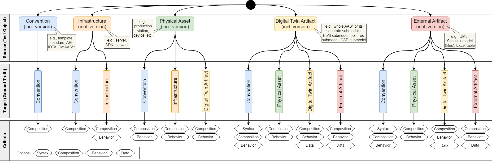
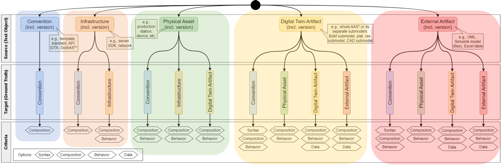
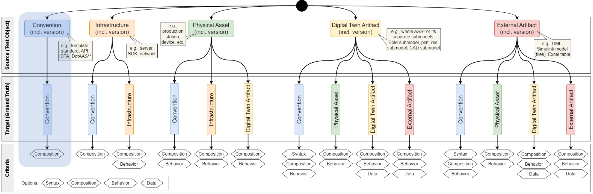
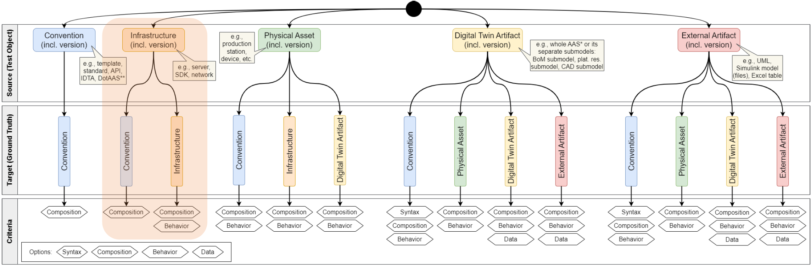
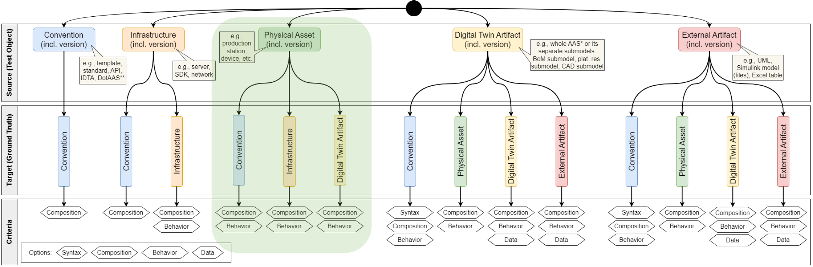
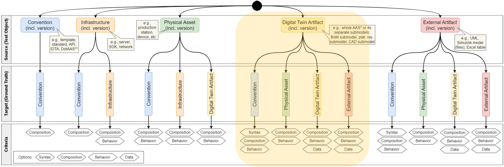
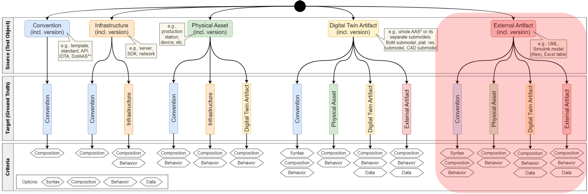

# Conformity Classification Theory

As already explained in [Background & Definitions](./background.md), this classification is focused in conformity, but it can be seen as a specialization of consistency, the following classification can also mostly be applied/translated to consistency.

## Leading Classification Idea
What can be said about conformity (based on the earlier [Background & Definitions](./background.md)):
- Conformity is always checked between two objects
- Conformity is always checked with a certain direction in mind
  - Something (start/source) is checked against something (target)
  - You always can or want to ask: “Is a source conform to/with a target?”
- These objects can be grouped into certain types (conventions, infrastructure, …)

Resulting classification approach:
- First, classify according to the type of the source object
- Second, classify according to the type of the target object (within each source type)
- Finally, classify according to the criteria that is used as comparison base between source and target

## Terminology
- “Source” = test object of which the conformity (to sth.) is not clear
- “Target” = ground truth regarding conformity
- “Criteria” = aspects of source and target that are used for conformity analysis/comparison (e.g., structure, behavior, data)
- Resulting question: “Is the <source> conform to/with <target> regarding <criteria>?”
- “Classification path” = a specific set of source type, target type, and criterion

Example: “Is this Bill of Material submodel X conform to its IDTA template regarding its structure?”
- Source = BoM submodel X (of classification type “Digital Twin”)
- Target = IDTA BoM template (of classification type “Convention”)
- Criteria = Structure
- Classification path = Digital Twin (as source) --> Convention (as target) --> Structure (as criterion)

Options for criteria:
- Syntax: The target specifies explicitly how the source needs to be "written", i.e., the notation/syntax of it, including the syntactical structure (where something needs to be written).
- Composition: The target specifies of what the source needs or can be composed and how this can or needs to be structured. Synonyms might be "structure" or "configuration". 
- Behavior: The target specifies how the source should behave when it is executed.
- Data: The target specifies which data most be present in the source and/or how it should look like. This is very close to consistency (data overlap that must be consistent between target and source).
- Semantics: This was excluded in this project's context.

## Overview Conformity Relation Types

All sources and targets are combined with their specific version. This enables conformity checks between different versions of the same object/type (although this goes more into the consistency aspect between different versions).

Not all possible combinations of source types with target types make sense. Some <source, target> pairs make only sense in one direction while for other pairs it can go in both directions. E.g., it makes only sense to check if a digital twin is conform to a convention and not if a convention is conform to a (specific) digital twin.

## Structure of Next Sections

- Blue: Source = Convention
- Orange: Source = Infrastructure
- Green: Source = Physical Asset
- Yellow: Source = Digital Twin Artifact
- Red: Source = External Artifact

## Part 1: Source = Convention

### Type description
- Conventions are documented specifications/agreements which give guidance, suggestions and/or rules on how something should appear, what it should contain, what it should provide, how it should be handled, and/or more. A convention can specify the characteristics of something (artifacts, assets, technologies) and can act as an agreement between different parties. 
- Examples: Standards like ISO 23247:2021 or IDTA. Templates like the AAS Submodel Templates. Specifications like the metamodel or API of DotAAS. Protocols like HTTP(S).

### Possible conformity targets
- Convention: A convention can be conform to another convention or to another version of itself.
- Other types do not make sense for conventions, since conventions are rather the target / ground truth of a conformity check (since they specify something) than a source / test object.

### Possible criteria for each comparison with a possible target
- Composition: A convention usually does not have any behavior or any specific data content, which is why it only makes sense to compare the composition/structure given by the convention, e.g., if specific types are still defined.

### Why do we want to check conformity for these cases?
- If we want to check a convention against another convention regarding conformity, it is often to see if they are still upward/downward compatible, or if one can be seen as a special/refined specification of the other one, or if one is correctly using the other's specifications while describing its own specifications (see UML).

### Examples
- Is a specific AAS Submodel template conform to the DotAAS?
- Is the UML usage (the UML templates) inside DotAAS conform to the general UML specification?

## Part 2: Source = Infrastructure

### Type description
- Infrastructure encompasses the hardware, software, and networks used for information processing and data management within an organization. It includes components such as servers, storage devices, computer networks, operating systems, databases, and software applications. In the context of OT, it refers to the technology and systems that control and monitor physical processes and operations in industries. In contrast to "Physical Asset", the infrastructure is meant as sth. more abstract, e.g., the concept of a network and not the actual cables.
- Examples: AAS SDKs, AAS Servers, Control Components, PLC, SCADA

### Possible conformity targets
- Conventions: an infrastructure can be conforming to a convention
- Infrastructure: an infrastructure's conformance to other pieces of infrastructure

### Possible criteria for each comparison with a possible target
- Composition: (towards convention) The infrastructure needs to follow the composition/structure the convention defines.
- Behavior: (between infrastructure) If Control Component says, "open valve", PLC has to open valve. It also includes time behavior, e.g., different server timeouts.

### Why do we want to check conformity for these cases?
- With infrastructure, it basically boils down to interoperability. Without conformance to conventions, or, if not existing, to other infrastructure respectively, there cannot be syntactic interoperability.

### Examples
- Conventions: "Is the AAS SDK conforming to the AAS Specification (DotAAS)?"
- Infrastructure: "Is the Control Component conforming to the API of the PLC? (and can therefore interact with it?)"

## Part 4: Source = Physical Asset

### Type description
- A physical assets is an object/item that exists in the real world, i.e., it has a physical form, and has a finite value (it is valuable itself and/or it produces value). We define it as the actual physical representation/instance of the object, in contrast to the "Infrastructure" term that describes the abstract concept/idea of the object. An often-used synonym is "tangible asset/item". It can be (digitally) represented by digital twins. 
- Examples: Products, tools, workstations, production cells, factories, humans/workforce

### Possible conformity targets
- Conventions: A physical asset can be conform to a convention (usually standards) that specifies aspects of it.
- Infrastructure: A physical asset can be conform to an infrastructure that represents the abstract concept of the physical instance.
- Digital Twin Artifact: A physical asset can be conform to a digital twin (artifact) that describes/represents this physical asset. The usual case is the other way around: the digital twin (artifact) should be conform to the physical asset that it is representing (see "Digital Twin Artifact" category). However, if the digital twin is used as actual planning model/instance and the physical asset should then be build and work like planned, the digital twin is the specification and therefore the physical asset must be conform to it.

### Possible criteria for each comparison with a possible target
- Composition: If a convention or infrastructure concept specifies details about a physical asset, this is usually about its composition / structure, e.g., what it needs to contain and what not.
- Behavior: A physical assets has some kind of behavior. It can be compared if the physical asset in reality has the same / conformable behavior as the digital artifact that describes/represents the physical asset as specification.

### Why do we want to check conformity for these cases?
- A physical asset, e.g., a product, needs to follow often some standards or other conventions. To know if this is in the end actually the case, we need to check if the asset is conform to the convention. The same applies to infrastructure. This represents a plan/concept of how the physical instances should look like and therefore, the physical asset needs to be conform with it.
- If a physical asset has a digital twin, they need to match (otherwise, the whole idea if the digital twin is useless). Therefore, we need to make sure that the asset is conform to the digital twin (and vice versa).
### Examples
- Is autonomous vehicle X conform to ISO 26262 („Road vehicles – Functional safety“)?
- Is the network cable Y conform to the network type/specification of the used/wanted infrastructure?
- Is the produced motor Z conform to its digital twin, e.g., has it actually all the parts specified by the Bills of Material Submodel (maybe the other way around is more often used/logical)?

## Part 5: Source = Digital Twin Artifact

### Type description
- There are lot of different definitions of Digital Twins. Since we are within the BaSys4Transfer project, we use here the Asset Administration Shell as a standardized digital representation of an asset, but this can also be expanded with a more generic definition. The representable asset of a Digital Twin is a physical, digital, or intangible entity that has value to an individual, an organization, or a government (see "Physical Asset" category). 
- Examples: Instance of an Asset Administration Shell (AAS), Instance of a Submodel (SM)

### Possible conformity targets
- Convention: A digital twin (artifact) can be conform to a convention (usually standards) that specifies aspects of it, e.g., to DotAAS Part 1, etc.
- Physical Asset: A digital twin (artifact) should be conform to its physical asset that it is representing, otherwise it is not representing the asset.
- Digital Twin Artifact: A digital twin artifact can be conform to another digital twin artifact within the same digital twin.
- External Artifact: A digital twin artifact can be conform to an external artifact if the latter specifies, e.g., what data needs to be present in the digital twin artifact.

### Possible criteria for each comparison with a possible target
- Target = Convention: Syntax, Composition, Behavior
- Target = Digital Twin Artifact: Data, Semantics

### Why do we want to check conformity for these cases?
- Target = Convention:
  - Interoperability: When a Digital Twin follows a convention, it ensures that it can seamlessly interact with other systems, applications or components that also follow that convention. This improves interoperability and enables smooth integration and collaboration with other systems.
  - Interchangeability and scalability: Following a convention facilitates the interchangeability of Digital Twins. When multiple Digital Twins follow the same convention, they can be easily interchanged to meet different application or operational needs. This allows for increased scalability and flexibility of the system.
  - Collaboration and coordination: Conventions serve as a common language and framework for collaboration and coordination between different parties. When Digital Twins follow a convention, this facilitates communication and cooperation between the involved actors, as they can expect the same standards and behaviors.
  - Maintainability and further development: Following a convention makes it easier to maintain and further develop the Digital Twin. If a Digital Twin is well documented and follows a convention, future changes or upgrades can be implemented more easily because the developers are already familiar with the standards and guidelines.
  - Security and reliability: Conventions can also cover security aspects. By adhering to security standards and protocols, a digital twin's conformance can help ensure security and reliability. This minimizes potential risks or vulnerabilities and ensures the integrity of the system.
- Target = Digital Twin Artifact:
  - When two Digital Twins follow the same convention, it means that they adhere to the same standards, guidelines or specifications. In this case, they can be said to be compliant with respect to the convention.
  - However, conformity does not necessarily mean that the two Digital Twins are identical or interchangeable with respect to all aspects. Although they conform to the same convention, they may still have different functions, data models, or interfaces that make them unique.
  - Conformance to a convention ensures that the two Digital Twins meet the basic requirements and standards established by the convention. It means that they share certain common characteristics or behaviors defined by the convention. This facilitates interoperability and collaboration between the two Digital Twins because they share a common language and standards.

### Examples 
(here the version v3.0 of the specification is used)

- Every Asset Administration Shell must follow to the specification of the Asset Administration Shell "Part 1: Metamodel" (https://industrialdigitaltwin.org/en/wp-content/uploads/sites/2/2023/04/IDTA-01001-3-0_SpecificationAssetAdministrationShell_Part1_Metamodel.pdf)
- The Digital Twin modelled as a Type 1 AAS and provided as an AASX-file must follow the specification of the Asset Administration Shell "Part 5: Package File Format (AASX)" (https://industrialdigitaltwin.org/en/wp-content/uploads/sites/2/2023/04/IDTA-01005-3-0_SpecificationAssetAdministrationShell_Part5_AASXPackageFileFormat.pdf)
- The Digital Twin provided as a Type 2 AAS via an API must follow the specification of the Asset Administration Shell "Part 2: Programming Interfaces" (https://industrialdigitaltwin.org/en/wp-content/uploads/sites/2/2023/04/IDTA-01002-3-0_SpecificationAssetAdministrationShell_Part2_API.pdf)

## Part 6: Source = External Artifact

### Type description
- External artifacts are the collection container for anything that does not directly fit into the other categories/types, i.e., no convention, no infrastructure, no physical asset, and no digital twin artifact. Like the digital twin artifact, it is a digital artifact, but it is not the digital twin itself or one of its submodels (hence “external” to the digital twin definition). However, an external artifact must have relations to the digital twin, e.g., must be referenced by it, or otherwise it does not make sense to talk about it in the scope of a digital twin project. 

- Examples: 
  - External models like UML models, Simulink models, AutoFOCUS3 models, etc. that are referenced by the digital twin, e.g., by one of its submodels
  - External files like Excel tables, configuration/parameter files, etc. that are referenced by the digital twin, e.g., by one of its submodels

### Possible conformity targets
- In general: very similar to “Digital Twins Artifact”, because both refer to digital artifacts
- Convention: An external artifact can be conform to a convention like a standard, where it is described what this artifact should contain, etc.
- Physical Asset: An external artifact can be conform to a physical asset if it directly models/ represents something of the asset and therefore needs to be conform to it.
- Digital Twin Artifact: An external artifact can be conform to a digital twin artifact if it has a relation to it. Either the digital twin artifact specifies something in the external artifact or both artifacts share some details/information (have “overlaps”). In the latter case we then speak of consistency between these artifacts. 
- External Artifact: An external artifact can be conform to another external artifacts or to another version of itself.

### Possible criteria for each comparison with a possible target
- Syntax: This is the case when, e.g., a metamodel or standard explicitly describes how the external artifact must be written (syntactical structure, etc.).
- Composition: This is the case when external artifacts should be conform to more abstract things like conventions. Then, the specified composition / structure can be compared to the actual one of the artifact.
- Behavior: This is the case mostly for comparison with other artifacts if both have behavior and the other artifact describes/defines a specific behavior of the current/source artifact. 
- Data: This is the case for comparison with other (digital) artifacts. They both have then usually some data that can be compared regarding syntax and/or semantics. This is especially interesting regarding consistency between the artifacts.

### Why do we want to check conformity for these cases?
- Every artifact should follow its specifications, like standards, templates, etc., if they exist. Otherwise, they might not work as expected (e.g., when using the wrong interface), it is more difficult to understand them (no uniformity), and/or is not correctly machine-readable/analyzable.
- If the source and target share information (overlaps), they need to be consistent (conform to each other or rather to the overlap rules made for/between them). Otherwise, they cannot be used together for the development of the same system/product (conflicting information).

### Examples
- Any external model, e.g., UML class diagram, must be conform to its metamodel.
- An Excel table (external artifact) that documents the operating time of a production machine (physical asset) must be conform the actual operating time of the asset (kind of consistency?).
