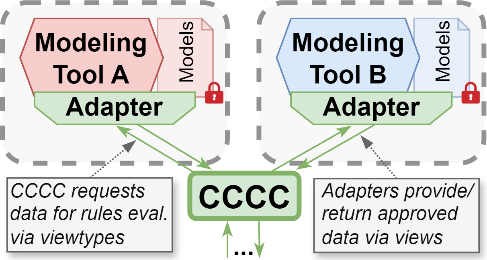
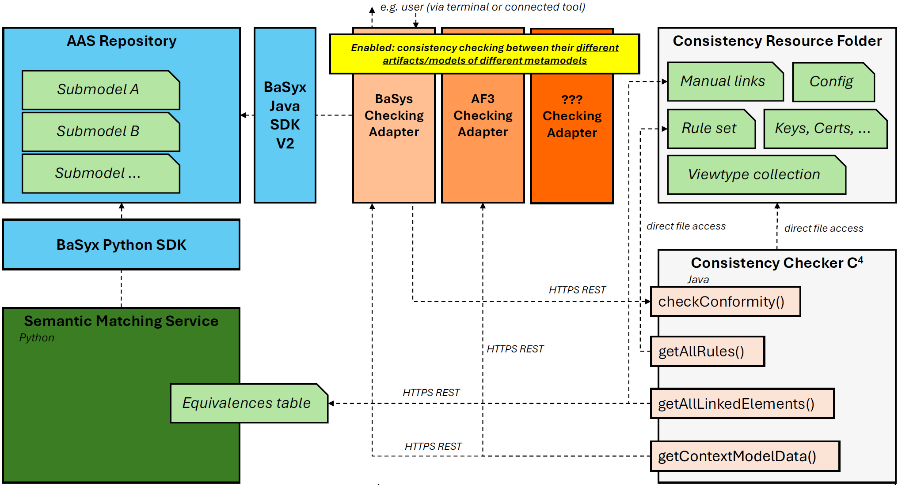
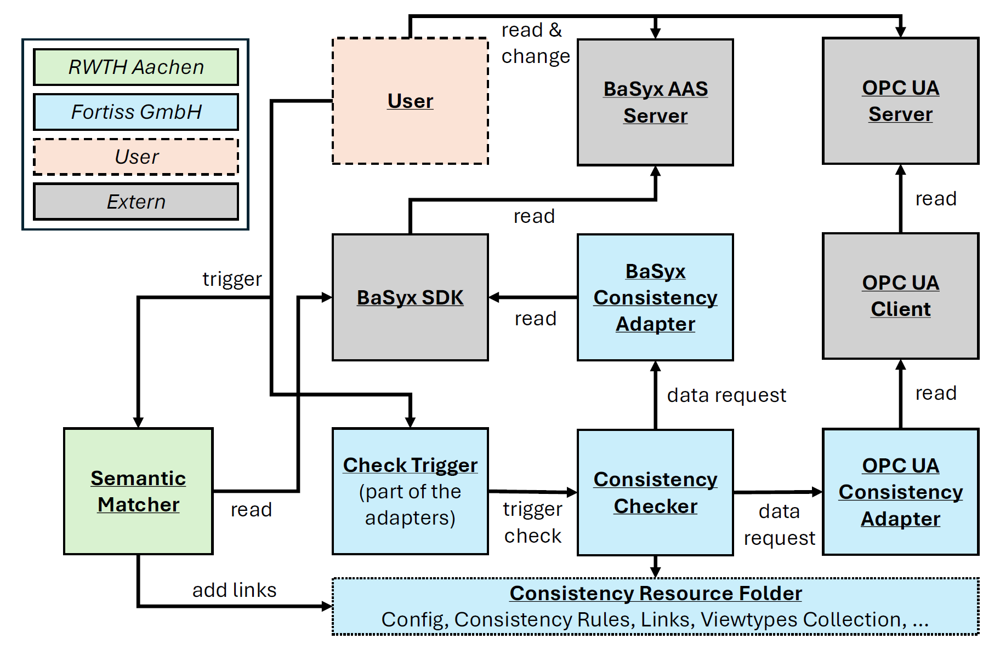

# Implementation of the Checker

## Overview
To be able to check conformity and consistency between different data sources, especially in the context of Digital Twins, we have implemented the "Central Confidential Consistency Checker", short C4 or CCCC. This page should not provide a full description and explanation of it, since we did this already in a published paper and will do so in upcoming ones. This page should only increase the awareness that this concept and prototype exists already and link to the first paper and the implementation/demonstration.

The published paper about an early prototype of this checker:
[Modular Consistency Checking Between Heterogeneous Models Without Direct Data Exchange Between Collaborators](https://dl.acm.org/doi/10.1145/3652620.3688554)

## Coverage/Advantages
- **Heterogeneity**:
  - The checker can check rules across different models or data sources, even when they are from different tools and based on different metamodels/types. This is made possible due to a generic viewtype collection that the checker is using internally and the general middleman-adapter concept. The viewtype collection can be seen as some kind of metamodel (parts) collection and contains different element types. The checker can only understand element types that are present in this collection. The transformation between these generic consistency types and the related tool-specific types happens in the consistency adapters, because only the adapters have the actual connection to their tool and can build this relation.
  - Besides connecting the consistency checker to digital twins and submodels on the example of BaSyx, we have also connected it to architecture, behavior and deployment modeling tools (AutoFOCUS3 and OpenModelica), to a CAD modeling tool (Autodesk Fusion 360), and to OPC UA servers. This can easily be extended (see next).
- **Extensibility**:
  - Consistency rules and links can be directly modified by the user.
  - Connecting new data sources and tools to the checking environment can be done by a developer with the modular adapter concept (without needing to change anything on the actual checker or the other consistency adapters).
  - The viewtype collection (common type base between the connected data sources) can be extended via Ecore models.
- **Confidentiality preservation** of data during consistency checking:
  - No direct data exchange between the data sources / adapters.
  - Checker does not forward received data except the final feedback.
  - If data is exchanged (with the central checker), it is always encrypted (hybrid).
  - Who is allowed to check what and get which feedback is managed via access control policies (ABAC).
  - Further security elements are still in progress.

## Architecture
Example architecture of the checker when connected to BaSyx:

## Technology Stack
- The consistency checker is built with Java and is thus an executable JAR.
- The consistency checker offers a HTTPS REST API via the Spring Framework to communicate with consistency adapters.
- The consistency adapters can therefore be written in any programming language. Currently, we have adapters written in Java and Python.
- We use TLSv1.3 socket connections with enforced handshakes and authentication on both sides, enabling a two-way authenticated and end-to-end encrypted server-client communication between the checker and the adapters. Besides, the internal hybrid encryption of the exchanged data is done with Google Tink.
- The management of the model element types and the common ground between the adapters and the checker is based on EMF via Ecore models.
- The currently used consistency rule evaluator is based on OCL.

## Deployment & Usage
### Open-source demonstration
We have built a demonstration of how the consistency checker works in an environment with BaSyx submodels and OPC UA servers, and pushed it to an opens-source repository:

https://git.fortiss.org/basys/BaSyx-OPCUA-ConsistencyDemo

It is completely containerized with Docker. You can try it out under Windows and Linux/Ubuntu.

Demo setup:

This is only the demonstration of a prototype and research object. Is is not fine-tuned or made very user-friendly. It should only show that consistency checking is also possible within the BaSys/AAS context (since the checker is built very generic and already tried out for other modeling contexts, like CAD or architecture, logical and deployment models). You will also not find the source code of the consistency checker and adapters in that repository, since this is only the demonstrator. If you are more interested in this topic and want to know about it (maybe also extend/tailor the consistency checker for your needs), feel free to contact the [MBSE Team of fortiss GmbH](https://www.fortiss.org/en/research/fields-of-competence/detail/model-based-systems-engineering).

### Quickstart tutorial
This is written in the actual demo repository as well, and you need to execute everything [there](https://git.fortiss.org/basys/BaSyx-OPCUA-ConsistencyDemo) (only stated here to show with which little effort you can try it out).

First, you need to match the [prerequisites](https://git.fortiss.org/basys/BaSyx-OPCUA-ConsistencyDemo#prerequisites) (install Docker and make sure `LOCALHOST_IP` in `.env` fits to your OS). Then, you choose a build profile from [Build profiles](https://git.fortiss.org/basys/BaSyx-OPCUA-ConsistencyDemo#build-profiles) and run it (e.g., `docker compose --profile all up --build`). Afterwards, you follow [Conduct a consistency check](https://git.fortiss.org/basys/BaSyx-OPCUA-ConsistencyDemo#conduct-a-consistency-check) (e.g., `docker exec -t basyx-opc-ua-demo_basyx-c-adapter curl http://localhost:9001/trigger`). Congratulation, you have just triggered a consistency check. 

Everything else in this README is then to explain what happens in the example ([Example consistency check](https://git.fortiss.org/basys/BaSyx-OPCUA-ConsistencyDemo#example-consistency-check)), how you can look into the used models/data and the feedback ([Environment visualization](https://git.fortiss.org/basys/BaSyx-OPCUA-ConsistencyDemo#environment-visualization) and end of [Conduct a consistency check](https://git.fortiss.org/basys/BaSyx-OPCUA-ConsistencyDemo#conduct-a-consistency-check)), and especially how you could change the pre-build check that is always initially triggered ([Configure the checking environment](https://git.fortiss.org/basys/BaSyx-OPCUA-ConsistencyDemo#configure-the-checking-environment)).
