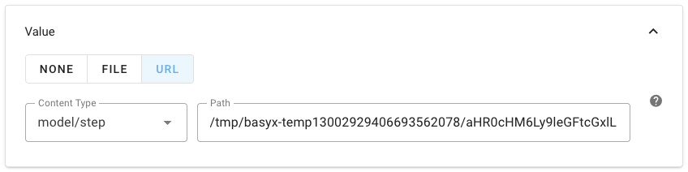

# CAD Data Integration

For many machine builders and engineering companies, CAD data is a central part of the Digital Twin. While the Asset Administration Shell (AAS) provides a standardized framework for Digital Twins, many organizations in this domain lack deep IT expertise to integrate CAD models effectively.
BaSyx addresses this challenge by making CAD data integration simple, standardized, and directly usable inside the AAS ecosystem.

As per AAS specification, all files (including CAD files) are represented as SubmodelElements of the type `File`. BaSyx implements this according to Part 1 of the AAS specification leveraging the meta model implementation provided by Eclipse AAS4J. In addition, BaSyx offers the standardized `/attachment` endpoints for easy file upload and download according to the AAS specification Part 2.

## CAD Support in BaSyx

BaSyx goes beyond the basic AAS specification by providing specialized support for CAD files. This includes:

- **Visualization Panel in BaSyx AAS Web UI**: The BaSyx AAS Web UI includes a dedicated visualization panel that can render CAD files directly within the browser. This panel supports common CAD formats such as STL, OBJ and glTF, allowing users to visualize 3D models without needing specialized software. Other file formats are supported as well, but not visualized.

  ```{figure} images/cad_visualization_panel.png
  ---
  name: cad_visualization_panel
  ---
  Visualization of a CAD model in the BaSyx AAS Web UI Visualization Panel.
  ```

- **Easy Integration**: The integration of CAD files into the AAS is straightforward. Users can upload CAD files via the `/attachment` endpoint, and these files are automatically linked to the corresponding `File` SubmodelElement.

- **Standardized Access**: Once integrated, CAD files can be accessed and managed using standard AAS operations, making it easy to incorporate them into broader Digital Twin applications. This also includes downloading the files via the `/attachment` endpoint.

```{note}
An example setup can be found in the <a href="https://github.com/eclipse-basyx/basyx-java-server-sdk/tree/main/examples/BaSyxCADFiles" target="_blank">Examples on GitHub</a>. Feel free to try it out yourself!
```

## Example Workflow

1. Create or select an AAS Submodel in the BaSyx AAS Web UI
2. Add a File Submodel Element for the CAD file

   ```{figure} images/add_sme.png
   ---
   name: add_sme
   ---
   Adding a Submodel Element.
   ```

   ```{figure} images/add_file_sme.png
   ---
   name: add_file_sme
   ---
   Adding a File Submodel Element.
   ```

3. Upload a CAD file via the AAS Editor (drag & drop or file selection)

   ```{figure} images/cad_upload.png
   ---
   name: cad_upload
   ---
   Uploading a CAD file.
   ```

4. Preview the model in the Web UI (if supported format)
5. Distribute or share the CAD file through the AAS interfaces (attachment endpoints)

   ```{figure} images/cad_download.png
   ---
   name: cad_download
   ---
   Downloading a CAD file.
   ```

6. Share the AAS including the CAD file using the standardized AASX file format by downloading the AAS

   ```{figure} images/aas_download.png
   ---
   name: aas_download
   ---
   Downloading an AAS including the CAD file.
   ```

```{warning}
Some content types may not be recognized automatically by the browser when uploading CAD files. In this case, you can manually set the content type in the AAS Editor after uploading the file. Those are the most common content types for CAD files:

| File Extension | Content Type        |
|----------------|---------------------|
| .stl           | application/sla     |
| .obj           | application/obj     |
| .gltf          | model/gltf+json     |
| .step/.stp     | model/step          |


```

## Additional Resources

For more information about file integrations with BaSyx:

- [BaSyx Components Documentation](../../user_documentation/basyx_components/index.md)
- [BaSyx AAS Web UI Visualization Panel](../../user_documentation/basyx_components/web_ui/index.html#visualization-panel)
