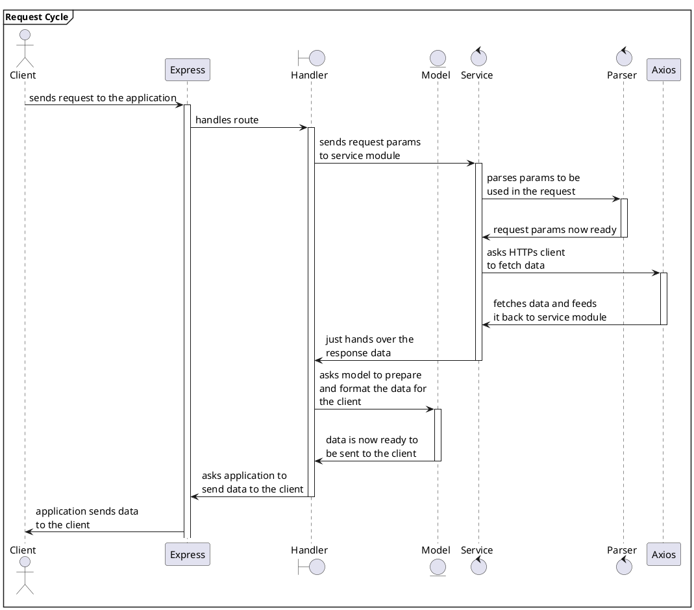

# Live Data Integration

An essential functionality when deploying Digital Twins is the possibility to exchange live data between an asset and the Digital Twin. This is also true for the Asset Administration shell as standardized Digital Twins. In the case of the BaSyx ecosystem, the BaSyx Databridge plays a crucial role in facilitating this data exchange.

This section covers data integration capabilities provided by BaSyx, particularly focusing on the BaSyx Databridge component. The following example will illustrate how to use the Databridge to retrieve data from a MQTT datasource (broker) and transfer it into Properties inside of an AAS Submodel.

## Data Flow Architecture

The following diagram illustrates the data flow from an MQTT client through the Mosquitto broker, BaSyx Databridge, to the AAS Environment:

:::{uml}


```{note}
The example can be found on in the <a href="https://github.com/eclipse-basyx/basyx-java-server-sdk/tree/main/examples/BaSyxDatabridge" target="_blank">Examples on GitHub</a>. Feel free to try it out yourself!
```

```{include} ../../../_external/basyx-java-server-sdk/examples/BaSyxDatabridge/README.md
```

## Additional Resources

For more information about data integration with BaSyx:

- [BaSyx Components Documentation](../../user_documentation/basyx_components/index.md)
- [Device Integration Concepts](../../user_documentation/concepts%20and%20architecture/device_integration.md)
- [BaSyx Databridge Documentation](../../user_documentation/basyx_components/databridge/index.md)
- [BaSyx Databridge on GitHub](https://github.com/eclipse-basyx/basyx-databridge)
