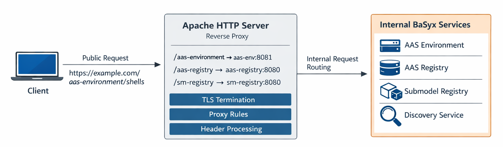

# Reverse Proxy with BaSyx

In distributed **Asset Administration Shell (AAS)** environments, BaSyx
components such as **AAS Environments**, **Registries**, and **Discovery
Services** are often deployed as independent services. While this provides
flexibility and scalability, it also introduces challenges related to
**Networking**, **URL Consistency**, **Security**, and **External
Accessibility**.

A **reverse proxy** addresses these challenges by acting as a **single,
central entry point** for all external requests and routing them to the
appropriate BaSyx components internally.

In BaSyx-based setups, **Apache HTTP Server (httpd)** can be used as a
robust and widely adopted reverse proxy implementation.

---

## Motivation and Use Case

Without a reverse proxy, BaSyx services typically expose:

- Different ports per service (e.g. `8080`, `8081`, `3000`)
- Internal Docker hostnames (e.g. `aas-env`, `aas-registry`)
- URLs that are **not externally resolvable**

This leads to problems such as tight coupling between infrastructure and client configuration.

A **reverse proxy with Apache** solves these issues by providing:

- A **single public base URL**
- Path-based routing to BaSyx components
- Centralized TLS termination and header handling

---

## Reverse Proxy Architecture Overview

The following diagram illustrates the typical interaction between a
Client, Apache as reverse proxy, and BaSyx components.



**Key idea:**

- Clients communicate exclusively with **Apache**
- Apache forwards requests to internal BaSyx services
- BaSyx services run with internal hostnames and ports
- Public URLs are consistent and externally reachable

---

## Example Request Flow

1. A client sends a request to a public URL:  
   `https://example.com/aas-environment/shells`

2. Apache receives the request and matches it via path-based routing:  
   `/aas-environment → aas-env:8081`

3. The request is forwarded to the internal BaSyx service.

4. The response is returned to the client via Apache.

---

## BaSyx-Specific Configuration Requirements

Using a reverse proxy with BaSyx requires **explicit configuration on
both sides**.

### 1. Apache HTTP Server Configuration

Apache defines how external paths are mapped to internal services using
`mod_proxy` and `mod_proxy_http`.

Example configuration:

```apache
ProxyPass /aas-environment/ http://aas-env:8081/aas-environment/
ProxyPassReverse /aas-environment/ http://aas-env:8081/aas-environment/
```

This configuration ensures that all requests to `/aas-environment` are
forwarded to the correct BaSyx container.

In a typical setup, Apache exposes multiple BaSyx components, such as:

- AAS Environment
- AAS Registry
- Submodel Registry
- AAS Discovery Service
- AAS Web UI

All of them are reachable under a shared public base URL using distinct
context paths.

---

### 2. Context Path Configuration in BaSyx

BaSyx services must be aware of the context path under which they are
exposed externally.

Example (`application.properties`):

```properties
server.servlet.context-path=/aas-environment
```

This ensures that internal routing and generated links are consistent
with the reverse proxy configuration.

---

### BaSyx Components

The BaSyx Registries are configured in the `docker-compose.yml` file.
You can change the port mappings as well as the context path there.

To change the context path of the AAS Environment and the AAS Discovery Service, you have to modify the `basyx/aas-env.properties` file and the `basyx/aas-discovery.properties` file.

### AAS Env Registry Integration

To ensure that the Registries contain the correct URLs of the AASs and Submodels, the `basyx.externalurl` property in the `basyx/aas-env.properties` file must be set to the URL of the AAS Environment.

---

## Summary

A reverse proxy is a fundamental building block for production-ready
BaSyx deployments.

In combination with **Apache HTTP Server**, it provides:

- Centralized access to all AAS-related services
- Clean and stable public URLs
- Correct endpoint registration in registries
- Improved security and centralized header handling
- Decoupling of internal infrastructure from external consumers

Correct configuration of Apache and all used BaSyx Components is essential to ensure a reliable and interoperable Digital Twin in a distributed environment.

---

## Additional Resources

For more information about Apache and BaSyx Reverse Proxy:

- [Download BaSyx Example](https://github.com/eclipse-basyx/basyx-java-server-sdk/tree/main/examples/BaSyxReverseProxy)
- [Apache ReverseProxy Documentation](https://httpd.apache.org/docs/2.4/howto/reverse_proxy.html)
