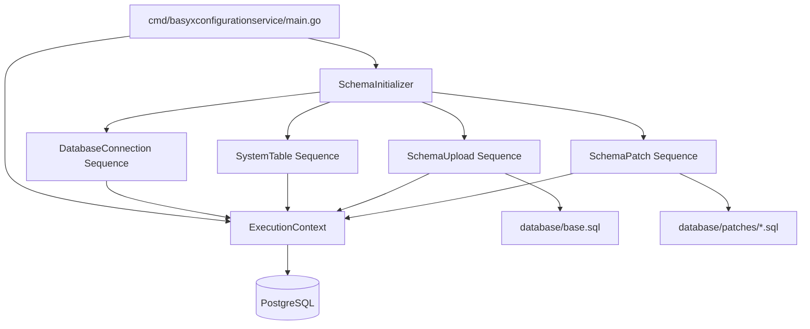

# Architecture Overview

The BaSyx Configuration Service is a one-shot command-line service. It does not expose API endpoints and does not run as a daemon.

## Main Components

| Component | Location | Responsibility |
| --- | --- | --- |
| Service entry point | `cmd/basyxconfigurationservice/main.go` | Parses flags, creates the shared execution context, registers sequences, executes the initializer. |
| Schema initializer | `internal/basyxconfigurationservice/schema_initializer.go` | Stores ordered sequences and executes them one after another. |
| Sequence interface | `internal/basyxconfigurationservice/sequences/i_sequence.go` | Defines the executable contract for initialization steps. |
| Execution context | `internal/basyxconfigurationservice/sequences/execution_context.go` | Shares loaded configuration and the database handle between sequences. |
| Database connection sequence | `internal/basyxconfigurationservice/sequences/database.go` | Loads config, builds the PostgreSQL DSN, opens the database connection, applies pool settings. |
| System table sequence | `internal/basyxconfigurationservice/sequences/system_table.go` | Creates and seeds `basyxsystem` when required. |
| Schema upload sequence | `internal/basyxconfigurationservice/sequences/schema_upload.go` | Uploads `base.sql` when the base schema is not initialized. |
| Schema patch sequence | `internal/basyxconfigurationservice/sequences/schema_patch.go` | Applies a registered patch when the database version is older than the patch target version. |

## Component Diagram

## Interaction Overview

The entry point registers sequences explicitly. The initializer does not discover sequences automatically. Each sequence receives the same `ExecutionContext`, allowing earlier sequences to provide state for later sequences.

The database connection sequence populates the context with `Config` and `DB`. All later database-related sequences require `ctx.DB` to be set.

