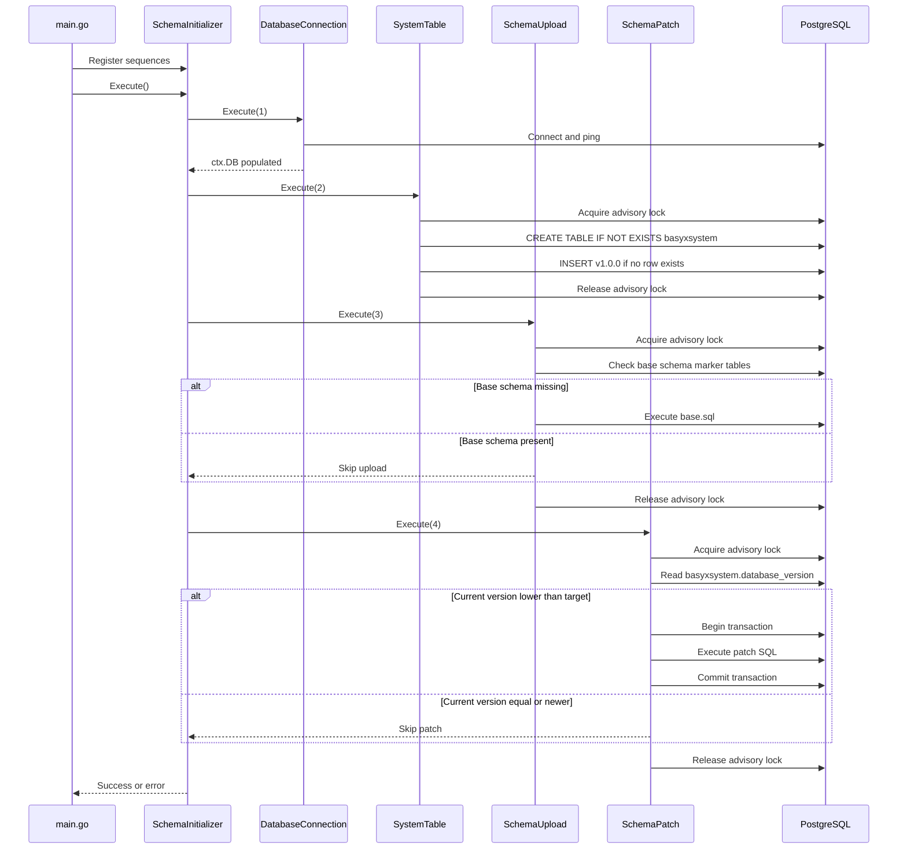

# Execution Flow

## Startup Lifecycle

The service lifecycle is deterministic and runs before the BaSyx services start:

1. Parse command-line flags.
2. Create an empty `ExecutionContext`.
3. Create a `SchemaInitializer`.
4. Register sequences in the intended execution order.
5. Execute all sequences sequentially.
6. Close the database handle.
7. Exit with status `0` on success or status `1` on failure.

## Current Registered Order

The service currently registers:

1. `DatabaseConnection`
2. `SystemTable`
3. `SchemaUpload`
4. `SchemaPatch` for `101.sql` targeting `v1.0.1`

These components are described in the [architecture overview](architecture.md).

## Flow Diagram



```{hint}
The diagram shows the current example with one registered patch path to `v1.0.1`. If multiple patches are registered, the `SchemaPatch` step repeats in registration order.
```

## Error Handling

`SchemaInitializer.Execute()` stops on the first sequence error. Errors are wrapped with `BASYXCFG-INIT-EXECSTEP`, including the failed sequence index and status code.

Sequences return:

- `0, nil` on success.
- Non-zero status and an error on failure.

The main function logs the wrapped error as `BASYXCFG-MAIN-EXECUTE` and exits with status `1`.

## Locking Behavior

`SystemTable`, `SchemaUpload`, and `SchemaPatch` use the same PostgreSQL advisory lock ID. This serializes schema changes across concurrent Configuration Service instances.

The patch sequence acquires the advisory lock before reading the current database version. This prevents two instances from both deciding that a patch must run based on the same old version.
