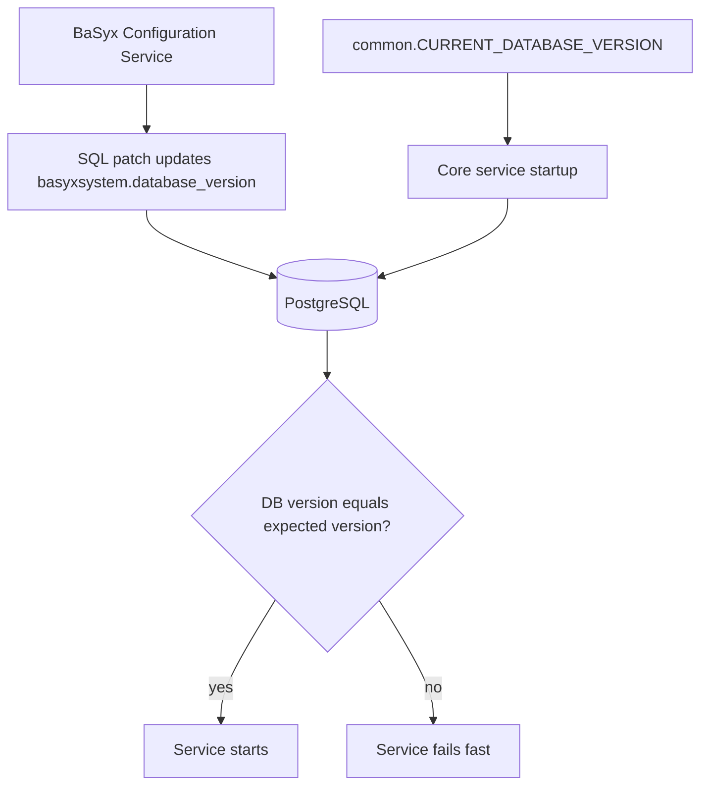

# Release Advisor

This guide explains how to keep BaSyx core services, database patches, Docker images, examples, and CI checks in sync when releasing changes that affect the database schema.

## Release Principle

The BaSyx Configuration Service owns database initialization and patch execution. Regular BaSyx core services do not migrate the database; they validate that the database version matches the version they expect.

For every schema-affecting release, these parts must move together:

- `database/base.sql`
- `database/patches/*.sql`
- Patch registration in `cmd/basyxconfigurationservice/main.go`
- `common.CURRENT_DATABASE_VERSION` in `internal/common/database.go`
- Docker images for the Configuration Service and affected BaSyx core services
- Docker Compose examples and integration-test compose files
- CI test and release workflows

If one part is updated without the others, deployments can fail at startup or run with an incompatible schema.

## Core Service Synchronization Model

Core services call the common database version validation during startup. The expected version is defined centrally as `common.CURRENT_DATABASE_VERSION`.



The Configuration Service must be able to bring the database to the same version that core services expect. For example, if `CURRENT_DATABASE_VERSION` is `v1.0.2`, the Configuration Service must register and execute patches up to `v1.0.2`.

## Schema Release Checklist

Use this checklist whenever a release changes the database schema.

- Add a new SQL patch file under `database/patches`.
- Ensure the patch file updates `basyxsystem.database_version` to the new target version.
- Register the new patch in `cmd/basyxconfigurationservice/main.go` after all older patches.
- Update `common.CURRENT_DATABASE_VERSION` in `internal/common/database.go` to the new target version.
- Keep `database/base.sql` aligned with the full schema expected for fresh installations.
- Do not edit already released patch files.
- Verify Docker Compose files start `basyx_configuration` before services that validate the database version.
- Ensure release and snapshot workflows include the Configuration Service image.
- Run unit tests for `internal/basyxconfigurationservice`.
- Run representative integration tests for services affected by the schema change.

## Fresh Installations vs Upgrades

Fresh installations and upgrades both need to end at the same database version.

| Scenario | Expected behavior |
| --- | --- |
| Fresh database | `SystemTable` creates `basyxsystem` with `v1.0.0`, `SchemaUpload` uploads `base.sql`, then registered patches advance the version. |
| Existing database at old version | `SchemaUpload` skips the base schema when base tables exist, then newer registered patches run sequentially. |
| Existing database already current | Base schema upload and already applied patches are skipped. |

Because fresh installations also run patches, `base.sql` and patches must be compatible. A schema change that is included in `base.sql` should still have a safe patch for existing installations, usually using `IF EXISTS` or `IF NOT EXISTS` guards where appropriate.

## Version Alignment Example

When releasing `v1.0.2`:

1. Create `database/patches/102.sql`.
2. End the patch with:

```sql
UPDATE basyxsystem
SET database_version = 'v1.0.2'
WHERE identifier = (
  SELECT identifier
  FROM basyxsystem
  ORDER BY identifier ASC
  LIMIT 1
);
```

3. Register the patch:

```go
schemInit.Register(steps.NewSchemaPatch(execCtx, filepath.Join(patchBasePath, "101.sql"), "v1.0.1"))
schemInit.Register(steps.NewSchemaPatch(execCtx, filepath.Join(patchBasePath, "102.sql"), "v1.0.2"))
```

4. Update the expected service version:

```go
const (
    CURRENT_DATABASE_VERSION = "v1.0.2"
)
```

5. Build and release both the Configuration Service image and the affected BaSyx core service images from the same commit or release tag.

## Docker Image Release Coordination

The Configuration Service image contains the database SQL files copied from the repository. Therefore, the image version matters for schema releases.

For a release tag, ensure that:

- `eclipsebasyx/basyxconfigurationservice-go` is built from the same tag as the core service images.
- Core service images contain the matching `CURRENT_DATABASE_VERSION` constant.
- Examples and deployment manifests use compatible image tags.

Avoid combining a newer core service image with an older Configuration Service image. The core service may expect a database version that the old Configuration Service cannot create.

## Docker Compose Coordination

Any compose file that starts a database-backed BaSyx service should include the Configuration Service as a completed dependency.

Recommended pattern:

```yaml
services:
  basyx_configuration:
    image: eclipsebasyx/basyxconfigurationservice-go:<release-tag>
    depends_on:
      db:
        condition: service_healthy

  submodelrepository:
    image: eclipsebasyx/submodelrepository-go:<release-tag>
    depends_on:
      basyx_configuration:
        condition: service_completed_successfully
      db:
        condition: service_healthy
```

This prevents core services from starting before schema initialization and patches are complete.

## CI and Release Workflow Checks

Before merging or releasing schema changes, verify:

- The Configuration Service unit tests run in CI.
- Database-related path filters include `database/**` where relevant.
- Docker snapshot and release workflows include `basyxconfigurationservice` in their image matrix.
- Container vulnerability scanning includes the Configuration Service image when image matrices are changed.
- Integration tests use compose files with `basyx_configuration` dependencies.

Useful local checks include:

```bash
go test -v ./internal/basyxconfigurationservice/...
go test ./cmd/basyxconfigurationservice
go vet ./internal/basyxconfigurationservice/... ./cmd/basyxconfigurationservice
```

Run affected integration tests when schema changes touch service behavior.

## Common Release Failure Modes

| Failure | Likely cause | Fix |
| --- | --- | --- |
| Core service fails with database version mismatch | `CURRENT_DATABASE_VERSION` is newer than the DB version produced by the Configuration Service. | Add/register the missing patch or align image versions. |
| Patch runs but version remains old | Patch SQL does not update `basyxsystem.database_version`. | Add the mandatory version update to the patch. |
| Fresh installation differs from upgraded installation | `base.sql` and patch files are not equivalent. | Update `base.sql` and provide a safe patch for existing databases. |
| Service starts before schema is ready | Compose/Kubernetes startup ordering does not wait for the Configuration Service. | Add dependency on successful Configuration Service completion. |
| Reproducibility differs between environments | Released patch was modified after use. | Restore immutability and add a corrective follow-up patch. |

## Release Review Questions

Ask these before approving a schema-related release:

- What database version will this release produce?
- Does `CURRENT_DATABASE_VERSION` match that produced version?
- Can a fresh database and an upgraded database both reach the same final schema?
- Are all patches registered in deterministic order?
- Does every new patch update `basyxsystem.database_version`?
- Are Docker images for the Configuration Service and core services released together?
- Do examples and integration tests use the Configuration Service dependency pattern?
- Have already released patches remained unchanged?

