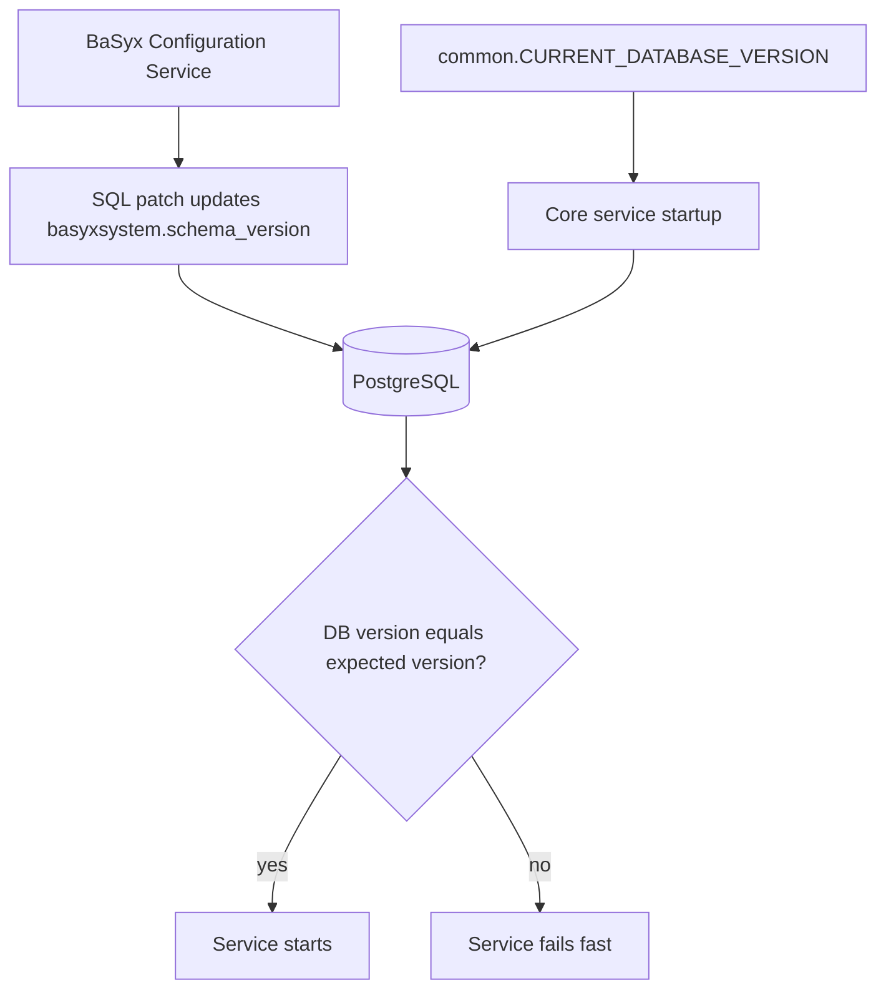

# Release Advisor

This guide explains how to keep BaSyx core services, database patches, Docker images, and examples in sync when releasing changes that affect the database schema.

## Release Principle

The BaSyx Configuration Service owns database initialization and patch execution. Regular BaSyx core services do not migrate the database; they validate that the database version matches the version they expect.

For every schema-affecting release, these parts must move together:

- `database/base.sql`
- `database/patches/*.sql`
- Patch registration in `cmd/basyxconfigurationservice/main.go`
- `common.CURRENT_DATABASE_VERSION` in `internal/common/database.go`
- Docker images for the Configuration Service and affected BaSyx core services
- Docker Compose examples and integration-test compose files

If one part is updated without the others, deployments can fail at startup or run with an incompatible schema.

## Core Service Synchronization Model

Core services call the common database version validation during startup. The expected version is defined centrally as `common.CURRENT_DATABASE_VERSION`.



```{hint}
The Configuration Service must be able to bring the database to the same version that core services expect. For example, if `CURRENT_DATABASE_VERSION` is `v1.0.2`, the Configuration Service must register and execute patches up to `v1.0.2`.
```

```{warning}
The Configuration Service version should match the version of the BaSyx service, for example the AAS Repository, so the database version produced during startup is the same version expected by the running service.
```

## Schema Release Checklist

Use this checklist whenever a release changes the database schema.

- Add a new SQL patch file under `database/patches`.
- Ensure the patch file updates `basyxsystem.schema_version` to the new target version and leaves `basyxsystem.state` as `clean`.
- Register the new patch in `cmd/basyxconfigurationservice/main.go` after all older patches.
- Update `common.CURRENT_DATABASE_VERSION` in `internal/common/database.go` to the new target version.
- Keep `database/base.sql` aligned with the full schema expected for fresh installations.
- Do not edit already released patch files.
- Verify Docker Compose files start `basyx_configuration` before services that validate the database version.
- Run unit tests for `internal/basyxconfigurationservice`.
- Run representative integration tests for services affected by the schema change.

## Fresh Installations vs Upgrades

| Scenario | Expected behavior |
| --- | --- |
| Fresh database | `SystemTable` creates `basyxsystem` with `v1.0.0`, `SchemaUpload` uploads `base.sql`, then registered patches advance the version. |
| Existing database at old version | `SchemaUpload` skips the base schema when base tables exist, then newer registered patches run sequentially (including `SystemTable` version bump to the newest patch version). |
| Existing database already current | Base schema upload and already applied patches are skipped. |

## Version Alignment Example

When releasing `v1.0.2`:

1. Create [`database/patches/102.sql`](https://github.com/eclipse-basyx/basyx-go-components/tree/main/database/patches).
2. End the patch with:

```sql
UPDATE basyxsystem
SET schema_version = 'v1.0.2',
    state = 'clean'
WHERE identifier = (
  SELECT identifier
  FROM basyxsystem
  ORDER BY identifier ASC
  LIMIT 1
);
```

3. Register the patch in [`cmd/basyxconfigurationservice/main.go`](https://github.com/eclipse-basyx/basyx-go-components/blob/main/cmd/basyxconfigurationservice/main.go):

```go
schemInit.Register(steps.NewSchemaPatch(execCtx, filepath.Join(patchBasePath, "101.sql"), "v1.0.1"))
schemInit.Register(steps.NewSchemaPatch(execCtx, filepath.Join(patchBasePath, "102.sql"), "v1.0.2"))
```

4. Update the expected service version in [`internal/common/database.go`](https://github.com/eclipse-basyx/basyx-go-components/blob/main/internal/common/database.go):

```go
const (
    CURRENT_DATABASE_VERSION = "v1.0.2"
)
```

5. Build and release the Configuration Service image and the affected BaSyx core service images with matching versions.

## Docker Compose Coordination

Any compose file that starts a database-backed BaSyx service should include the Configuration Service as a completed dependency.

Recommended pattern:

```yaml
services:
  basyx_configuration:
    image: eclipsebasyx/basyxconfigurationservice-go:<release-tag>
    depends_on:
      db:
        condition: service_healthy

  submodelrepository:
    image: eclipsebasyx/submodelrepository-go:<release-tag>
    depends_on:
      basyx_configuration:
        condition: service_completed_successfully
      db:
        condition: service_healthy
```

This prevents core services from starting before schema initialization and patches are complete.
