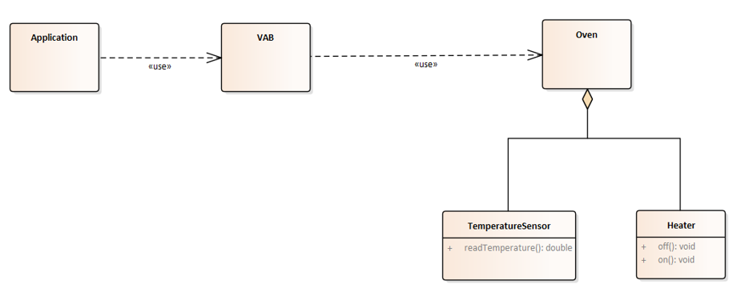

# Example 1 - Local VAB Access
In this first example, an oven will be connected to the VAB. Next, the VAB will be used to access and control the oven.



## Example Code
To do this, we first need to describe the oven in a model and provide this model to the VAB. As [described](../../../vab_providers/index.md), maps can be used for easy definition of models. Thus, an initial model of the oven using Maps is defined. Additionally, the already existing interface to the oven has to be integrated into the map model. To do this, the [Lambda Provider](../../../vab_providers/lambda_provider.md) is used.

```java
import java.util.HashMap;
import java.util.Map;
import java.util.function.Function;
import java.util.function.Supplier;
 
import org.eclipse.basyx.vab.modelprovider.api.IModelProvider;
import org.eclipse.basyx.vab.modelprovider.lambda.VABLambdaProvider;
import org.eclipse.basyx.vab.modelprovider.lambda.VABLambdaProviderHelper;
import org.slf4j.Logger;
import org.slf4j.LoggerFactory;
 
/**
 * The Virtual Automation Bus maps communication semantics to five simple primitives:
 * - CREATE, DELETE, RETRIEVE, UPDATE, INVOKE
 * These primitive functions are represented in the IModelProvider interface.
 * 
 * In this HandsOn, a local model provider is created that gives access to an oven model via these primitives.
 * Remote connections and the AAS metamodel is excluded for now.
 * 
 * A virtual "Oven" with a heater and a temperature sensor is used.
 * It is specific to this HandsOn and can be used in the following way:
 * Oven oven = new Oven()
 * Heater heater = oven.getHeater();
 * heater.activate(); // turns the heater on
 * heater.deactivate(); // turns the heater off
 * TemperatureSensor sensor = oven.getSensor();
 * double temperature = sensor.readTemperature(); // gets the current temperature in the oven
 * 
 * 
 * Expected console output in this HandsOn:
 * - the heater id
 * - oven is activated and deactivated multiple times
 * - temperature values between 30 and 40
 * 
 */
public class Scenario1 {
	// Initializes a logger for the output
	private static final Logger logger = LoggerFactory.getLogger(Scenario1.class);
 
	public static void main(String[] args) throws Exception {
		// Create a model for an oven device. Models in the BaSyx Java SDK are based on
		// HashMaps.
		Map<String, Object> myOvenModel = createMyOvenModel(new Oven());
 
		// Wrap the device model in a VAB model provider. In this case, a
		// VABLambdaProvider is used that enables dynamic resolution of model
		// properties. There are also other providers like the VABMapProvider and the
		// FileSystemProvider
		IModelProvider provider = new VABLambdaProvider(myOvenModel);
 
		// Now you can access the properties of the oven via the five primitives using
		// the model provider.
		// CREATE: IModelProvider::createValue
		// DELETE: IModelProvider::deleteValue
		// RETRIEVE: IModelProvider::getModelPropertyValue
		// UPDATE: IModelProvider::setModelPropertyValue
		// INVOKE: IModelProvider::invokeOperation
 
		String id = (String) provider.getValue("/properties/id");
		logger.info("Heater id: " + id);
		// NOTE A: getModelPropertyValue has "Object" as the return type, so you
		// probably will have to cast the result to the appropriate type.
		// NOTE B: The argument "/properties/id" references the static id property of
		// the model. This path depends on the structure of the HashMap =>
		// /properties/id assumes that the model structure matches the intended map
		// structure that is proposed at the beginning of "helperfunction".
 
		// The operations can be invoked via the model provider like this:
		provider.invokeOperation("/operations/activateOven");
 
		// Now that the oven is on, we don't want it to get too hot, so we implement a
		// simple bang-bang controller
		for (int i = 0; i < 100; i++) {
			// Pause for 100ms
			Thread.sleep(100);
 
			// Retrieve the current temperature from the model provider
			double temperature = (double) provider.getValue("/properties/temperature");
			logger.info("Current temperature: " + temperature);
 
			// Turn the oven on/off, depending on the defined temperature range
			if (temperature > 40) {
				provider.invokeOperation("/operations/deactivateOven");
			} else if (temperature < 30) {
				provider.invokeOperation("/operations/activateOven");
			}
		}
	}
 
	public static Map<String, Object> createMyOvenModel(Oven oven) {
		/*  Pseudo-Code for the intended map structure of the oven model:
		 * 	myModel = new HashMap(
		 * 		properties: new HashMap(
	 	 * 			id: "heater01", 
	 	 * 			temperature: Dynamic *Lambda-Property* that represents the current oven temperature,
		 * 		),
		 * 		operations: new HashMap(
		 * 			activateOven: *Function* for activating the oven,
	 	 * 			deactivateOven: *Function* for deactivating the oven
	 	 * 		)
	 	 * 	)
		 */
 
		// Create an empty container for custom properties
		Map<String, Object> properties = new HashMap<>();
 
		// Add a static element
		properties.put("id", "heater01");
 
		// Now we want to create a dynamic property that can resolve its value during runtime
		// 1. Create a supplier function that can determine the oven temperature using the +sensor
		Supplier<Object> lambdaFunction = () -> oven.getSensor().readTemperature();
 
		// 2. Use a VABLambdaProviderHelper in order to create a lambda property out of that supplier
		// NOTE: A setter function is not required (=> null), because a sensor temperature is "read only"
		Map<String, Object> lambdaProperty = VABLambdaProviderHelper.createSimple(lambdaFunction, null);
 
		// 3. Add that lambda property to the model exactly like the static property before
		properties.put("temperature", lambdaProperty);
 
		// Create an empty container for custom operations
		Map<String, Object> operations = new HashMap<>();
 
		// Add a function that activates the oven and implements a functional interface
		// Creation of this function needs to follow this method signature for Function. 
		// In the release version 1.1, this will be simplified.
		Function<Object, Object> activateFunction = (args) -> {
			oven.getHeater().activate();
			return null;
		};
 
		// Add a function that deactivates the oven and implements a functional interface
		operations.put("activateOven", activateFunction);
 
		// Add a function that deactivates the oven and implements a functional interface
		Function<Object, Object> deactivateFunction = (args) -> {
			oven.getHeater().deactivate();
			return null;
		};
 
		// Add a function that deactivates the oven and implements a functional interface
		operations.put("deactivateOven", deactivateFunction);
 
		// Create a root map and return a single model with the created operations and properties
		Map<String, Object> myModel = new HashMap<>();
		myModel.put("operations", operations);
		myModel.put("properties", properties);
		return myModel;
	}
}
```

## Expected Output
You should see something like the following few lines in your console. The time at the start of each will be your current time. At first you will see what id the selected heater has. The temperature values at the end of the lines may differ by a small margin and will fluctuate between ~30 and ~40 as the heater is activated or deactivated multiple times.

```
15:07:57.283 [main] INFO  i.Scenario1 - Heater id: heater01
Heater: activated
15:07:57.394 [main] INFO  i.Scenario1 - Current temperature: 23.0
15:07:57.502 [main] INFO  i.Scenario1 - Current temperature: 25.7
15:07:57.610 [main] INFO  i.Scenario1 - Current temperature: 28.13
15:07:57.719 [main] INFO  i.Scenario1 - Current temperature: 30.317
15:07:57.828 [main] INFO  i.Scenario1 - Current temperature: 32.2853
15:07:57.936 [main] INFO  i.Scenario1 - Current temperature: 34.05677
15:07:58.045 [main] INFO  i.Scenario1 - Current temperature: 35.651093
15:07:58.155 [main] INFO  i.Scenario1 - Current temperature: 37.08598370000001
15:07:58.265 [main] INFO  i.Scenario1 - Current temperature: 38.37738533000001
15:07:58.373 [main] INFO  i.Scenario1 - Current temperature: 39.53964679700001
15:07:58.482 [main] INFO  i.Scenario1 - Current temperature: 40.58568211730001
Heater: deactivated
15:07:58.591 [main] INFO  i.Scenario1 - Current temperature: 38.52711390557001
15:07:58.700 [main] INFO  i.Scenario1 - Current temperature: 36.674402515013014
15:07:58.809 [main] INFO  i.Scenario1 - Current temperature: 35.00696226351172
15:07:58.918 [main] INFO  i.Scenario1 - Current temperature: 33.50626603716054
15:07:59.025 [main] INFO  i.Scenario1 - Current temperature: 32.15563943344449
15:07:59.133 [main] INFO  i.Scenario1 - Current temperature: 30.940075490100043
15:07:59.242 [main] INFO  i.Scenario1 - Current temperature: 29.846067941090038
...
```

## Oven Stub
Any implementation supporting the used interfaces of the oven can be used. In the following, an example implementation is given:

## Oven Code
```java
/**
 * Oven containing a heater and a temperature sensor
 */
public class Oven {
	private Heater heater;
	private TemperatureSensor sensor;
 
 
	public Oven() {
		heater = new Heater();
		sensor = new TemperatureSensor(heater);
	}
 
	public Heater getHeater() {
		return heater;
	}
 
	public TemperatureSensor getSensor() {
		return sensor;
	}
}
```

## Heater Code
```java
/**
 * Simple heater with two states: activated or deactivated
 *
 */
public class Heater {
	private boolean isActive = false;
 
	public void activate() {
		if (!isActive) {
			System.out.println("Heater: activated");
			isActive = true;
		}
	}
 
	public void deactivate() {
		if (isActive) {
			System.out.println("Heater: deactivated");
			isActive = false;
		}
	}
 
	public boolean isActive() {
		return isActive;
	}
}
```

## TemperatureSensor Code
```java
/**
 * A sensor for reading a temperature value that is dependent on a heater
 */
public class TemperatureSensor {
	private final double maxTemperature = 50;
	private final double minTemperature = 20;
	private final double changeRate = 0.1d;
 
	private double currentTemperature = 20.0;
 
	public TemperatureSensor(final Heater heater) {
		// Start a new Thread that updates the temperature in every tick
		new Thread(() -> {
			while (true) {
				try {
					Thread.sleep(100);
				} catch (InterruptedException e) {
					e.printStackTrace();
				}
				double targetTemperature = minTemperature;
				if (heater.isActive()) {
					targetTemperature = maxTemperature;
				}
				currentTemperature = (1 - changeRate) * currentTemperature + changeRate * targetTemperature;
			}
		}).start();
	}
 
	public double readTemperature() {
		return currentTemperature;
	}
}
```