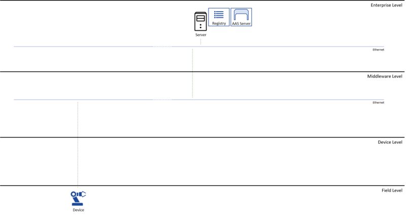
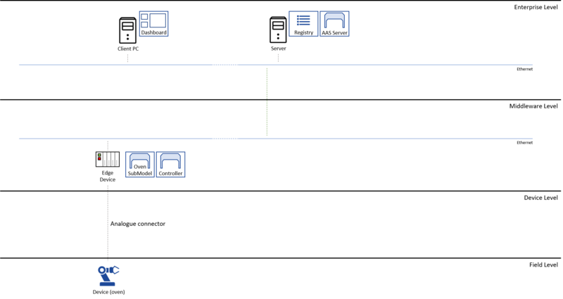

# Step 1: Creating the digital manufacturing concept

The first step in creating adigital manufacturing architecture is to create the Submodels for all real-world assets, and to devise the overall system architecture. Real-world assets are both physical assets, e.g. products and devices, and also non-physical assets, such as processes, orders, and possibly deadlines. This architecture defines public properties of assets, and offered services. It also defines the deployment of main BaSyx components. The figure below illustrates a common, basic BaSyx deployment that fits very well as nucleus for most settings.




This basic deployment consists of the most important components for running Eclipse BaSyx only. The registry tracks available Asset Administration Shells and Submodels, the AAS server provides access to AAS and Submodel instances through a unified API (cf. [Registry](../../../../../API/registry.md) and [AAS](../../../../../API/aas.md))). Both components are deployed as containers on host systems that are part of the IT infrastructure (Server) of the company.

A real BaSyx deployment will use additional AAS servers and Submodel locations to balance the load, and to enable data processing close to the process. The figure below illustrates the deployment that we will be used for the next steps of this example. In addition to the basic architecture, a client application is deployed on an office PC, and the oven Submodel is deployed to an edge device close to the process. This enables the processing of raw data on site, and will only report aggregated data to the IT infrastructure. The oven is an existing oven that does not provide any AAS or Industry 4.0 functionality. Therefore, the AAS needs to implement the communication with the oven, and it needs to request temperature data when required.




The oven will be represented by an AAS with one Submodel: the oven Submodel. The oven Submodel provides access to the oven temperature and enables a very basic controlling of the oven.

Every AAS has a generic structure. All specific information is provided by Submodels. These contain therefore the domain specific knowledge. Submodels enable access to data and services. Depending on the kind of Submodel, this may be static data, e.g. a digital nameplate, or dynamic data and services. In our example, the oven defines a single Submodel that enables the activation and de-activation of the heater, and access to the current temperature of the oven. The following illustrates the structure of the oven Submodel that will be implemented in the next steps:


```yaml
properties:
id: "heater01"
temperature

operations:
deactivateOven // *Function* for deactivating the oven,
activateOven // *Function* for activating the oven
```