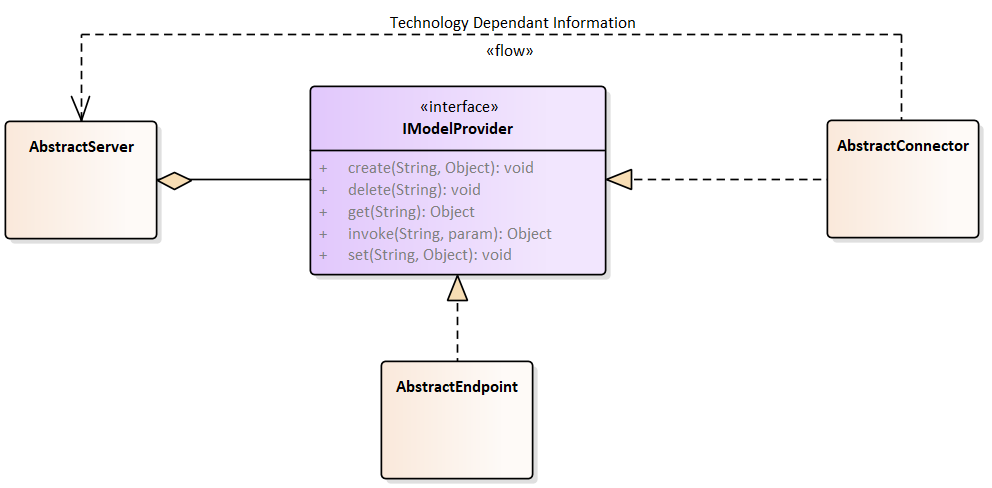
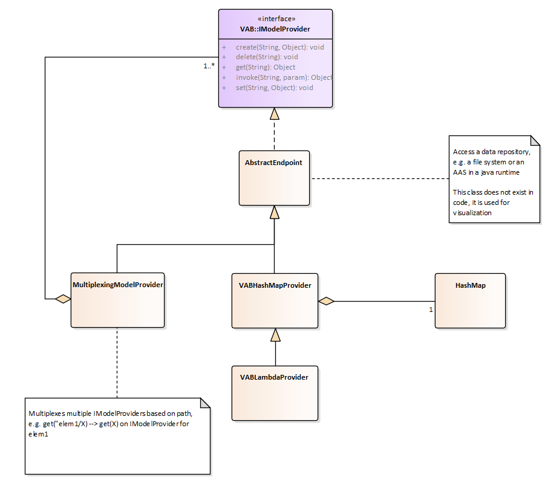
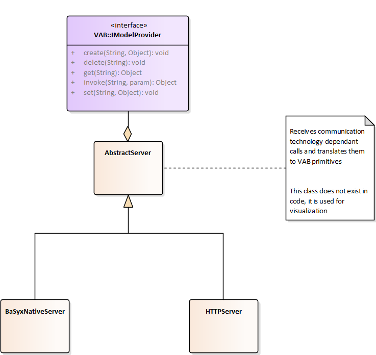
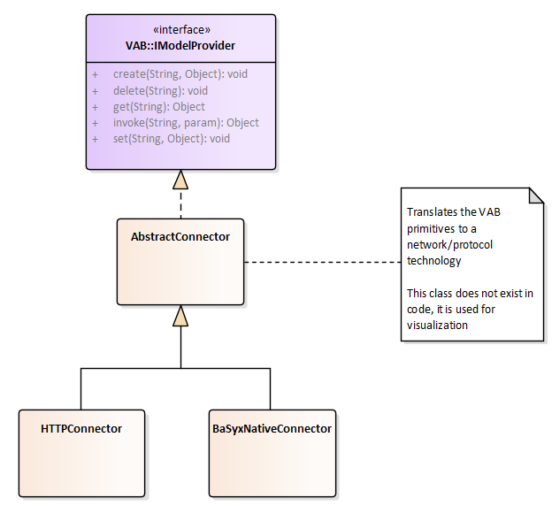
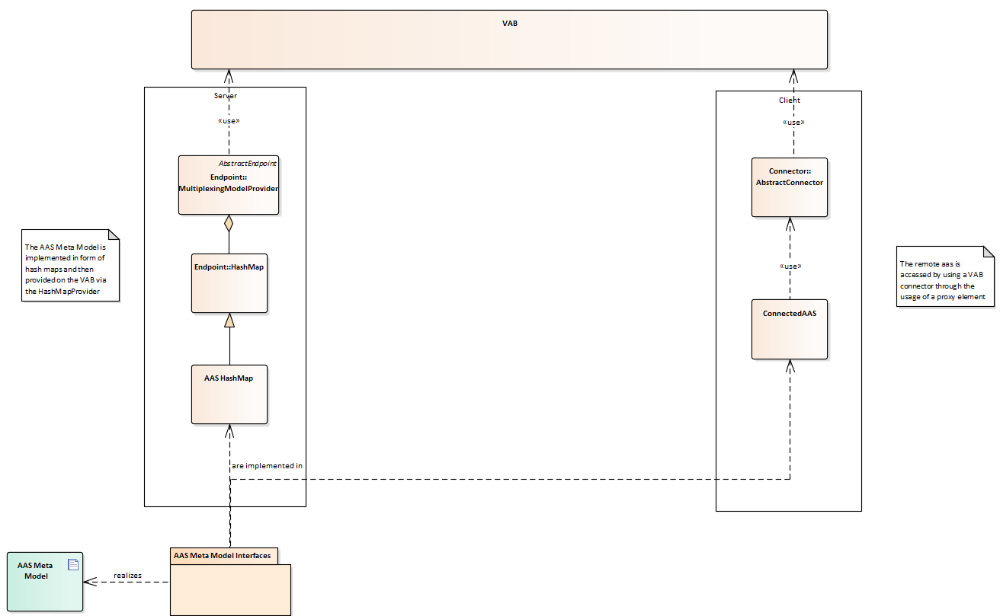

# Java SDK Architecture Overview

In the following, a high level overview of the Java SDK architecture will be provided.

## Virtual Automation Bus

### General Overview



The diagram provides a high level overview of the relation of the different elements of the Virtual Automation Bus. Each abstract class does only exist for visualization and is not directly implemented. For corresponding implementations, see the diagrams below.

**IModelProvider** is the central interface, providing the VAB primitives.

An **AbstractEndpoint** implements these primitives and provides access to a local resource, e.g. to a Java Objects or to a SQL database.

In contrast, an **AbstractConnector** translates the primitives to the communication primitives used by the native network it is connecting to, e.g. invoke to HTTP-POST in an HTTP-REST network.

The **AbstractServer** translates this communication back to the VAB primitives, using them to access an IModelProvider. This IModelProvider may either by an AbstractEndpoint or an AbstractConnector. In the latter case, the server is acting as gateway.


### Endpoint



There exist multiple implementation of the AbstractEndpoint. First, there is the **VABHashMapProvider**. It provides Map<String, Object> to the VAB. Since an element of the VAB is addressed by a path, e.g. *Sensor/Values/Temperature*, this Map then can be understood as a tree and can be traversed using the elements of the path.

However, this solution requires the values to be present in the Map, e.g. a sensor value has to be updated by a writing it into the Map. Additionally, if a value has to be written back to a device, it has to be read from the map. This can be done by for example a third party.

As a different solution to this issue, the **VABLamdaProvider** is provided. Again, it provides a Map to the VAB. Additionally to being able to provide static values, hidden functions can be used. Reading or writing a value can be delegated to a function, that retrieves the data directly from the device or writes it directly to the device. For more detail on this, please reference the implementation of the **VABLambdaProvider**.

To be able to provide multiple IModelProvider and multiplex between them, e.g. using an ID written in the path, there exists the **MultiplexingModelProvider**. As an example, for an Asset Administration Shell, it multiplexes */aas/* to the IModelProvider containing the AAS, */aas/submodels/maintenance* to the IModelProvider containing the submodel *maintenace*.

### Server



The AbstractServer translates technology dependent communication back to the VAB primitives, using them to access an IModelProvider. This IModelProvider may either by an AbstractEndpoint or an AbstractConnector. In the latter case, the Server is acting as gateway.

Currently, there are two implementations of AbstractServer:

- HTTPServer, which HTTP-REST to the VAB primitives

- BaSyxNativeServer, which maps the native TCP protocol

### Connector



Analogous to the AbstractServer, there exists the AbstractConnector that translates from the VAB primitives to the technology specific communication. Currently, there are two implementations of AbstractConnector:

- HTTPConnector, translating to HTTP-REST

- BaSyxNativeConnector, translating to the native TCP protocol

## Mapping of Asset Administration Shell on VAB



Using the capabilities of the VAB, Asset Administration Shells and Submodels can be provided.

The meta model as defined in the *Details of the Asset Administration Shell* document is implemented in several interfaces and realized by HashMap implementations on the server.

These maps are provided to the VAB using a **MultiplexingModelProvider** wrapping several VABModelProviders and an arbitrary AbstractServer.

On the client side, the meta model interfaces are implemented in a **Connected** variant, delegating each call to an AbstractConnector connecting to the providing server.

```
Category: BaSyx
```