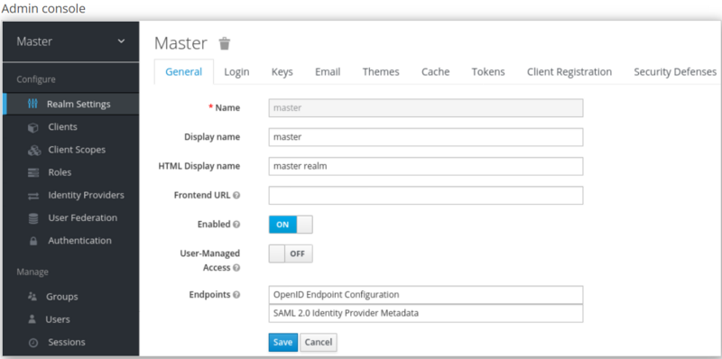
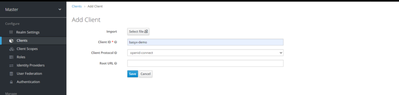
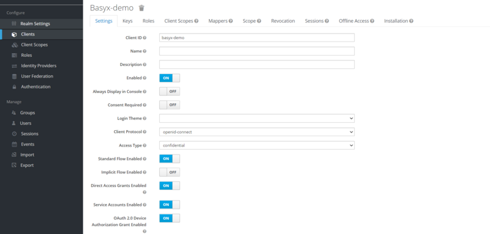

# Setting up Keycloak

Keycloak is an open source software product to allow single sign-on with Identity and Access Management aimed at modern applications and services. As of March 2018 this WildFly community project is under the stewardship of Red Hat who use it as the upstream project for their RH-SSO product.

## Startup

To start the Keycloak, you can use the following command:

`docker run -p 9006:8080 -e KEYCLOAK_USER=admin -e KEYCLOAK_PASSWORD=admin jboss/keycloak`

**Warning**: The startup may take a while. Do not stop the server after the message `Added 'admin' to '/opt/jboss/keycloak/standalone/configuration/keycloak-add-user.json', restart server to load user -b 0.0.0.0.`

Once the server is started, the admin console can be opened in the browser using the link below:

`http://127.0.0.1:9006/auth`

**Note**: You must only start the Docker Container to execute the Test Scenario, as the Realm and Client is automatically created by the Keycloak ServiceProvider when executing the Test.

## Setup using portal

The initial screen for the admin console appears.



## Realms and users

When you log in to the admin console, you work in a realm, which is a space where you manage objects. Two types of realms exist:

* Master realm - This realm was created for you when you first started Keycloak. It contains the admin account you created at the first login. You use this realm only to create other realms.
* Other realms - These realms are created by the admin in the master realm. In these realms, administrators create users and applications. The applications are owned by the users.


## Create Realm
As the admin in the master realm, you create the realms where administrators create users and applications.

**Prerequisites**

* Keycloak is installed.
* You have the initial admin account for the admin console.
**Procedure**

1. Go to http://localhost:9006/auth/admin/ and log in to the Keycloak admin console using the admin account.
2. From the Master menu, click Add Realm. When you are logged in to the master realm, this menu lists all other realms.
3. Type basyx-demo in the Name field.
4. Click Create.


***The realm name is case-sensitive, so make note of the case that you use.***

The main admin console page opens with realm set to basyx-demo.


## Add Client
**Procedure**

1. Go to http://localhost:9006/auth/admin/ and log in to the Keycloak admin console using the admin account.
2. From the Master menu, select basyx-demo.
3. Click Clients.
4. Click Create.




**Set the property of client**

* Set Access Type to Confidential
* Turn ON OAuth 2.0 Device Authorization Grant Enabled
* Turn ON Authorization Enabled
* Enter valid redirect URIs
* Click **Save**.



## Setup using Keycloak Java Adapter

Add the following maven dependencies to the project :

**keycloak-spring-boot-starter**

```yaml
<dependency>
   <groupId>org.keycloak</groupId>
   <artifactId>keycloak-spring-boot-starter</artifactId>
   <version>16.1.1</version>
</dependency>
```

**keycloak-admin-client**

```yaml
<dependency>
   <groupId>org.keycloak</groupId>
   <artifactId>keycloak-admin-client</artifactId>
   <version>16.1.1</version>
</dependency>
```
Create a Keycloak instance as depicted in below code :

```java
private void buildKeycloak() {
	keycloak = KeycloakBuilder.builder()
	         .serverUrl(BASE_ADDRESS)
	         .realm(MASTER_REALM_NAME)
	         .clientId(MASTER_CLIENT_ID)
	         .username(USERNAME)
	         .password(PASSWORD)
	         .build();
}
```

## Create Realm

Create a realm using below code snippet :
```java
private void createRealm() throws RealmCreationException {        
	RealmRepresentation realmRepresentation = createRealmRepresentationFromJson();
 
	keycloak.realms().create(realmRepresentation);
}
 
private RealmRepresentation createRealmRepresentationFromJson() {
	return loadJson(KeycloakServiceProvider.class.getResourceAsStream("/" + REALM_FILE_NAME), RealmRepresentation.class);
}
```

## Add Client

Add a client to a realm using below code snippet :

```java
private void addClientToRealm() throws AddClientException {        
	RealmResource realmResource = getRealmResource();
 
	ClientRepresentation clientRepresentation = createClientRepresentationFromJson();
 
	realmResource.clients().create(clientRepresentation);
}
 
private RealmResource getRealmResource() {		
	return keycloak.realms().realm(REALM_NAME);
}
 
private ClientRepresentation createClientRepresentationFromJson() {
	return loadJson(KeycloakServiceProvider.class.getResourceAsStream("/" + CLIENT_FILE_NAME), ClientRepresentation.class);
}
```

# Setting up Authorized AAS Registry
The [Cloud & Edge Deployment](./cloud-edge-deployment.md) scenario can be implemented using Authorized AAS Registry.

After setting up Keycloak, follow below steps to access the secured endpoints of AAS Registry:

Step 1 : Create an instance of Authorized AAS registry proxy.

**Code Snippet**
```java
private void createAuthorizedAASRegistryProxy() {
	registry = new AuthorizedAASRegistryProxy(REGISTRY_ENDPOINT, authorizationProvider.getAuthorizationSupplier());
}
```
Step 2 : Create an instance of Authorized Connected AAS manager using the above instance of registry to access a secured AAS repository.

**Code Snippet**
```java
private void createConnectedAASManager() {
	aasManager = new AuthorizedConnectedAASManager(registry, authorizationProvider.getAuthorizationSupplier());
}
```
Step 3 : Use the above Authorized Connected AAS manager to perform the general operation like Creating AAS, Creating Submodels etc.

**Code Snippet to create AAS**
```java
private void createAssetAdministrationShellOnCloudServer() {
	aasManager.createAAS(componentFactory.getAAS(), CLOUD_ENDPOINT);
}
```

**Code Snippet to create Submodel**
```java
private void createSubmodelOnAasCloudServer() {
	Submodel docuSubmodel = componentFactory.getDocuSM();
 
	asManager.createSubmodel(aasIdentifier, docuSubmodel);
}
```
Full code implementation can be found here [AuthorizedRegistryScenario](https://github.com/eclipse-basyx/basyx-java-examples/blob/development/basyx.examples/src/main/java/org/eclipse/basyx/examples/scenarios/authorization/AuthorizedRegistryScenario.java)

Additional Resources
`https://www.keycloak.org/docs-api/11.0/javadocs/overview-summary.html`
`https://www.keycloak.org/documentation`
`https://hub.docker.com/r/jboss/keycloak/`
`https://www.keycloak.org/docs/11.0/getting_started/`