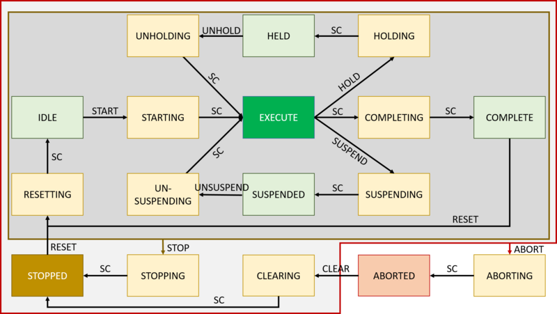
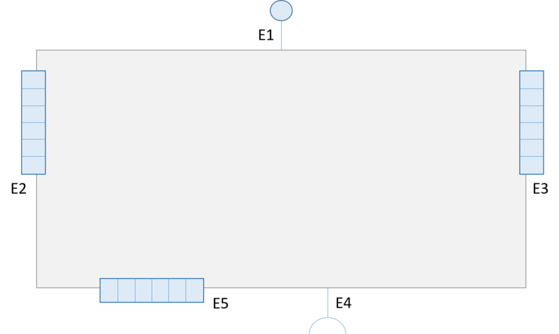

# BaSyx device Interface
BaSys 4.0 control components provide a harmonized interface to device services, and shield native device communication from users. The same physical device may provide several device control components at different network communication endpoints to control independent device services. The BaSyx device interface defines a generic interface to all control components, i.e. device control components and group control components. It defines a minimum common set of primitives that enables the issuing of commands, setting of states, and querying of results. Device specific extensions may be added to reflect device specific services, modes of operation, and status information, as well as other primitives. This section first describes the technology independent device interface, its realization in context of the Virtual Automation Bus as End-to-End communication medium and concrete technology mappings.

### Technology independent interface concept
The BaSyx device interface defines the necessary primitives and the interface semantics of a BaSys 4.0 control component. The interface to a control component consists of defined orders and signals. Orders invoke component operations, signals are attributes.

#### Control component state machines
Defined state machines represent the status of a BaSys 4.0 component. The following state machines are defined for every BaSys component:

* **Occupation**: The occupation state machine defines the occupation state of the component. An occupation realizes an exclusive lock to the control component. It defines who is using a control component. Some orders may only be issued if the issuer occupies the control component, i.e. iff he possesses the lock of the control component.
* **Execution mode**: The execution mode state machine defines execution mode of the control component. The execution mode defines how a control component reacts to commands. Execution modes are for example the automatic mode of operation, which is the common mode of operation, or semi-automatic mode for setup operation. A control component is at every time in only one execution mode.
* **Execution state**: The execution state communicates the execution state of a control component by using a PackML state machine. The execution state indicates the state of a control component in a specific execution mode.
* **Operation mode**: Component operation modes are used to separate different capabilities of a component. By selecting an operation mode, the user of a component defines what a component will be doing.
* **Work state**: The work state of a component defines the current, operation mode specific, state of a control component.
* **Error state**: The error state of a control component indicates if an error did happen, or if the component is in normal operation.

Variables describe the status of each state machine. The following table illustrates the variable used by the predefined state machines of control components. Every control component may define additional state machines and variables to communicate information that is more specific. Control of state changes is via orders or input signals.

| State machine   |         Property         | Variable |
|-----------------|:------------------------:|:--------:|
| Occupation      | Current occupation state | OCCST    |
|                 | ID of current occupier   | OCCUPIER |
|                 | ID of previous occupier  | OCCLAST  |
| Execution mode  | Active execution mode    | EXMODE   |
| Execution state | Active execution state   | EXST     |
| Operation mode  | Active operation state   | OPMODE   |
| Work state      | Actual work state        | WORKST   |
| Error state     | Actual error state       | ER       |
|                 | Previous error state     | ERLAST   |

#### Occupation state machine
The occupation state machine defines who is using the control component. The output signal OCCST describes the occupation state of BaSys 4.0 components. It defines four different states:

| Signal value |   Name   | Description                                                                                                                                                                                                                                                                                                                                                     |
|--------------|:--------:|-----------------------------------------------------------------------------------------------------------------------------------------------------------------------------------------------------------------------------------------------------------------------------------------------------------------------------------------------------------------|
| 0            | FREE     | The component is currently not occupied                                                                                                                                                                                                                                                                                                                         |
| 1            | OCCUPIED | The component is occupied by a different entity, e.g. by a different BaSys control component. This is the normal occupation state with priority 1                                                                                                                                                                                                               |
| 2            | PRIO     | A different component did occupy the component with priority. This is for example an operator that wants to control the device manually, e.g. for configuring it or for testing device functions. This priority occupation is possible also if the component is in state OCCUPIED. The new occupier needs to make sure that no invalid operations are performed |
| 3            | LOCAL    | The component is occupied by a local entity. This always overrides OCCUPIED and PRIORITY occupations. LOCAL occupation is only possible via a local entity, e.g. an operator using a control panel. Implementation of this state is optional                                                                                                                    |

The signal OCCUPIER provides the identifier of the current occupier of a control component. The signal OCCLAST holds the name of the previous occupier in case of a PRIORITY occupation. If the current occupier is overridden by a local override, the OCCUPIER signal will output “LOCAL”.

Controlling the occupation state machine is via orders and input signals. The component occupation state machine accepts three orders:

| Order  | Parameter |                   Description                   |
|--------|:---------:|:-----------------------------------------------:|
| FREE   | -         | Free component occupation if sender is occupier |
| OCCUPY | -         | Occupy component                                |
| PRIO   | -         | Occupy component with priority                  |

Every order contains the sender ID of the requesting entity. In addition, the component occupation state machine processes the input signals *LocalOverwrite* and *LocalOverwriteFree* that control the LOCAL occupation mode. The following state machines define the semantics of control component occupation without and with local override support:

#### Execution mode state machine

The execution mode state machine defines the current execution mode of a control component. It defines how a control component reacts to commands. The current mode of operation is exposed through signal EXMODE. Every control component defines the following basic modes of operation and signal values:

| Signal value |   Name   | ISA-TR88.00.02 “PackML” | ISA-88.00.01-2010 “ISA-88” |                                                     Description                                                     |
|--------------|:--------:|:-----------------------:|:--------------------------:|:-------------------------------------------------------------------------------------------------------------------:|
| 1            | AUTO     | Producing               | Automatic                  | Automatic operation. This is the normal operation of a device.                                                      |
| 2            | SEMIAUTO | Maintenance             | Semi-automatic             | Maintenance operation. This execution mode is used for setup of automatic operation.                                |
| 3            | MANUAL   | Manual                  | Manual                     | Manual operation mode that enables manual intervention with explicit confirmation of machine operation by operator. |
| 4            |          | Future reserve          |                            | Reserved for future mode that enables manual operation without explicit confirmation by operator                    |
| 5            | SIMULATE |                         |                            | Simulation mode that behaves like automatic mode but does not issue any orders to devices/actuators                 |

The execution modes are defined as following:

* The *automatic mode* is the most common mode of operation for a machine. In this mode, safety measures must guarantee that operators cannot enter the operation area of a machine. This may be achieved for example by automatic locking doors or by switching off the machine immediately when a door is opened.
* The *semi-automatic* mode supports setting up of a machine for automatic mode. In semi-automatic mode, machine functions are restricted. For example may the operation speed be significantly reduced compared to automatic mode. Operators need to actively confirm operation, e.g. by pressing and holding a button to keep the device moving.
* The *manual mode* enables manual intervention into the automatic mode. It may be used for example to work manually on a complex work piece. This mode of operation enables the operator to monitor and control manufacturing processes with opened doors. A requirement for this mode is a substitute for safety measures, e.g. a moveable panel with an active confirmation. An example is a confirmation button that stops machine operation as soon as it is no longer pressed. Movement speeds are restricted but not as much as in semi-automatic mode.
* A *future reserved mode* could be an extended maintenance mode that is permitted in special cases. It removes the need for a permanent active confirmation from maintenance mode, which is necessary in case of longer operation cycles. This mode will require a tailored safety concept for the machine.
* The simulation mode enables the integration of the control component into a virtualized plant. In this mode, the control component does not issue any orders to the controlled physical device.

Changes in execution mode may be triggered externally or internally. External triggers is an order, internal triggers may be for example a signal from a key switch or a detected fault. Changing of execution mode may require safety measures. The following order are supported by every BaSys component:

| Order    | Parameter |            Description            |
|----------|:---------:|:---------------------------------:|
| AUTO     | -         | Change to execution mode AUTO     |
| SEMIAUTO | -         | Change to execution mode SEMIAUTO |
| MANUAL   | -         | Change to execution mode MANUAL   |

#### Execution state state machine

Every execution mode has execution states that define the state of a control component. BaSys describes execution modes with ISA-88-2 (PackML). Every BaSys component is at every time in exactly one execution state of exactly one execution mode. All execution states must be mapped to the states of the PackML state machine. Additional parallel state machines may be defined to provide additional, control component specific information. Signal EXST provides the execution state of a control component. The figure below defines the PackML state machine with execution states and state changes of BaSys control components. State changes are triggered either by the control component itself (transition SC – State Complete), or by an order (all other transitions). State changes triggered by the control component itself happen when a state did complete. This is for example because of the completion of a running operation.

The meaning of the PackML states are as following:

* IDLE The control component is idle and waits for orders and/or signals
* STARTING The selected operation (operation mode) is starting. This state is entered when the START order is received by the control component.
* EXECUTE The selected operation is executing. This state is entered after the STARTING command completes.
* COMPLETING Execution of the selected operation did complete manually. The selected operation is completing.
* COMPLETE The execution of the selected operation did complete normally.
* RESETTING The control component (and its connected device if necessary) is resetting to IDLE state. This state is entered after the * * * RESET command is received by the control component.
* SUSPENDING The control component is suspending the device. This state is entered after the SUSPEND order is received
* SUSPENDED The device is suspended. In this state the device is operational but nor producing anything.
* UNSUSPENDING The device is being unsuspended, moving back to normal operation. This state is entered after the UNSUSPEND command is received.
* HOLDING The device is being prepared for HELD state. This state is entered when the HOLD order is received.
* HELD The device is held, i.e. temporarily stopped.
* UNHOLDING The device is being moved back to EXECUTE state.
* ABORTING This state is entered at any time in response to the ABORT order, on the occurrence of a machine fault, or in response of an emergency stop. The abort logic will bring the device to a rapid, controlled safe state.
* ABORTED The machine is in a safe state. It retains information about the condition that die lead to abort state.
* CLEARING The state is entered when the control component receives the CLEAR command. It orders the control component and device to clear the information that did lead to the ABORT state and move to STOPPED state.
* STOPPING The control component is stopping the device, i.e. bringing it to a controlled and safe stop. The STOPPING state is entered from any state in response to the STOP command.
* STOPPED In this state the device is stationary and powered on. It is also communicating.

The following table defines execution states and accepted commands for state changes in each execution state. The control component issues the State completed (SC) command when a previous state completes.

| Current State |   Order  |            |           |         |           |            |              |       |          |          | State Complete (SC) |
|:-------------:|:--------:|:----------:|:---------:|:-------:|:---------:|:----------:|:------------:|:-----:|:--------:|:--------:|:-------------------:|
|               |   START  |  COMPLETE  |   RESET   |   HOLD  |   UNHOLD  |   SUSPEND  |   UNSUSPEND  | CLEAR |   STOP   |   ABORT  |          SC         |
| IDLE          | STARTING |            |           |         |           |            |              |       | STOPPING | ABORTING |                     |
| STARTING      |          |            |           |         |           |            |              |       | STOPPING | ABORTING | EXECUTE             |
| EXECUTE       |          | COMPLETING |           | HOLDING |           | SUSPENDING |              |       | STOPPING | ABORTING |                     |
| COMPLETING    |          |            |           |         |           |            |              |       | STOPPING | ABORTING | COMPLETE            |
| COMPLETE      |          |            | RESETTING |         |           |            |              |       | STOPPING | ABORTING |                     |
| RESETTING     |          |            |           |         |           |            |              |       | STOPPING | ABORTING | IDLE                |
| HOLDING       |          |            |           |         |           |            |              |       | STOPPING | ABORTING | HELD                |
| HELD          |          |            |           |         | UNHOLDING |            |              |       | STOPPING | ABORTING |                     |
| UNHOLDING     |          |            |           |         |           |            |              |       | STOPPING | ABORTING | EXECUTE             |
| SUSPENDING    |          |            |           |         |           |            |              |       | STOPPING | ABORTING | SUSPENDED           |
| SUSPENDED     |          |            |           |         |           |            | UNSUSPENDING |       | STOPPING | ABORTING |                     |
| UNSUSPENDING  |          |            |           |         |           |            | UNSUSPENDING |       | STOPPING | ABORTING | EXECUTE             |
| STOPPING      |          |            |           |         |           |            |              |       |          | ABORTING | STOPPED             |
| STOPPED       |          |            | RESETTING |         |           |            |              |       |          | ABORTING | IDLE                |
| ABORTING      |          |            |           |         |           |            |              |       |          |          | ABORTED             |
| CLEARING      |          |            |           |         |           |            |              |       |          | ABORTING | STOPPED             |

#### Operation Mode state machine

Operation modes structure the functions of a control component. A component may realize multiple operation modes that may be selected by the component user to select the behavior of the control component and controlled devices. Different production steps supported by the same device are implemented as operation modes. The current operation mode of a control component is provided via signal OPMODE. The actual execution mode indicates the execution mode of the selected operation mode. In addition to control component specific operation modes, each control component defines the basic operation mode BSTATE, which is the basic state. Changing of operation mode may be via an order that selects the operation mode. These orders are specific to the control component, for example, the order name may be the same as the desired operation mode. Switching of operation modes is not possible in any execution state. Most control components support switching of operation modes in IDLE execution state, but switching semantics to a specific operation mode depends on the control component. Changing to a specific execution mode, e.g. COMPLETED, ABORTED, STOPPED may also yield an operation mode change. Operation modes and execution modes are therefore not independent.

#### Work state state machine
Signal WORKST defines the work state of a component. It contains control component specific information.

#### Error state state machine
BaSys 4.0 components should report exactly one error state for every occurring fault. BaSys does not define a generic fault automaton that describes the error state of a component. If a control component is in normal operation, it should communicate error state 0 (OK).

### Components with concurrent behavior
Complex devices may consist of concurrent behavior. BaSys control components do need to provide the control component interface and state machines. In case of concurrent behavior in devices, an implementer has two options:

* Development of one control component that applies internal mappings to map concurrent device behavior to control component state machines
* Development of multiple control components that control independent aspects of the controlled device.

### Control component interface

Communication endpoints realize the communication of every control component. The following figure illustrates the communication endpoints of every control component:

The meaning of communication endpoints (ports) E1-E5 are as following:

* E1: Component service interface (upstream)
    * The component service interface provide a service-based interface to the component. Other BaSys components use this interface to invoke service of the control component.
* E2: Signal inputs
    * Signal inputs of a control component are value-based inputs. This interface is optional. They enable direct inter-component communication. They support for example the direct exchange of safety signals and are often fixed connections that in some cases map directly to physical connections. The value of some signal inputs are available via the component service interface.
* E3: Signal outputs
    * Signal outputs are optional value based outputs of a component. They support for example the direct exchange of safety signals and are often fixed connections that in some cases map directly to physical connections. The value of some signal outputs are available via the component service interface.
* E4: Component service interface (downstream)
    * Group components use the component service interface (downstream) to connect to other components, and to invoke services and to read and/or change property values.
* E5: Native device interface
    * Device components use the native device interface to interact with native devices. This communication endpoint implements any proprietary communication that is necessary to control a device, and to access its properties and services.

## Service Interface

The BaSys 4.0 project has defined technology mappings for the device interface that are implemented by the Virtual Automation bus. BaSyx users may define additional technology mappings for other types of networks and bus systems and include them by creating BaSyx Virtual Automation Bus (VAB) Gateways. Moreover, control components and devices with non-conforming interfaces may be included by implementing component and device specific mappings that provide a conforming facade to the VAB.

### Virtual Automation Bus (VAB) implementation

Eclipse BaSyx connects BaSyx control components as elements to the Virtual Automation Bus (VAB), the End-to-End communication infrastructure of Eclipse BaSyx. Every BaSyx control component needs to implement the **minimum VAB interface** that is described in this section. The following table illustrates the minimum set of VAB attributes and operations for control components that are connected to the virtual automation bus. The predefined property group *STATUS* lists all propertys describing the current status of the control component, respectively its state machine states. The predefined *OPERATIONS* group implement the minimum API for every control component that enables the control of its states via the previously described state machines.

| Attribute path (output) | Corresponding state machine |                   Description                   |
|-------------------------|:---------------------------:|:-----------------------------------------------:|
| STATUS                  |                             | Property group for all status properties        |
| STATUS/OCCST            | Occupation                  | Current occupation state                        |
| STATUS/OCCUPIER         | Occupation                  | ID of current occupier                          |
| STATUS/EXMODE           | Execution mode              | Active execution mode                           |
| STATUS/EXST             | Execution state             | Active execution state                          |
| STATUS/OPMODE           | Operation mode              | Active operation mode                           |
| STATUS/WORKST           | Work state                  | Current work state                              |
| STATUS/ER               | Error state                 | Current error state                             |
| Operations              | Corresponding state machine |                   Description                   |
| OPERATIONS              |                             | Group for all operations                        |
| OPERATIONS/FREE         | Occupation                  | Free component occupation if sender is occupier |
| OPERATIONS/OCCUPY       | Occupation                  | Occupy component                                |
| OPERATIONS/PRIO         | Occupation                  | Occupy component with priority                  |
| OPERATIONS/AUTO         | Execution mode              | Change to execution mode AUTO                   |
| OPERATIONS/MANUAL       | Execution mode              | Change to execution mode MANUAL                 |
| OPERATIONS/START        | Execution state             | Start selected operation mode                   |
| OPERATIONS/STOP         | Execution state             | Stop operation                                  |
| OPERATIONS/RESET        | Execution state             | Reset completed or stopped control component    |
| OPERATIONS/ABORT        | Execution state             | Abort operation                                 |
| OPERATIONS/CLEAR        | Execution state             | Clear aborted execution state                   |

### OPC-UA

An example control component in OPC UA realizing the BASYS profile. The control components address space is marked in orange.
This section defines a mapping of the BaSys 4.0 control component interface to OPC-UA. Our OPC-UA mapping maps VAB operations to OPC-UA methods and VAB attributes to OPC-UA variables, resprectively properties. Eclipse BaSyx will provide a generic BaSyx OPC-UA gateway component to connect control components with the OPC-UA interface from this section to the virtual automation bus and therefore enables accessing of the control component status and services. Developers therefore only need to implement this OPC-UA object structure to ensure a BaSyx conforming component. The control components browsename itself is not relevant as it is identified by its node id corresponding to the VAB elementId, shown in green in the [example figure](./images/BaSyx-ControlComponent-OPCUA-BaSysProfile.png). The namespace index of all browse names defined here, should be the basys namespace http://basys4.de/controlcomponent, which is namespace 2 in the [example figure](./images/BaSyx-ControlComponent-OPCUA-BaSysProfile.png). Operations to select application or domain specific operation modes should be written in CamelCase and should use own namespaces or the application namespace. For the interface only the minimum required characteristics are describe in order to gain as much freedom of implementation as possible (cf. interface specification). Hence only the entry point (VAB elementId, OPC UA node id of the control component) and browsepathes are specified, as shown in the blue field in the [example figure](./images/BaSyx-ControlComponent-OPCUA-BaSysProfile.png). For example no display names, descriptions, node ids, type references or reference types for the hierarchical references are specified.

| Relative OPC-UA browse path |     Node class     |            Data type           |
|-----------------------------|:------------------:|:------------------------------:|
| STATUS                      | Object or Variable | Group for all status variables |
| STATUS/OCCST                | Variable           | String                         |
| STATUS/OCCUPIER             | Variable           | String                         |
| STATUS/EXMODE               | Variable           | String                         |
| STATUS/EXST                 | Variable           | String                         |
| STATUS/OPMODE               | Variable           | String                         |
| STATUS/WORKST               | Variable           | String                         |
| STATUS/ER                   | Variable           | String                         |
| OPERATIONS                  | Object or Variable | Group for all operations       |
| OPERATIONS/FREE             | Method             |                                |
| OPERATIONS/OCCUPY           | Method             |                                |
| OPERATIONS/PRIO             | Method             |                                |
| OPERATIONS/AUTO             | Method             |                                |
| OPERATIONS/MANUAL           | Method             |                                |
| OPERATIONS/START            | Method             |                                |
| OPERATIONS/RESET            | Method             |                                |
| OPERATIONS/ABORT            | Method             |                                |
| OPERATIONS/STOP             | Method             |                                |
| OPERATIONS/CLEAR            | Method             |                                |

#### Enpoint Specification
To specify the endpoint of an OPC UA control component the server and the node id or a browsepath to the node may be encoded in an URL. The URL typically consists of the following parts with examples:

* Scheme: opc.tcp
* Host: basys4.de
* Port: 4840
* Path or id of the node representing the control component
    * Node id according to [[UA standard part 6 section 5.3.1.10](https://reference.opcfoundation.org/v104/Core/docs/Part6/5.3.1/#5.3.1.10%7COPC)]: ns=1;i=42
    * rowse path according to [[OPC UA standard part 4 annex A.2](https://reference.opcfoundation.org/v104/Core/docs/Part4/A.2/%7C)]: /Objects/1:MyControlComponent
Examples of control component endpoints for OPC UA are:

* opc.tcp://basys4.de:4840/ns=1;i=42
* opc.tcp://basys4.de:4840/Objects/1:MyControlComponent