## What is a Dataspace?

A Data Space can be defined as a collaborative data ecosystem where organizations and individuals share, exchange, and utilize data in a structured and trusted environment. At its core, a data space is built upon commonly agreed-upon building blocks, such as shared governance models, interoperability standards, and technical frameworks, ensuring that all participants operate on equal footing.

This structure is designed to enable effective and trusted sharing of data among participants while maintaining each organization's control over their own data. The idea is to foster collaboration without compromising data security, privacy, or ownership. Participants can confidently share their data, knowing that the framework ensures compliance with relevant legal, regulatory, and ethical standards.

## AAS Dataspace

The **AAS Dataspace** enables the **exchange of information** seamlessly across the entire **value chain**, facilitating a smooth flow of data between all entities involved in production, logistics, and other related processes. The data shared within this space provides a holistic view of the product or service lifecycle, ensuring that relevant information is available at every stage, from design and manufacturing to delivery and post-sales support.

This exchange occurs **between partners within the value chain**, allowing manufacturers, suppliers, service providers, and other stakeholders to collaborate efficiently. By enabling data sharing among trusted partners, the AAS Dataspace strengthens collaboration, reduces information silos, and accelerates decision-making processes. This transparency enhances supply chain efficiency, product quality, and responsiveness to market demands.

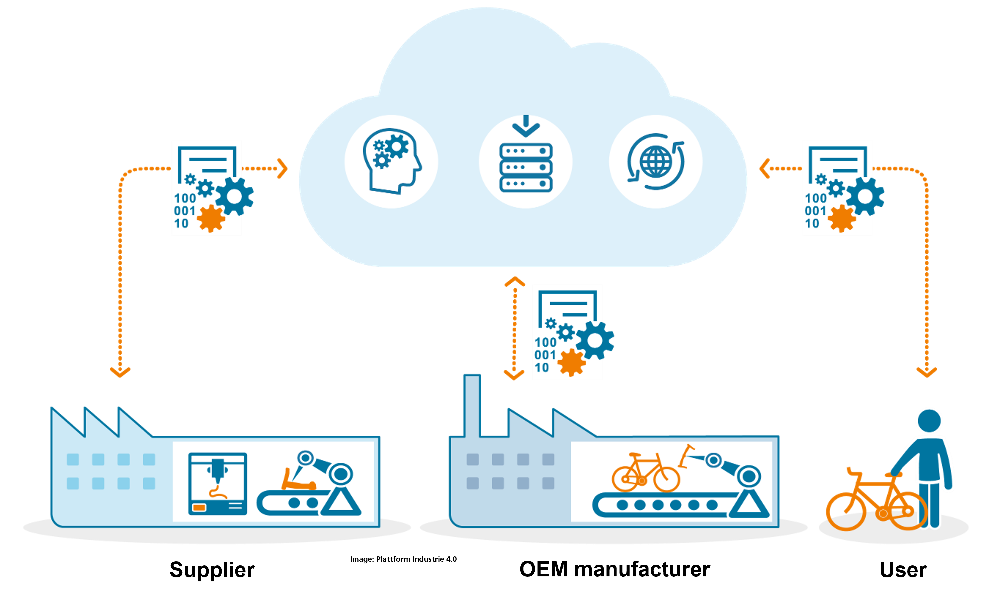

Moreover, the AAS Dataspace **supports cross-company information sharing**, breaking down traditional barriers between organizations. Companies can exchange crucial data across organizational boundaries while retaining control over their proprietary information. This fosters innovation, opens up new business opportunities, and enables a more agile response to challenges in an increasingly interconnected industrial landscape.

Importantly, when discussing the AAS Dataspace, we are **not referring to shopfloor automation**.

## Datasharing in AAS Dataspace

What we are **not talking about** in the context of the AAS Dataspace is **uncontrolled access to information**. The goal of the AAS Dataspace is not to create a free-for-all data environment where any participant can access sensitive or proprietary information without proper consent. Instead, the focus is on establishing a **secure and structured system** that prevents unauthorized access, protects intellectual property, and ensures data privacy.

We are talking about **intentional and agreed data exchange**. In the AAS Dataspace, data is shared deliberately, based on clearly defined agreements between parties. This means that data owners always retain control over who accesses their data, for what purpose, and under what conditions. This structured approach ensures that data flows are governed by mutual consent and trust.

Furthermore, the data exchange occurs **between one or more authorized partners**. Only those who have been explicitly given permission and meet the necessary criteria for accessing specific data are allowed to participate in the exchange. This ensures that all participants in the data space are trusted entities, and no unauthorized third parties can disrupt the data-sharing process.

The AAS Dataspace also focuses on data exchange **for a specific use**. Data sharing is not open-ended or unrestricted. It is purpose-driven and aligned with predefined goals, whether it's improving product design, optimizing supply chains, or enhancing collaboration on innovation projects. Each exchange is tied to a particular use case, ensuring that data is only shared when it adds clear value and aligns with the business objectives of all parties involved.

## Examples of Collaborative Data Exchange

* Downloading product-related documents, such as datasheets or specifications, to provide detailed technical or product information.
* Providing technical data in a standard format, ensuring interoperability and easy integration across different systems and partners in the value chain.
* Electronic ordering, tracking, and payments, facilitating seamless, automated transactions and improving overall supply chain efficiency.
* Submitting engineering files to part producers and then forwarding those files to toolmakers for accurate, precise production.
* Allowing access to maintenance data, enabling partners to monitor and maintain equipment effectively and prevent downtime.
* Allowing visibility into stock levels, so participants can check inventory in real time and plan production or ordering decisions accordingly.

These actions reflect how the AAS Dataspace enables controlled and purpose-driven data sharing among trusted partners, enhancing collaboration across the value chain.

## The AAS Dataspace in details

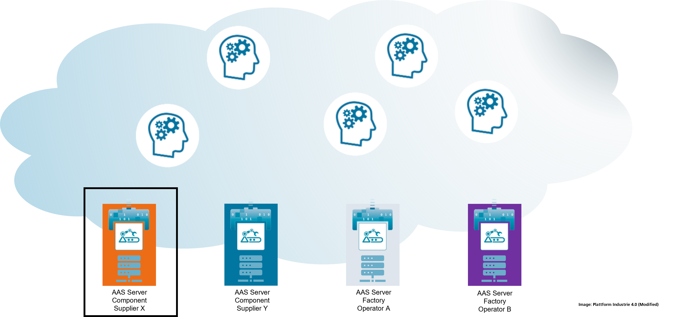

* Lots of Participants: The AAS Dataspace involves a wide variety of participants who play different roles in the value chain, such as:

    * AAS Providers: These can include component suppliers, factory operators, and other organizations that offer access to their AAS.
    * Entities Accessing the Provided AAS: In addition to providers, multiple external entities may access the data, creating a diverse ecosystem of data consumers and providers.
* Applications: Different software applications may access the AAS to retrieve or contribute data, enabling automation, monitoring, and advanced analytics for manufacturing processes and beyond.

* Marketplaces: AAS data can also be shared via digital marketplaces, where information related to products, services, and parts is exchanged in a structured, efficient way.

* Other AAS Providers: Beyond individual entities, other AAS providers can connect to exchange data, enabling collaboration between different companies, suppliers, and service providers in the same network.

Complex Questions Arise: While the setup may seem straightforward, several critical issues need to be addressed.

### How do we setup our AAS Infrastructure?

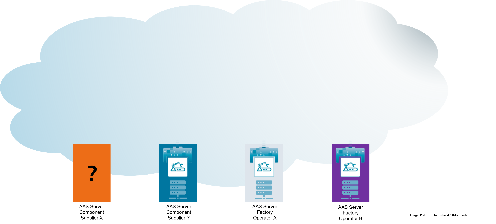

This question explores the possibility of setting up the AAS infrastructure within the organization's own data centers. It raises the need to consider factors such as internal control over data, security management, and the capabilities required to maintain the infrastructure internally. The organization would be responsible for managing hardware, software, and network resources.

### Do we host it on premise, do we set it up in the cloud using existing components?

Here, the focus shifts to cloud-based infrastructure. This question seeks to understand whether leveraging cloud solutions, such as public or private cloud services, could provide the flexibility and scalability required for hosting the AAS. It also touches on whether pre-existing cloud components, such as databases, computing power, or analytics tools, can be integrated into the AAS infrastructure to streamline operations and reduce complexity.

### Is there maybe even an AAS Infrastructure-as-a-service?

This question delves into the possibility of utilizing a pre-packaged, ready-to-use AAS infrastructure offered as a service by third-party providers. Such a solution might allow for a more hands-off approach, where the underlying infrastructure is managed externally, and the organization can focus on the business use of AAS. It raises inquiries about the availability of fully managed, scalable AAS platforms provided by industry specialists, and whether such services align with the organization's goals.

Regardless of how you answer these questions a new question pops-up:

### How to find your AAS?

The question, "How do you find your AAS?", is crucial for ensuring that an AAS is not only implemented but also discoverable and usable by the intended participants. This question seeks to explore the mechanisms through which stakeholders can locate and access an AAS once it has been deployed.

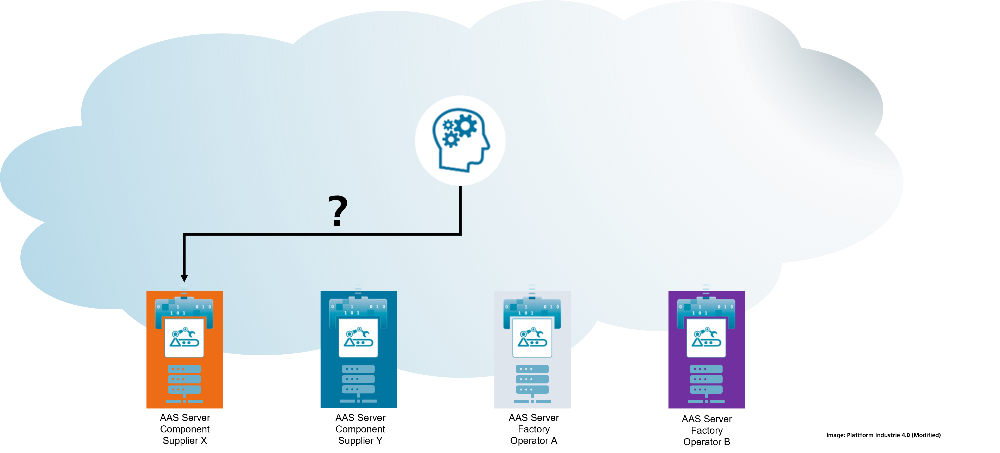

* Having an AAS Infrastructure is only a starting point:

    * Setting up the infrastructure for the AAS is the foundation. However, deploying the AAS alone is not sufficient; it also needs to be discoverable to those who will interact with it, such as partners, service providers, or applications.

* People have to be aware of its existence:

    * If potential users, applications, or other AAS providers are not aware that your AAS exists, it will not fulfill its collaborative potential. Visibility is essential for its utilization in the broader data space.

* So, how do people find your AAS?:

    * This question explores the need for mechanisms that allow others to easily find, identify, and connect to your AAS. It raises the issue of discoverability, and how to ensure that all relevant stakeholders can access the AAS without manual processes or complex configurations.

* Is there a central registry we can use to register?:

    * One possible solution is a centralized registry where AAS providers can list their AAS for others to find. This would act as a directory where users and applications can search for specific AASs, streamlining the discovery process.

* Hierarchy of registries, like a registry of registries:

    * The question also considers whether a hierarchical system of registries might be needed, especially in large and complex ecosystems like manufacturing. This would involve a top-level registry that contains links to smaller, domain-specific registries. Such an architecture might make discovery more efficient across various sectors or industries.

* Are there other discovery mechanisms? E.g., defined in the context of Manufacturing-X?:

    * Beyond centralized registries, the question asks if there are other discovery mechanisms that could be used. For example, Manufacturing-X might define protocols or decentralized approaches for discovering AASs, which could enhance flexibility and scalability in locating relevant AAS.

* Now, if people are aware of my AAS, they can access them:

    * Once people are aware of your AAS through these discovery methods, they can then proceed to access and interact with it. This emphasizes the importance of not just deploying an AAS but ensuring that it is easily found and utilized by authorized participants in the ecosystem.

### How to Get Access to your AAS?

The question "How to Get Access to Your AAS?" addresses the technical and procedural steps required to ensure that the right users or systems can securely access and interact with your AAS. Here's an elaboration based on the provided points:

* What does it mean to get access to your system?:

    * Gaining access to your AAS involves a combination of authentication, authorization, and security protocols that ensure only authorized users can interact with your system. Access to the system might include:
        - Viewing or interacting with specific data or services within the AAS.
        - Submitting data or receiving updates.
        - Utilizing APIs or interfaces provided by your AAS for integrations.
    * This access must be controlled and monitored to protect data and ensure compliance with security policies.

* Setup Identity Provider:

    * One of the first steps in managing access is establishing an Identity Provider (IdP). An IdP is responsible for:
        - Authenticating users (i.e., verifying their identity through credentials).
        - Authorizing their level of access based on predefined roles or policies.
        - Managing Single Sign-On (SSO) functionality, which allows users to access multiple systems, including your AAS, using a single set of credentials.
    * Identity providers create a seamless yet secure method for users and applications to prove their identity when accessing your system.

* Distribute Certificates:

    * Digital certificates are critical for ensuring secure access. These certificates verify the identity of the users or systems accessing the AAS and establish trust between entities. The process involves:
        - Issuing and managing public key infrastructure (PKI) certificates.
        - Ensuring encrypted communication between the AAS and users/systems.
        - Managing certificate lifecycle, such as issuing, renewing, and revoking certificates.
    * Certificates help protect against unauthorized access by ensuring that only those with valid credentials can interact with your AAS.

* Join VPN:

    * In certain cases, participants may be required to join a Virtual Private Network (VPN) to securely access the AAS. A VPN provides a secure, encrypted tunnel over the internet, ensuring that all data exchanged is protected from potential threats. Key considerations include:
        - Determining who needs VPN access (internal or external partners).
        - Setting up policies to manage and monitor VPN usage.
        - Integrating VPN with identity and access management (IAM) systems to ensure secure and seamless access.
    * VPN access adds an extra layer of protection, especially for sensitive or mission-critical data exchanges.

* Infrastructure for Managing Access is Needed:

    * Proper infrastructure must be established to handle access management effectively. This involves:
        - Implementing Identity and Access Management (IAM) systems to automate the process of granting and revoking access, managing user roles, and monitoring access behavior.
        - Creating Access Control Policies, which define who can access the AAS, under what conditions, and for what purpose.
        - Setting up tools for monitoring and logging access activities to ensure compliance, detect anomalies, and maintain security audits.
        - Ensuring that all access is governed by strict security protocols, including encryption, multi-factor authentication (MFA), and role-based access control (RBAC).

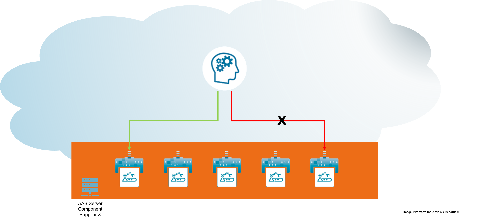

When setting up access to your AAS, it's important to recognize that not all users or systems will have the same access rights. Permissions may be differentiated at multiple levels, such as the AAS level, Submodel level, and even at the SubmodelElement level, ensuring that each participant only accesses the data or services they are authorized to. Proper authentication mechanisms must be in place to verify the identity of users.

## How to scale?

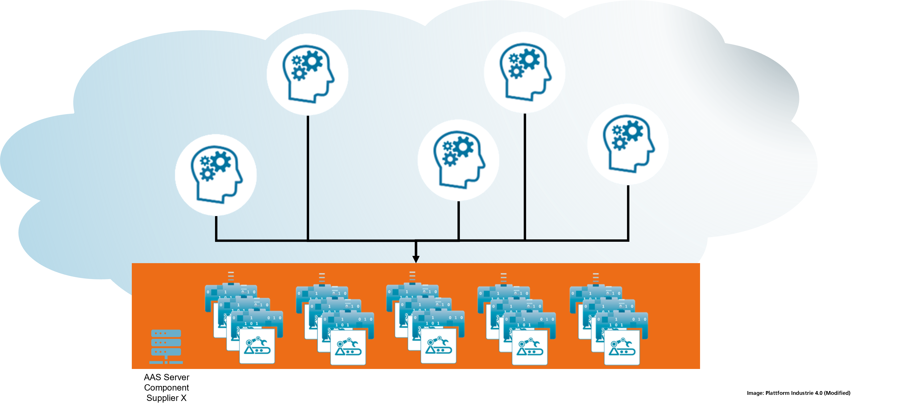

The question "How to Scale?" addresses the challenge of ensuring that your AAS infrastructure can handle a potentially massive number of AAS and the numerous entities that will be interacting with them. Here's an elaboration based on the provided points:

* There may be millions, if not billions of AAS in your infrastructure:

    * In large-scale industrial ecosystems, the number of AAS could grow exponentially as more assets, components, and systems are digitized and represented through AAS. It's crucial to consider how your infrastructure will manage such large quantities of AAS, ensuring that each can be accessed, updated, and interacted with efficiently and without delay.
* There are lots of entities accessing those AAS:

    * Not only will there be a large number of AAS, but there will also be a significant number of entities, such as users, systems, applications, and partners, trying to access and interact with them. This introduces the need to handle concurrent access while maintaining performance, security, and reliability.
* How do you ensure scalability?:

    * Ensuring scalability means designing an infrastructure that can expand seamlessly as the number of AAS and users grows. This involves:
        - Architectural Design: Using a distributed, cloud-native architecture that can scale horizontally by adding more computing resources or nodes as needed.
        - Load Balancing: Implementing load balancers to evenly distribute traffic across servers, ensuring that no single system becomes a bottleneck.
        - Caching: Leveraging caching mechanisms to store frequently accessed data, reducing the load on the system and improving response times.
        - Database Scaling: Utilizing databases that can scale horizontally or vertically to handle the massive data generated and accessed by the AAS and their interacting entities.
        - Microservices Architecture: Breaking down your infrastructure into smaller, modular microservices that can scale independently based on demand.
* Scalability is not only a question of the used software & architecture but also the used hardware:

* While software architecture is critical, the hardware that supports the infrastructure must also be capable of scaling. 
* So, after answering these questions, we have secured infrastructure that can be found by other entities and that does scale:

    * By addressing both the software and hardware aspects of scalability, you ensure that your AAS infrastructure is resilient, scalable, and secure. The infrastructure should not only support massive growth in the number of AAS and entities accessing them, but also provide seamless discovery, access control, and performance even at scale. This allows the system to grow in line with business needs without sacrificing efficiency or security.

However, we did not look at one last but very important question

### How to Connect your own Systems?

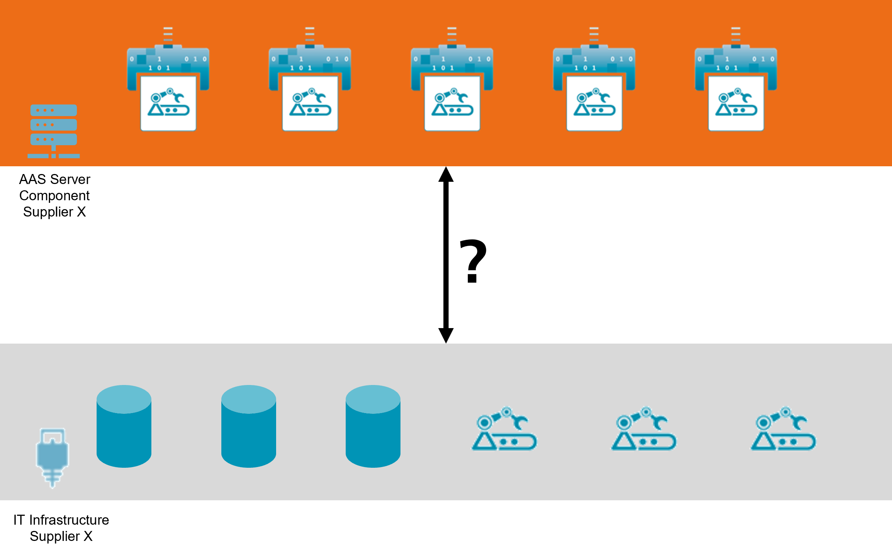

The question "How to Connect Your Own Systems?" explores how to integrate your existing infrastructure and assets with the AAS framework to create a seamless, automated environment. This process ensures that your systems, devices, and products are represented in the AAS infrastructure efficiently and accurately.

* Your AAS infrastructure needs to be populated with AAS representing your assets: Devices, Products, �Ǫ:

    * To make full use of the AAS infrastructure, you must populate it with digital representations of your assets. These assets can include physical devices, products, services, or processes. Each of these needs to be connected to an AAS, which serves as a digital twin that contains information about the asset's properties, status, and lifecycle.
* Of course, you can create all of those by hand, but this is obviously not the way to go:

    * Manually creating each AAS, especially in a large-scale operation, would be time-consuming, error-prone, and inefficient. While manual creation might be feasible for a small number of assets, this method doesn't scale well and is not practical in a dynamic environment where asset data constantly changes.
* Instead, data of your systems, e.g., PLM, ERP need to be available as AAS in an automated way:

    * The preferred approach is to automate the creation and updating of AAS by integrating your existing systems, such as Product Lifecycle Management (PLM), Enterprise Resource Planning (ERP), and other databases. These systems already contain valuable data about your assets, such as design specifications, production schedules, inventory levels, and more.
* Additionally, your devices need to be integrated with AAS to provide, for example, live data:

    * Beyond static data from systems like PLM and ERP, many devices and assets generate real-time data, such as operational metrics, sensor readings, and status updates. These devices need to be integrated with the AAS infrastructure to provide live data streams that reflect the current condition or performance of the asset. This real-time data can be critical for monitoring, predictive maintenance, and optimizing operations. Integration with IoT platforms or direct connection to device interfaces may be required to capture and feed this live data into the AAS.
* Concrete implementation depends on your own setup and organizational constraints, e.g., of your IT department:

    * The specific way in which you connect your systems to the AAS will depend heavily on the existing infrastructure and organizational constraints of your company. Factors such as your IT department's capabilities, the type of systems you are currently using, and security policies will influence how integration is implemented.

Now, after having addressed all the key questions, such as how to set up, scale, secure, and connect your systems to the AAS dataspace, you are ready to integrate with the AAS infrastructure. However, the process of answering these questions, from managing identity and access to ensuring scalability and automating data integration, can be time-consuming and costly. This complexity raises the question: is there an alternative to handling all these challenges independently? Wouldn't it be ideal if a project could offer this entire setup as-a-service, providing ready-to-use solutions that simplify the implementation and maintenance of your AAS infrastructure? Such a solution would eliminate the burden of building everything from scratch, significantly reducing costs and time to deployment.

## AAS Dataspace for Everybody

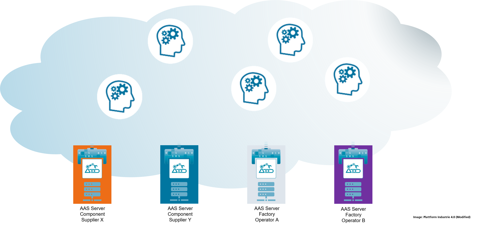

This is exactly what the AAS Dataspace for Everybody is aiming to achieve! It is a collaborative initiative designed to simplify the process of setting up and integrating with the AAS dataspace, helping organizations avoid the time and costs associated with building their own infrastructure from scratch. It's a project led by IDTA, Fraunhofer IESE, and NetApp, aimed at providing a testbed for getting started with AAS Dataspaces. Here's what the project focuses on:

* Simplifying the sharing of Digital Twins: The project makes it easier for companies to share digital twins securely and efficiently across organizational boundaries.
* Simplifying the creation of AAS-based digital twin environments: It helps participants rapidly build environments based on AAS principles, reducing the complexity and time needed for setup.
* Prototyping cross-company digital twins: The initiative supports the development and testing of cross-company digital twins, enabling seamless data exchange and collaboration between different organizations.
* Integrating dataspace technologies into products, processes, and devices: The project works to integrate AAS and dataspace technologies into real-world products, manufacturing processes, and devices, making digital twins a core part of daily operations.

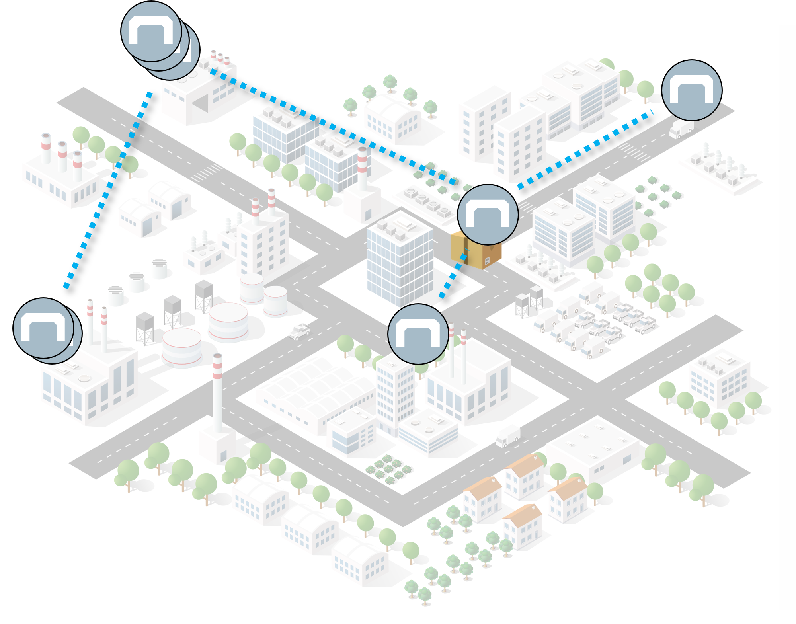

One key point is that the AAS Dataspace for Everybody serves as a testbed for precompetitive use cases. It's a space for experimentation, not for commercial use, where organizations can explore and refine their digital twin strategies without the pressure of market competition.

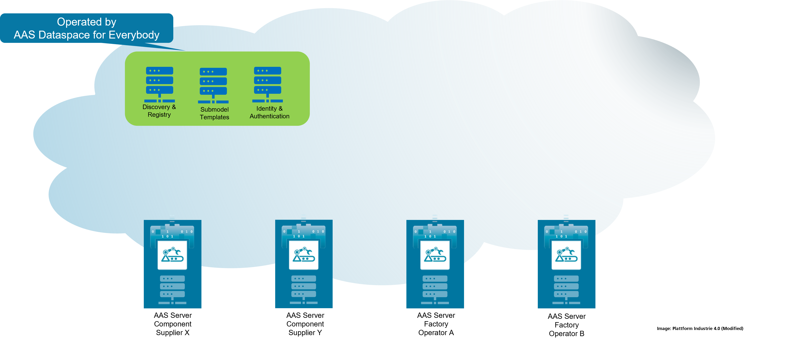

The infrastructure will be operated 24/7 at IESE in Kaiserslautern, using Eclipse BaSyx as the core platform. For scalability, the project leverages NetApp hardware and technology, ensuring that the infrastructure can handle a growing number of AAS and the demands of cross-company collaboration.

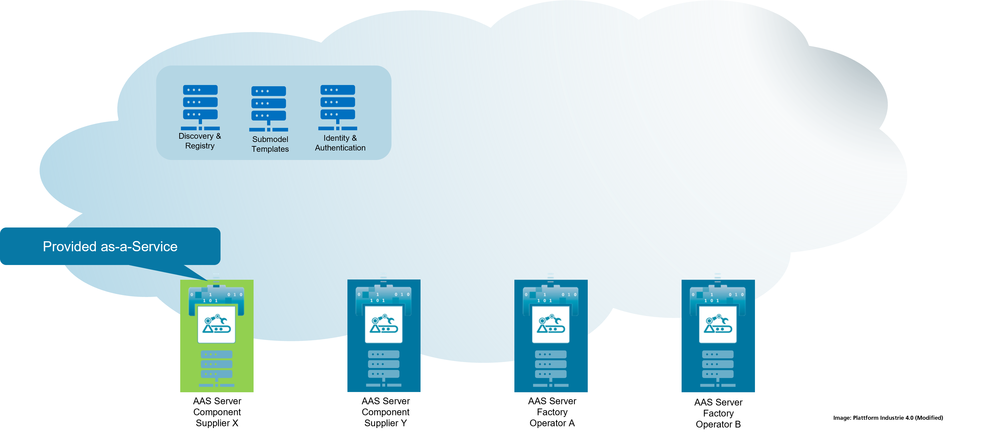

This project aims to provide an accessible, scalable, and collaborative environment to help organizations quickly start working with AAS dataspace technologies, offering a practical alternative to building everything from scratch.

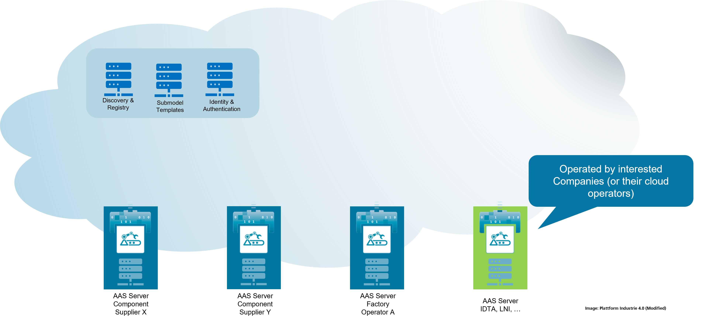

Let's now answer the questions step by step based on the AAS Dataspace for Everybody project:

* How to find your AAS?

    * The AAS Dataspace for Everybody solves this by hosting the Discovery and Registry infrastructure. This ensures that your AAS can be easily found by other participants in the dataspace. You don't need to worry about setting up complex registries or discovery mechanisms, this is managed for you.

* How to get access to your AAS?

    * Access control is handled through the project's hosted Identity Management and Access Control systems. The infrastructure includes policies for managing who can access your AAS and under what conditions, ensuring secure, controlled access without requiring you to set up and manage these mechanisms yourself.

* How to scale?

    * Scalability is managed for you as well. The AAS Dataspace for Everybody utilizes state-of-the-art hardware from NetApp, providing the computational power and storage capacity needed to scale as the number of AAS grows. This ensures that your infrastructure can handle large numbers of AAS and concurrent users, without performance degradation.

* Which Submodel Templates are used? Where to get them?

    * You guessed it, we provide the Submodel Templates too! The project includes ready-to-use Submodel templates that conform to industry standards, simplifying the creation and deployment of AAS. You don't need to develop these from scratch, as we offer a library of templates to get you started quickly and efficiently.

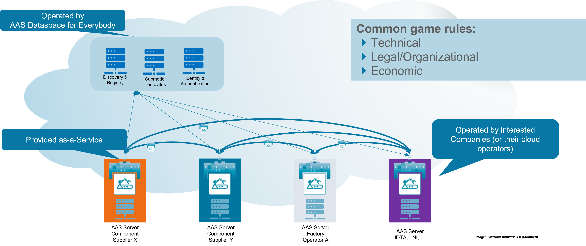

By offering these key components' Discovery, Registry, Access Control, Scalability, and Submodel Templates, the AAS Dataspace for Everybody project removes the complexities of setting up and managing your own AAS infrastructure. Everything you need is hosted and provided within the framework, allowing you to focus on utilizing the AAS for innovation and collaboration.

### When you have your own AAS infrastruture

If you already have your own AAS infrastructure but would like to participate in the AAS Dataspace for Everybody, you can easily connect to the core infrastructure without needing to overhaul your existing setup. By simply linking your AAS infrastructure to the Discovery and Registry services provided by the project, you can seamlessly integrate and participate in the broader dataspace. This allows your AAS to be discoverable and interoperable with other participants in the network. Organizations like LNI and VWS Vernetzt are already doing this, leveraging the project's core services to extend their capabilities while maintaining their existing systems. This flexible approach ensures that organizations can benefit from the shared infrastructure and collaboration opportunities without having to start from scratch.

To put it all together:

* We are providing a core infrastructure that includes key services such as Discovery, Registry, and Submodel Templates, while also managing Identity and Authentication to ensure secure access and participation in the AAS Dataspace.
* We enable interested parties to connect their existing AAS infrastructure seamlessly to the AAS Dataspace for Everybody, allowing them to integrate with the broader network without needing to replace their current systems.
* For those starting from scratch, we offer AAS as-a-service, providing a ready-to-use platform that eliminates the complexities of setting up your own AAS infrastructure.
* By offering these services, we are establishing common game rules at several levels, ensuring that all participants operate with consistent standards, security measures, and interoperability, facilitating collaboration and data exchange across organizations.

Now, you may be wondering, what is the software backbone that powers this AAS Dataspace?

The software backbone for the AAS Dataspace for Everybody is called **Eclipse BaSyx**. Naturally, this raises the next important question, what is Eclipse BaSyx?

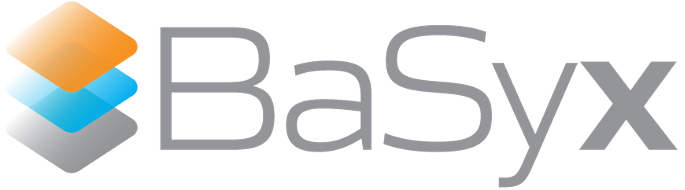

Eclipse BaSyx is an open-source platform that provides a complete AAS infrastructure, offering all the tools and components necessary for the creation, management, and interaction of Asset Administration Shells. It is highly regarded for its Technology Readiness Level (TRL), making it a trusted choice for industrial and commercial applications.

With over 320,000+ downloads, Eclipse BaSyx has proven its reliability and widespread adoption in various industries. Its scalable and secure architecture ensures that it can handle large-scale AAS environments while maintaining the highest standards of security and performance.

Eclipse BaSyx is also applied in mission-critical environments, where uptime, reliability, and security are paramount, further demonstrating its robustness and capability. Beyond the technical aspects, BaSyx benefits from a strong ecosystem of contributors and users, ensuring continued development, support, and innovation, making it the ideal backbone for the AAS Dataspace for Everybody.

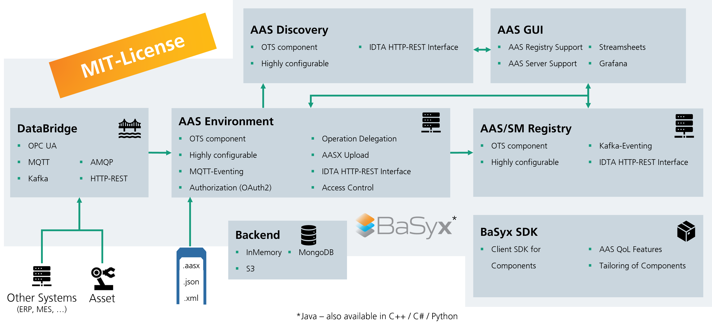

To know more about Eclipse BaSyx, please check the [documentation](https://wiki.basyx.org/en/latest/).

## How to Get Access to the AAS Dataspace for Everybody?

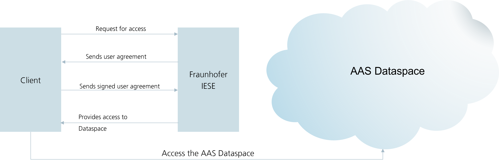

Now, the interesting question is "How can I access the AAS Dataspace for Everybody?". Access to the AAS Dataspace for Everybody is free for IDTA members, and getting started is straightforward. Just follow these three easy steps to gain access:

1. Request Access: To begin, send a request for access to the AAS Dataspace by emailing **[AASDataspace@iese.fraunhofer.de](mailto:AASDataspace@iese.fraunhofer.de?subject=Need%20access%20to%20the%20AAS%20Dataspace)**. This will initiate the process of setting up your participation.

2. Sign the Usage Agreement: After your request, you will receive a usage agreement form. Simply review, sign, and send it back to complete the legal and procedural formalities.

3. Obtain Certificates: Once the agreement is signed, you will receive the necessary certificates that grant you secure access to the AAS Dataspace. These certificates ensure that only authorized users can connect to and interact with the dataspace.

With these simple steps, IDTA members can quickly and securely integrate into the AAS Dataspace for Everybody and begin collaborating.

## I am not an IDTA member but still I want to access the AAS Dataspace for Everybody

Non-IDTA members are also welcome to access the **AAS Dataspace for Everybody**. We offer customized plans tailored to meet the specific needs of different customers, ensuring you only pay for what you require.

To get started, simply send an email to **[AASDataspace@iese.fraunhofer.de](mailto:AASDataspace@iese.fraunhofer.de?subject=Need%20access%20to%20the%20AAS%20Dataspace)**, describing your needs and requirements. Our team will review your request and provide a plan that best suits your situation, ensuring that you have the right level of access to the AAS Dataspace. Whether you're looking for full access or specific features, we'll work with you to create a plan that fits your needs.

## I have an access to the AAS Dataspace for Everybody, how can I access the AAS Dataspace infrastruture?

If you already have access to the AAS Dataspace for Everybody, the next step is to familiarize yourself with how to use the infrastructure. Please visit the comprehensive [tutorial](aas-dataspace-tutorial.md).

This tutorial provides a detailed guide on how to effectively use the AAS Dataspace, including code examples, security configuration instructions, and practical tips to help you get started quickly. Whether you're looking to integrate your systems, configure security settings, or explore advanced features, this tutorial will guide you through every step of the process, ensuring you can fully leverage the AAS Dataspace infrastructure.

