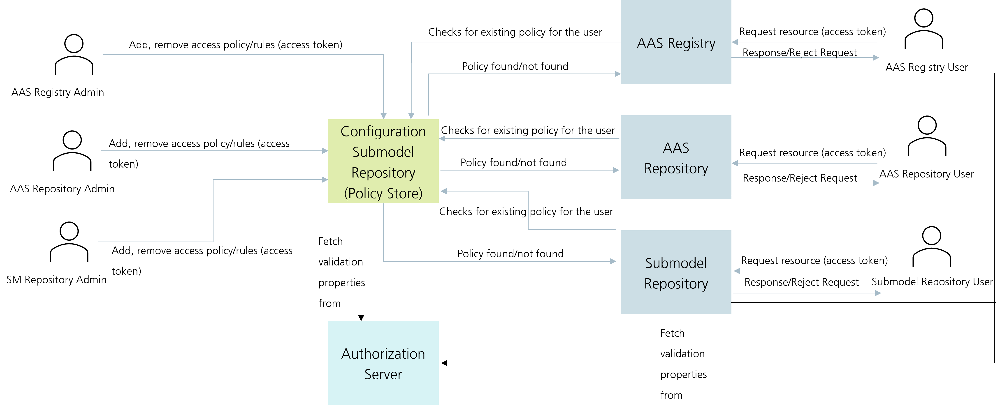
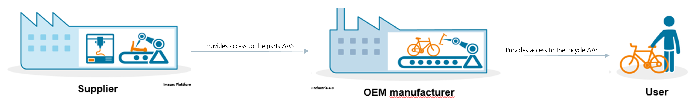

# AAS Dataspace for Everybody in Action

## Table of Contents
* [Overview](#Overview)
* [Target Group](#Target-Group)
* [Prerequisites](#Prerequisites)
* [Tutorial](#Tutorial)

***
## Overview
This tutorial focuses on below points:

* What is the �ǣAAS Dataspace for Everybody?
* Live Demonstration of the AAS Dataspace for Everybody
* Try out the AAS Dataspace yourself and share Digital Twins with multiple Partners.

This tutorial introduces the AAS Dataspace for Everybody, in a practical way, showcasing its capabilities for sharing digital twins with partners. Through a live demo and hands-on exercise, participants will learn how to create, manage, and collaborate on digital twins efficiently using the AAS Dataspace.

If you haven't checked the **detailed documentation** of the concept and use-case of AAS Dataspace for Everybody, please go through this [documentation](index.md).

***
## Target Group
AAS Developers, Companies


***
## Prerequisites
1. Laptop.
2. REST API Client (e.g., [Postman](https://www.postman.com/downloads/), [Insomnia](https://insomnia.rest/download))
3. Java JDK 17
4. Any IDE
5. Certificates (if you don't have one, pleasee check [here](index.md) to request one)

## Tutorial

### AAS Dataspace Dashboard Overview

AAS Dataspace for Everybody comprises of components of AAS Infrastructure and few external components. AAS Dataspace dashboard is to view the available components, their statuses, count of metamodels inside it etc.

AAS Dataspace for Everybody Dashboard can be accessed by the endpoint: https://dataspace.digital-twin.host/aas-dataspace-dashboard/

It also has features to navigate to the component, browse the APIs, and also check the supported features. It has following components:

* **AAS Environment** 
* **AAS registry**
* **Submodel Registry**
* **AAS Discovery**
* **AAS Repository**
* **Submodel Repository**
* **Concept Description Repository**
* **Identity Management**
* **AAS Web GUI**
* **Configuration Submodel Repository**

### AAS GUI

* Go to [AAS GUI](https://dataspace.digital-twin.host/aas-gui/)
* You will be prompted by the Login Screen (username -> john.doe, password -> johndoe)
* It will list all the AASs
* Now, try logging in with some other user which has only access for a single AAS (username -> dave, password -> dave)
* It will display the AAS assigned to that specific user in the Dataspace.

### Security in AAS Dataspace

AAS Dataspace currently supports the Role-based access control. 
Role-based access control (RBAC)-�**restricts network access based on a person's role within an organization**-�and has become one of the main methods for advanced access control.

A rule in the context of RBAC is a policy that defines the actions a specific role can perform on certain resources. Each rule typically consists of the following components:

* **Role**: The entity (user or group) that the rule applies to, such as `admin` or `basyx-reader`.
* **Action**: The operation permitted by the role, such as `CREATE`, `READ`, `UPDATE`, or `DELETE`.
* **Target Information**: The resource(s) that the action can be performed on, like `aas` (Asset Administration Shell) IDs. The targetInformation defines coarse-grained control over the resource, you may define the aasIds with a wildcard (\*), it means the defined role x with action y can access any Asset Administration Shell on the repository. You can also define a specific AAS Identifier in place of the wildcard (\*), then the role x with action y could be performed only on that particular AAS. There could be a single aasId or multiple aasIds as a list.

#### Example of a Simple RBAC Rule
```json
{
  "role": "admin",
  "action": "READ",
  "targetInformation": {
    "@type": "aas",
    "aasIds": "*"
  }
}
```

In this example, the rule grants the admin role permission to perform the READ action on all resources of type aas.

#### Persistency Support for RBAC Rules
* InMemory RBAC Storage - InMemory RBAC stores all rules directly in the application's memory.
* Submodel-based RBAC Storage - BAC rules are stored in a dedicated Security Submodel within a Configuration-Submodel Repository.

#### Formula for generating idShort of the RBAC rule for the Rule SubmodelElementCollection

* The idShort of the RBAC rule for the Rule SubmodelElementCollection is the Base64 encode of the concatenation of **Role** + **Action** + **TargetInformation Class**.
* For e.g., Role = admin, Action = DELETE, TargetInformation Class = org.eclipse.digitaltwin.basyx.aasrepository.feature.authorization.AasTargetInformation. The idShort will be Base64(adminDELETEorg.eclipse.digitaltwin.basyx.aasrepository.feature.authorization.AasTargetInformation) which is YWRtaW5ERUxFVEVvcmcuZWNsaXBzZS5kaWdpdGFsdHdpbi5iYXN5eC5hYXNyZXBvc2l0b3J5LmZlYXR1cmUuYXV0aG9yaXphdGlvbi5BYXNUYXJnZXRJbmZvcm1hdGlvbg==.

Similarly, you can create idShorts using the below TargetInformation class as per the TargetInformation in consideration.
* AAS Environment: org.eclipse.digitaltwin.basyx.aasenvironment.feature.authorization.AasEnvironmentTargetInformation
* AAS Repository: org.eclipse.digitaltwin.basyx.aasrepository.feature.authorization.AuthorizedAasRepository
* Submodel Repository: org.eclipse.digitaltwin.basyx.submodelrepository.feature.authorization.SubmodelTargetInformation
* Concept Description Repository: org.eclipse.digitaltwin.basyx.conceptdescriptionrepository.feature.authorization.ConceptDescriptionTargetInformation
* AAS Registry: org.eclipse.digitaltwin.basyx.aasregistry.feature.authorization.AasRegistryTargetInformation
* Submodel Registry: org.eclipse.digitaltwin.basyx.submodelregistry.feature.authorization.SubmodelRegistryTargetInformation
* AAS Discovery: org.eclipse.digitaltwin.basyx.aasdiscoveryservice.feature.authorization.AasDiscoveryServiceTargetInformation

#### Example of a Simple Submodel persistent RBAC Rule
```json
{
  "modelType": "SubmodelElementCollection",
  "idShort": "YWRtaW5ERUxFVEVvcmcuZWNsaXBzZS5kaWdpdGFsdHdpbi5iYXN5eC5hYXNyZXBvc2l0b3J5LmZlYXR1cmUuYXV0aG9yaXphdGlvbi5BYXNUYXJnZXRJbmZvcm1hdGlvbg==",
  "value": [
      {
          "modelType": "Property",
          "value": "admin",
          "idShort": "role"
      },
      {
          "modelType": "SubmodelElementList",
          "idShort": "action",
          "orderRelevant": true,
          "value": [
              {
                  "modelType": "Property",
                  "value": "READ"
              }
          ]
      },
      {
          "modelType": "SubmodelElementCollection",
          "idShort": "targetInformation",
          "value": [
              {
                  "modelType": "SubmodelElementList",
                  "idShort": "aasIds",
                  "orderRelevant": true,
                  "value": [
                      {
                          "modelType": "Property",
                          "value": "*"
                      }
                  ]
              }
          ]
      }
  ]
}
```

More details on Security can be found [here](https://github.com/eclipse-basyx/basyx-java-server-sdk/tree/main/basyx.aasrepository/basyx.aasrepository-feature-authorization)

### Dynamic RBAC Management

* BaSyx supports dynamic management of RBAC rules using Submodel.
* The administrator of the system controls the Policy inside the Submodel.
* Rules can be added or deleted while the system is running.



### Interaction With AAS DS4E with Postman

* There are multiple ways you could use to interact with AAS Dataspace based on the use case.
* With Postman - collections can be found [here](https://oc.iese.de/index.php/s/AlfERXOMdqlu8PU)
* Via browser
* Programmatically with client/server SDK

### How to install/add certificates?

* Accessing the AAS Dataspace requires certificates.
* Certificates permits a user/organization to access the Dataspace.
* Certificates for this workshop is kept [here](https://oc.iese.de/index.php/s/AlfERXOMdqlu8PU)
* A comprehensive document on how to install the certificates in various applications is kept [here](https://oc.iese.de/index.php/s/AlfERXOMdqlu8PU)

### Usage 1 of AAS Dataspace with Postman

* Postman/Insomnia is very helpful to interact easily with the AAS Dataspace.
* There are some basic APIs created for interacting with AAS Dataspace using Postman.
* The collection can be found [here](https://oc.iese.de/index.php/s/AlfERXOMdqlu8PU)

### Usage 2 of AAS Dataspace in an example use case

* A bicycle manufacturer and suppliers of parts of bicycle works collaboratively with the AAS Dataspace.
* There is one Manufacturer and three Suppliers.
* Three suppliers are for Gear, Frame, and Tyre.
* Following are the information for access rules configuration in Identity Management:
| Role              | User  | Password |
|-------------------|-------|----------|
| FrameSupplier     | alice | alice    |
| GearSupplier      | bob   | bob      |
| TyreSupplier      | carol | carol    |
| ManufacturerFrame | dave  | dave     |
| ManufacturerGear  | dave  | dave     |
| ManufacturerTyre  | dave  | dave     |


* When Frame Supplier delivers the product they also add a policy/rule (using Dynamic RBAC) so that the manufacturer can see the Digital Twin of the supplied product.
  - Postman -> AASDataspace -> Rules -> Frame (In Postman collection)
    - We need to add rules separately for AAS/SM Registry as well as AAS/SM Repository
    - Login to the UI using manufacturer account to see if the Frame AAS exists
      - Username: dave
      - password: dave
* Similarly when Gear Supplier delivers the product they also add a policy/rule (using Dynamic RBAC) so that the manufacturer can see the Digital Twin of the supplied product.
	- Postman -> AASDataspace -> Rules -> Gear
	- Login to the UI using manufacturer account (same credentials as above) to see if the Gear AAS exist.
* Similarly when Tyre Supplier delivers the product they also add a policy/rule (using Dynamic RBAC) so that the manufacturer can see the Digital Twin of the supplied product.
	- Postman -> AASDataspace -> Rules -> Tyre
	- Login to the UI using manufacturer account (same credentials as above) to see if the Tyre AAS exists

  

* When manufacturer opens the AAS GUI, and login through its own credentials, they can see the digital twins of the products provided by the suppliers.
* If Manufacturer tries to update some property value such as MaxLoadCapacity then they cannot do it because they have no rights for that.
* And then Supplier update some important details on its own AAS such as MaxLoadCapacity then the Manufacturer will be able to see it in real time and take action if necessary.
* Now, manufacturer provides access to the Bicycle AAS to the user by adding rule.

### Usage 3 of AAS Dataspace programmatically

* As we know, the AAS Dataspace is secured via certificate, so we need to add the certificate to the Java Keystore and configure the HttpClient with this SSL context. 
* The .pfx certificates cannot directly be added to the Java Keystore. So, we need to convert it into JKS format.
* Keytool is used to convert the pfx to jks. Below command can be used to convert an existing pfx to jks.
```bash
keytool -importkeystore -srckeystore workshop.pfx -srcstoretype pkcs12 -destkeystore workshop.jks -deststoretype JKS
```
* Then we use the below code to add the jks cert to Java Keystore and then create an SSL context using this:
```java
// Load the KeyStore (.jks file)
KeyStore keyStore = KeyStore.getInstance("JKS");
InputStream keyStoreStream = new FileInputStream(DataspaceHelper.JKS_FILE_PATH);
keyStore.load(keyStoreStream, DataspaceHelper.JKS_PASSWORD.toCharArray());

// Create a KeyManagerFactory
KeyManagerFactory kmf = KeyManagerFactory.getInstance(KeyManagerFactory.getDefaultAlgorithm());
kmf.init(keyStore, DataspaceHelper.JKS_PASSWORD.toCharArray());

// Initialize the SSLContext
SSLContext sslContext = SSLContext.getInstance("TLS");
sslContext.init(kmf.getKeyManagers(), null, new SecureRandom());
```
* Entire code is kept [here](https://oc.iese.de/index.php/s/AlfERXOMdqlu8PU)
* Build the code using below command in eclipse:
* Right click the project -> maven build... -> 
```bash
clean install
```

***
## Links
* Resources: https://oc.iese.de/index.php/s/kDQJmrsWdTKPNMC  (Password: FraunhoferIESE24)
* BaSyx GitHub: https://github.com/eclipse-basyx/basyx-java-server-sdk
* AAS Dataspace Dashboard: https://dataspace.digital-twin.host/aas-dataspace-dashboard/
* Base64 Encode: https://www.base64encode.org/
* Base64 Decode: https://www.base64decode.org/
* IDTA SMT Repo: http://smt-repo.admin-shell-io.com/
