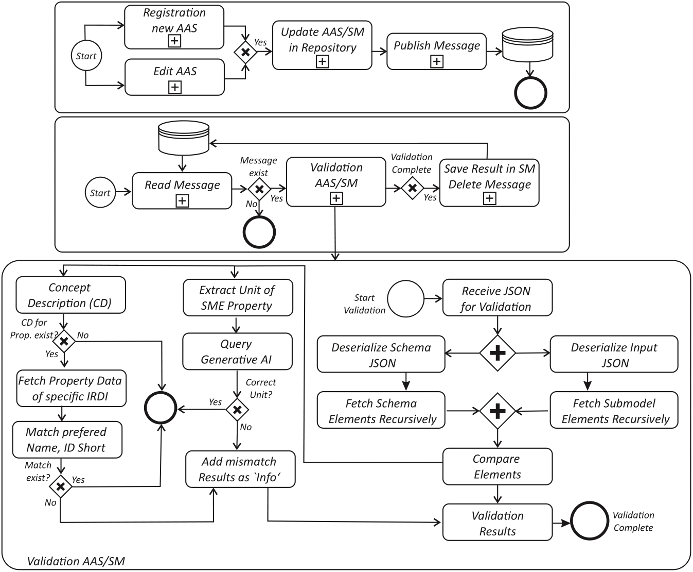

# System Components


## System Components of the Test Orchestrator
This section provides an overview of the main components involved in the Test Orchestrator architecture and how they interact to validate AAS Submodels.

---

## High-Level Architecture

The diagram below outlines the integration between the BaSyx Submodel Repository, AAS Web UI, MQTT Broker, and the Test Orchestrator components.

```{figure} ./images/architecture.png
---
width: 100%
alt: architecture
name: architecture
---
```

*Architecture of the Test Orchestrator and its integration with BaSyx modules and MQTT*

---

## Component Breakdown

At a high level, the orchestrator integrates with the BaSyx Submodel Repository, listens to MQTT events, deserializes incoming Submodels, performs template matching and recursive comparison, and stores the outcome as result Submodels.


### 1. AAS/Submodel Repository
Stores the uploaded submodels and triggers events on creation/update/deletion.

### 2. MQTT Broker
Handles event-driven messaging and allows the orchestrator to respond to submodel lifecycle events.

### 3. Deserializer
Parses incoming JSON or AASX files into structured AAS model objects.

### 4. Data Validator
Coordinates the comparison logic using schema matching and validation rules.

### 5. Result Submodels
All results—errors, warnings, etc.—are written back to dedicated TestResult submodels.

---


## Core Modules

- **Deserializer**  
  Parses JSON input and schema files into AAS model objects. Ensures version compatibility (AASX v3).

- **Comparator**  
  Selects the right schema via `SemanticId` and coordinates the validation process.

- **RecursionFunc**  
  Implements recursive validation of nested SubmodelElementCollections.

- **SMEComparator**  
  Applies multiplicity rules (`One`, `ZeroToOne`, `OneToMany`, `ZeroToMany`) and qualifier checks.

- **ComparisonResult**  
  Collects errors, warnings, differences, and info messages into a standardized format.

- **ResultSubmodelFactory**  
  Creates new result Submodels for reporting, including unsupported version or missing `SemanticId` cases.

---

The figure below illustrates the class diagram:

```{figure} ./images/ClassDiagram.png
---
width: 100%
alt: ClassDiagram
name: ClassDiagram
---
```
---

##  Further Reading

For deeper architectural insights, continue reading the published paper:  
[**An Automated Approach to Compliance Testing of Standardized Submodel Templates**](https://ieeexplore.ieee.org/document/11087912)

---
