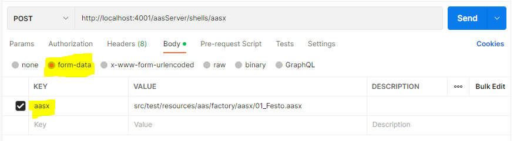

# AASX Upload Endpoint
## User Story & Use Case
*As AAS Components user*

*I want to upload AASX files via a dedicated HTTP/REST endpoint*

*so that I don't need to have any programming knowledge for uploading an AASX file*


This feature can be used to integrate AAS and Submodels in an AASX file after AAS Server component start without having to write a single line of code.

## Feature Overview
If this feature is enabled, it is possible to use the following endpoint for uploading the file via multipart form upload with an HTTP-POST request:
```
http://<server>:<port>/<contextPath>/shells/aasx
```
An .aasx-file has to be included as an entry in the multipart form data upload. The entry **must** have a non-empty name like e.g. "aasx", "file" or "path". The following Screenshot shows an example in Postman:



Here, we gave the entry the name "aasx". Make sure that "form-data" is selected!

If you want to upload an AASX-file via Java, use the following code to create an AAS aggregator with AASX-Upload function:
```
 IAASAggregator aasAggregator = new AASAggregatorAASXUpload(new AASAggregator());
```
Now, in order to upload an AASX package to the AAS-server, use the method uploadAAX(InputStream aasxStream)to upload an AASX-package. Before that, it is worth to pay attention that the AASX-package must be load as an input-stream. The following code example shows how to perform this step. We assume that the path of the AASX-package is specified by the AASX_PATH with:
```
 public static final String AASX_PATH = "src/test/resources/aas/factory/aasx/01_Festo.aasx";
```
Uploading an aasx works as following:
```
 File file = Paths.get(AASX_PATH).toFile();
 aggregator.uploadAASX(new FileInputStream(file));
```
The complete unit-test for AASXUpload can be found under: https://github.com/eclipse-basyx/basyx-java-sdk/blob/main/src/test/java/org/eclipse/basyx/testsuite/regression/extensions/aas/aggregator/aasxupload/TestAASAggregatorAASXUploadSuite.java

## Feature Configuration
This feature can be enabled via the aas.properties file. For this, add the following line to the file:
```
aas.aasxUpload=Enabled
```
Besides enabling or disabling (via Disabled), there's no need for additional configuration.