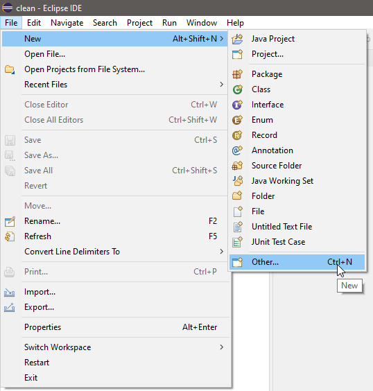
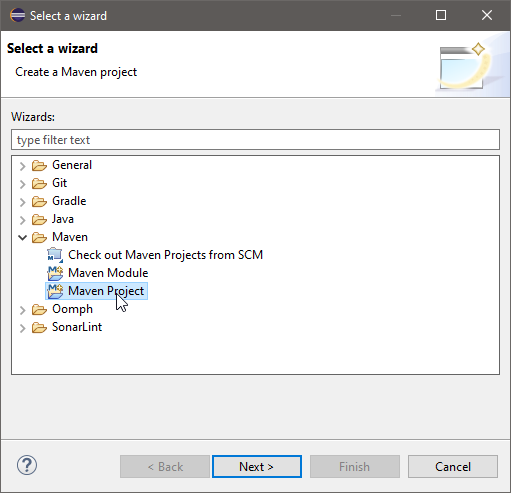
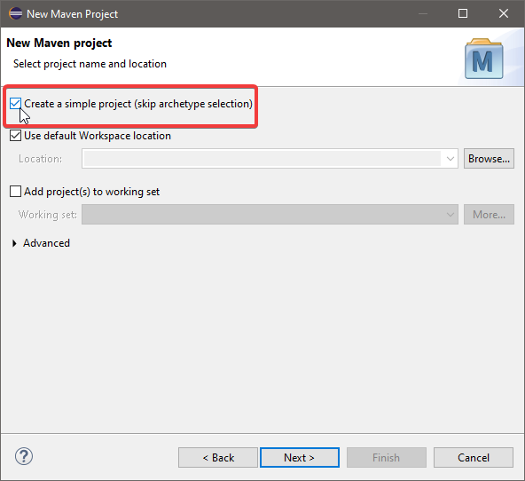
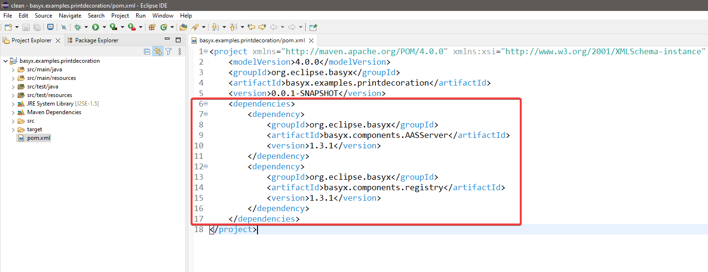
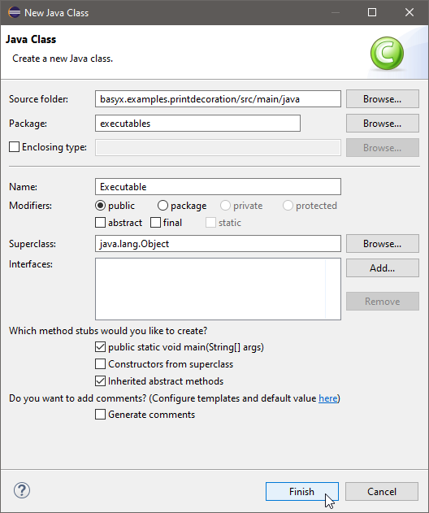

# Feature Decoration Example

## Introduction

With the feature factory decoration Eclipse BaSyx allows for the easy creation of new functionality around the official HTTP REST interface of the AAS. In this example, we will show how to create such a feature from scratch in a new Maven project using Eclipse as our IDE.

The idea of the feature decoration in BaSyx utilizes the decoration and factory patterns described by the Gang of Four. This is done to ensure the correct buildup process, as the APIs are used in the Aggregators of both the AAS and the submodel. However, building a new feature is quite simple and always follows the same structure.

All of this code is part of our Eclipse BaSyx Example repository and can be found [here](https://github.com/eclipse-basyx/basyx-java-examples/tree/development/basyx.examples.printdecoration).

## Step 0: Maven Project including BaSyx
Before we can start with the creation of a new feature, we need our own project that includes BaSyx. In this example, we create a new maven project. If you have your own project already, skip to [Step 1], if not follow these instructions. We recommend skipping the archetype selection for this short preview.








With the new project in place, we can add Eclipse BaSyx to our dependencies and create the first Java class to start a registry and a server.





```java
   public class Executable {
      public static void main(String[] args) {
         startRegistry();
         startAASServer();
      }
 
      private static void startAASServer() {
         BaSyxContextConfiguration config = new BaSyxContextConfiguration();
         config.loadFromResource("./serverContext.properties");
 
         BaSyxAASServerConfiguration aasConfig = new BaSyxAASServerConfiguration();
         aasConfig.loadFromDefaultSource();
 
         AASServerComponent server = new AASServerComponent(config, aasConfig);
         server.startComponent();
      }
 
      private static void startRegistry() {
         BaSyxContextConfiguration config = new BaSyxContextConfiguration();
         config.loadFromResource("./registryContext.properties");
 
         BaSyxRegistryConfiguration registryConfig = new BaSyxRegistryConfiguration();
         registryConfig.loadFromDefaultSource();
 
         RegistryComponent registry = new RegistryComponent(config, registryConfig);
         registry.startComponent();
      }
   }
```

## Property Files
As listed in the AASServer and Registry methods, we load the configurations from their default sources. For this, we will need to add the following files to our resources folder in the project. The different config elements can also be changed to your liking, we simply stick to the default values for this example.

#### aas.properties
```bash
   # #############################
   # AAS Server configuration file
   # #############################
 
   # #############################
   # Backend
   # #############################
   # Specifies the backend that loads the AAS and Submodels 
 
   # InMemory - does not persist AAS or submodels 
   aas.backend=InMemory
 
   # MongoDB - persists data within a MongoDB
   # See connection configuration in mongodb.properties
   # aas.backend=MongoDB
 
   # #############################
   # Source
   # #############################
   # Possible to load an AAS Environment from a file
 
   aas.source=
 
   # Other examples (Currently supported: *.xml, *.json and  *.aasx): 
   # aas.source=aasx/myAAS.aasx
   # aas.source=aasx/myAAS.xml
   # aas.source=aasx/myAAS.json
   # Or when encapsulated in the docker volume for this container:
   # aas.source=/usr/share/config/myAAS.aasx
   # Similarly, multiple sources can be specified using a JSON syntax:
   # aas.source=["json/aas.json","aasx/aas.aasx","xml/aas.xml"]
 
   # #############################
   # MQTT
   # #############################
   # Possible to enable MQTT events
 
   aas.events=NONE
   # aas.events=MQTT
   # aas.events=MQTTV2
   # aas.events=MQTTV2_SIMPLE_ENCODING
 
   # Id that is used in e.g. mqtt topics to enable multiple aas-servers connected to one broker
   aas.id=aas-server
 
   # #############################
   # AASX Upload
   # #############################
   # Possible to enable AASX Upload
 
   aas.aasxUpload=Enabled
   # aas.aasxUpload=Disabled
 
   # #############################
   # Registry
   # #############################
   # If specified, can directly register the AAS that has been loaded from the source file.
   # path specifies the registry endpoint
   registry.path=http://localhost:4000/registry/
 
   # #############################
   # Host
   # #############################
   # Host specifies the endpoint of the deployed AAS component
   # If host is empty, the registered AAS endpoint is derived from the context properties
 
   # registry.host=
 
   # #############################
   # Submodels
   # #############################
   # If one or more submodels are specified here, only the submodels will be registered at the 
   # registry. This can be used for distributed submodel deployments
   # In case of an empty or no list, this does not have an effect. By default, all submodels
   # are registered at a given registry.
 
   # registry.submodels=["smId1","smId2"]
 
   # ###########################
   # Authorization
   # ###########################
   # Enables Authorization via OAuth2, disabled by default
 
   # aas.authorization=Enabled
   aas.authorization=Disabled
 
   # ###########################
   # Property Delegation
   # ###########################
   # Delegate property value retrieval to arbitrary endpoints, enabled by default
 
   aas.delegation=Enabled
   # aas.delegation=Disabled
 
   # ##############################################
   # Authorization Credentials for Secured Registry
   # ##############################################
   #tokenEndpoint=http://127.0.0.1:9006/auth/realms/basyx-demo/protocol/openid-connect/token
   #clientId=basyx-demo
   #clientSecret=OZtOv3TlXvEhhKf705Z53J8QL8YPY9UJP
   #clientScopes=["urn:org.eclipse.basyx:scope:aas-registry:read","urn:org.eclipse.basyx:scope:aas-registry:write"]
```

#### registry.properties
```bash
   # ###########################
   # Registry configuration file
   # ###########################
 
   # ###########################
   # Backend
   # ###########################
   # Specifies the backend that loads the AAS and Submodels 
 
   # InMemory - does not persist AAS or submodels 
 
   registry.backend=InMemory
 
   # MongoDB - persists data within a MongoDB
   # See connection configuration in mongodb.properties
 
   # registry.backend=MongoDB
 
   # SQL - persists data within an SQL database
   # See connection configuration in sql.properties
 
   # registry.backend=SQL
 
   # ###########################
   # Event-Backend
   # ###########################
   # MQTT - MQTT events are fired for various registry operations
   registry.events=NONE
   # registry.events=MQTT
   # registry.events=MQTTV2
   # registry.events=MQTTV2_SIMPLE_ENCODING
 
   # Id that is used in e.g. mqtt topics to enable multiple registries connected to one broker
   registry.id=aas-registry
 
   # ###########################
   # Authorization
   # ###########################
   # registry.authorization=Enabled
   registry.authorization=Disabled
 
   # ###########################
   # TaggedDirectory
   # ###########################
   # registry.taggedDirectory=Enabled
   registry.taggedDirectory=Disabled
```
#### serverContext.properties
```bash
   # ###############################
   # HTTP Context configuration file
   # ###############################
 
   # ###############################
   # Context Path
   # ###############################
   # Specifies the subpath in the url for this server context
 
   contextPath=/aasServer
 
   # ###############################
   # Hostname
   # ###############################
   # Specifies the hostname for this server context
 
   contextHostname=localhost
 
   # ###############################
   # Port
   # ###############################
   # Specifies the port for this server context
 
   contextPort=4001
 
   # ###############################
   # HTTPS configuration
   # ###############################
   # Specifies the HTTPS configuration for this server context
   # Will be enabled if both sslKeyPath and sslKeyPass are set
   # The key references the SSL certificate
 
   # sslKeyStoreLocation=resources/basyxtest.jks
   # sslKeyPass=pass123
 
   # ############################### 
   # Cross-origin resource sharing 
   # ############################### 
   # CORS can be configured by defining the origin 
   # Use wildcard (*) to indicate that the requests from all domains are allowed 
 
   # accessControlAllowOrigin=http://www.example.com
```
#### registryContext.properties
```bash
   # ###############################
   # HTTP Context configuration file
   # ###############################
 
   # ###############################
   # Context Path
   # ###############################
   # Specifies the subpath in the url for this server context
 
   contextPath=/registry
 
   # ###############################
   # Hostname
   # ###############################
   # Specifies the hostname for this server context
 
   contextHostname=localhost
 
   # ###############################
   # Port
   # ###############################
   # Specifies the port for this server context
 
   contextPort=4000
 
   # ###############################
   # JWT Bearer Token Authentication
   # ###############################
   # jwtBearerTokenAuthenticationIssuerUri=http://localhost:9005/auth/realms/basyx-demo
   # jwtBearerTokenAuthenticationJwkSetUri=http://localhost:9005/auth/realms/basyx-demo/protocol/openid-connect/certs
   # jwtBearerTokenAuthenticationRequiredAud=aas-registry
 
   # ###############################
   # HTTPS configuration
   # ###############################
   # Specifies the HTTPS configuration for this server context
   # Will be enabled if both sslKeyPath and sslKeyPass are set
   # The key references the SSL certificate
 
   # sslKeyStoreLocation=resources/basyxtest.jks
   # sslKeyPass=pass123
 
   # ############################### 
   # Cross-origin resource sharing 
   # ############################### 
   # CORS can be configured by defining the origin 
   # Use wildcard (*) to indicate that the requests from all domains are allowed 
 
   # accessControlAllowOrigin=http://www.example.com
```

## Step 1: Feature Extension
Once the project using Eclipse BaSyx exists, we can continue with the feature extension process. A new **AASServerFeature** is needed as the first step. This feature consists of three methods. First, an initialization method is created. This method is executed as a first step at the start of the server, e.g. to start an MQTT connection. Second, a clean-up method that offers a place to close all connections made or stop other elements of the complete feature. The third method is to retrieve the **AASServerDecorator** which includes all the factories for the feature itself.

In our easy example, we create a feature that prints everything that happens using the REST interface to the java console.
```java
   public class PrintlnAASServerFeature implements IAASServerFeature {
      public void initialize() {
         // Code to create the context of the feature
      }
 
      public void cleanUp() {
         // Code to close the context of the feature
      }
 
      public IAASServerDecorator getDecorator() {
         return new PrintlnAASServerDecorator();
      }
   }
```

## Step 2: Feature Decorator
For the **PrintlnAASServerFeature** to work, we also need to create an **AASServerDecorator**. This decorator incorporates the factories for the API and Aggregator of the AAS and submodel. These factories are used to create the respective elements in the correct order without compromising the combination (stacking) of different features like the authorization and MQTT eventing. You can, of course, also not decorate certain aspects of the endpoints and just return the given factory. All of this depends on your specific use case.

```java
   public class PrintlnAASServerDecorator implements IAASServerDecorator {
      public ISubmodelAPIFactory decorateSubmodelAPIFactory(ISubmodelAPIFactory submodelAPIFactory) {
         return new PrintlnDecoratingSubmodelAPIFactory(submodelAPIFactory);
      }
 
      public ISubmodelAggregatorFactory decorateSubmodelAggregatorFactory(ISubmodelAggregatorFactory submodelAggregatorFactory) {
         return new PrintlnDecoratingSubmodelAggregatorFactory(submodelAggregatorFactory);
      }
 
      public IAASAPIFactory decorateAASAPIFactory(IAASAPIFactory aasAPIFactory) {
         return new PrintlnDecoratingAASAPIFactory(aasAPIFactory);
      }
 
      public IAASAggregatorFactory decorateAASAggregatorFactory(IAASAggregatorFactory aasAggregatorFactory) {
         return new PrintlnDecoratingAASAggregatorFactory(aasAggregatorFactory);
      }
   }
```

## Step 3: API and Aggregator Factories
Continuing building our new feature, we will need to create a decorating factory for all necessary endpoint aspects. The following code snippets show an overview of all four potential factories. For ease of use, there are interfaces for all four classes. This is to ensure the feature creation is done correctly. All follow the same structure of reusing the create method of the old factory and then decorating the result. **Important note**: It is relevant to add the constructor. This is to ensure the different features can be built on top of each other.

### DecoratingAASAggregatorFactory
```java
   public class PrintlnDecoratingAASAggregatorFactory implements IAASAggregatorFactory {
      private IAASAggregatorFactory aggregatorFactory;
 
      public PrintlnDecoratingAASAggregatorFactory(IAASAggregatorFactory factoryToBeDecorated) {
         this.aggregatorFactory = factoryToBeDecorated;
      }
 
      public IAASAggregator create() {
         IAASAggregator aggregator = aggregatorFactory.create();
         return new PrintlnAASAggregator(aggregator);
      }
   }
```

### DecoratingAASAPIFactory
```java
   public class PrintlnDecoratingAASAPIFactory implements IAASAPIFactory {
      private IAASAPIFactory apiFactory;
 
      public PrintlnDecoratingAASAPIFactory(IAASAPIFactory factoryToBeDecorated) {
         this.apiFactory = factoryToBeDecorated;
      }
 
      public IAASAPI getAASApi(AssetAdministrationShell aas) {
         IAASAPI api = apiFactory.create(aas);
         return new PrintlnAASAPI(api);
      }
   }
```

### DecoratingSubmodelAggregatorFactory
```java
   public class PrintlnDecoratingSubmodelAggregatorFactory implements ISubmodelAggregatorFactory {
      private ISubmodelAggregatorFactory aggregatorFactory;
 
      public PrintlnDecoratingSubmodelAggregatorFactory(ISubmodelAggregatorFactory factoryToBeDecorated) {
         this.aggregatorFactory = factoryToBeDecorated;
      }
 
      public ISubmodelAggregator create() {
         ISubmodelAggregator aggregator = aggregatorFactory.create();
         return new PrintlnSubmodelAggregator(aggregator);
      }
   }
```

### DecoratingSubmodelAPIFactory
```java
   public class PrintlnDecoratingSubmodelAPIFactory implements ISubmodelAPIFactory {
      private ISubmodelAPIFactory apiFactory;
 
      public PrintlnDecoratingSubmodelAPIFactory(ISubmodelAPIFactory factoryToBeDecorated) {
         this.apiFactory = factoryToBeDecorated;
      }
 
      public ISubmodelAPI getSubmodelAPI(Submodel submodel) {
         ISubmodelAPI api = apiFactory.create(submodel);
         return new PrintlnSubmodelAPI(api);
      }
   }
```

## Step 4: Decoration Classes
With all the prerequisites done, we now start with the decoration of all functionalities. For this, we create four classes again. One for each of the Aggregators and APIs that are used in Eclipse BaSyx. As a result, the classes each again implement an interface that includes all methods used by the official AAS REST API. The following snippets show the rest of the examples that will print all actions to the Java console. **Important note**: The constructor with the old endpoint decoration is necessary again because of the modularity of the features.

### FeatureAASAggregator
```java
   public class PrintlnAASAggregator implements IAASAggregator {
      private IAASAggregator aggregator;
 
      public PrintlnAASAggregator(IAASAggregator aggregator) {
         this.aggregator = aggregator;
      }
 
      public Collection<IAssetAdministrationShell> getAASList() {
         System.out.println("Get AAS list");
         return aggregator.getAASList();
      }
 
      public IAssetAdministrationShell getAAS(IIdentifier aasId) throws ResourceNotFoundException {
         System.out.println("Get AAS: " + aasId);
         return aggregator.getAAS(aasId);
      }
 
      public IModelProvider getAASProvider(IIdentifier aasId) throws ResourceNotFoundException {
         System.out.println("Get AASProvider: " + aasId);
         return aggregator.getAASProvider(aasId);
      }
 
      public void createAAS(AssetAdministrationShell aas) {
         System.out.println("Create AAS: " + aas.getIdentification().getId());
         aggregator.createAAS(aas);
      }
 
      public void updateAAS(AssetAdministrationShell aas) throws ResourceNotFoundException {
         System.out.println("Update AAS: " + aas.getIdentification().getId());
         aggregator.updateAAS(aas);
      }
 
      public void deleteAAS(IIdentifier aasId) {
         System.out.println("Delete AAS: " + aasId);
         aggregator.deleteAAS(aasId);
      }
   }
```

### FeatureAASAPI
```java
   public class PrintlnAASAPI implements IAASAPI {
      private IAASAPI api;
 
      public PrintlnAASAPI(IAASAPI api) {
         this.api = api;
      }
 
      public IAssetAdministrationShell getAAS() {
         IAssetAdministrationShell aas = api.getAAS();
         System.out.println("Get AAS: " + aas.getIdShort());
         return aas;
      }
 
      public void addSubmodel(IReference submodel) {
         System.out.println("Add submodel: " + submodel);
         api.addSubmodel(submodel);
      }
 
      public void removeSubmodel(String idShort) {
         System.out.println("Remove submodel: " + idShort);
         api.removeSubmodel(idShort);
      }
   }
```

### FeatureSubmodelAggregator
```java
   public class PrintlnSubmodelAggregator implements ISubmodelAggregator {
      private ISubmodelAggregator aggregator;
 
      public PrintlnSubmodelAggregator(ISubmodelAggregator aggregator) {
         this.aggregator = aggregator;
      }
 
      public Collection<ISubmodel> getSubmodelList() {
         System.out.println("Get submodel list");
         return aggregator.getSubmodelList();
      }
 
      public ISubmodel getSubmodel(IIdentifier identifier) throws ResourceNotFoundException {
         System.out.println("Get submodel: " + identifier.getId());
         return aggregator.getSubmodel(identifier);
      }
 
      public ISubmodel getSubmodelbyIdShort(String idShort) throws ResourceNotFoundException {
         System.out.println("Get submodel: " + idShort);
         return aggregator.getSubmodelbyIdShort(idShort);
      }
 
      public ISubmodelAPI getSubmodelAPIById(IIdentifier identifier) throws ResourceNotFoundException {
         System.out.println("Get submodel API: " + identifier.getId());
         return aggregator.getSubmodelAPIById(identifier);
      }
 
      public ISubmodelAPI getSubmodelAPIByIdShort(String idShort) throws ResourceNotFoundException {
         System.out.println("Get submodel API: " + idShort);
         return aggregator.getSubmodelAPIByIdShort(idShort);
      }
 
      public void createSubmodel(Submodel submodel) {
         System.out.println("Create submodel: " + submodel.getIdShort());
         aggregator.createSubmodel(submodel);
      }
 
      public void createSubmodel(ISubmodelAPI submodelAPI) {
         System.out.println("Create submodel: " + submodelAPI.getSubmodel().getIdShort());
         aggregator.createSubmodel(submodelAPI);
      }
 
      public void updateSubmodel(Submodel submodel) throws ResourceNotFoundException {
         System.out.println("Update submodel: " + submodel.getIdShort());
         aggregator.updateSubmodel(submodel);
      }
 
      public void deleteSubmodelByIdentifier(IIdentifier identifier) {
         System.out.println("Delete submodel: " + identifier.getId());
         aggregator.deleteSubmodelByIdentifier(identifier);
      }
 
      public void deleteSubmodelByIdShort(String idShort) {
         System.out.println("Delete submodel: " + idShort);
         aggregator.deleteSubmodelByIdShort(idShort);
      }
 
   }
```

### FeatureSubmodelAPI
```java
   public class PrintlnSubmodelAPI implements ISubmodelAPI {
      private ISubmodelAPI api;
 
      public PrintlnSubmodelAPI(ISubmodelAPI api) {
         this.api = api;
      }
 
      public ISubmodel getSubmodel() {
         ISubmodel submodel = api.getSubmodel();
         System.out.println("Get submodel: " + submodel.getIdShort());
         return submodel;
      }
 
      public void addSubmodelElement(ISubmodelElement elem) {
         System.out.println("Add submodel element: " + elem.getIdShort());
         api.addSubmodelElement(elem);
      }
 
      public void addSubmodelElement(String idShortPath, ISubmodelElement elem) {
         System.out.println("Add submodel element: " + idShortPath + elem.getIdShort());
         api.addSubmodelElement(idShortPath, elem);
      }
 
      public ISubmodelElement getSubmodelElement(String idShortPath) {
         System.out.println("Get submodel element: " + idShortPath);
         return api.getSubmodelElement(idShortPath);
      }
 
      public void deleteSubmodelElement(String idShortPath) {
         System.out.println("Delete submodel element: " + idShortPath);
         api.deleteSubmodelElement(idShortPath);
      }
 
      public Collection<IOperation> getOperations() {
         System.out.println("Get operations");
         return api.getOperations();
      }
 
      public Collection<ISubmodelElement> getSubmodelElements() {
         System.out.println("Get submodel elements");
         return api.getSubmodelElements();
      }
 
      public void updateSubmodelElement(String idShortPath, Object newValue) {
         System.out.println("Update submodel element: " + idShortPath);
         api.updateSubmodelElement(idShortPath, newValue);
      }
 
      public Object getSubmodelElementValue(String idShortPath) {
         System.out.println("Get submodel element value: " + idShortPath);
         return api.getSubmodelElementValue(idShortPath);
      }
 
      public Object invokeOperation(String idShortPath, Object... params) {
         System.out.println("Invoke operation: " + idShortPath);
         return api.invokeOperation(idShortPath, params);
      }
 
      public Object invokeAsync(String idShortPath, Object... params) {
         System.out.println("Invoke async: " + idShortPath);
         return api.invokeAsync(idShortPath, params);
      }
 
      public Object getOperationResult(String idShort, String requestId) {
         System.out.println("Get operation result: " + idShort);
         return api.getOperationResult(idShort, requestId);
      }
   }
```

## Step 5: Finalization
As the last step, before we can test our new feature, we need to adjust our Executable to add the feature to the server. For this, we can simply add the line *server.addAASServerFeature(createPrintlnFeature());* to our **Executable** and add the following method as well. If we run the class again, we will have the same Eclipse BaSyx AASServer and Registry as before, but all interactions with the server API will be logged in our console, because of our **PrintlnFeature**.

```java
   private static IAASServerFeature createPrintlnFeature() {
      return new PrintlnAASServerFeature();
   }
```
As a result, the startAASServer() method will look like this:

```java
    private static void startAASServer() {
	BaSyxContextConfiguration config = new BaSyxContextConfiguration();
	config.loadFromResource("./serverContext.properties");
 
	BaSyxAASServerConfiguration aasConfig = new BaSyxAASServerConfiguration();
	aasConfig.loadFromDefaultSource();
 
	AASServerComponent server = new AASServerComponent(config, aasConfig);
	server.addAASServerFeature(createPrintlnFeature());
	server.startComponent();
    }
```

### Additional Notes
Similar to the decoration of the AASServerComponent the RegistryComponent can be decorated. You simply follow the same generic steps with the exception that the interfaces change and thus other factory and decoration classes will be in the focus.