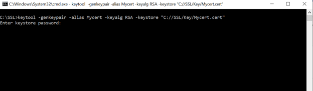
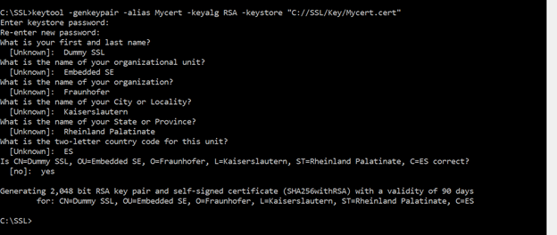

## Introduction
By default, the [AAS server component](../aas-server/index.md) uses plain *Hypertext Transfer Protocol* (HTTP) to communicate with clients. HTTP is unprotected against network attacks, which allows an adversary to read and manipulate any communication to and from the AAS server. However, the AAS server also supports a secure variant of HTTP named HTTPS. To secure exchanged data, HTTPS makes use of the *Transport Layer Security* protocol (TLS), which provides three protection layers: (1) Encryption: exchanged data cannot be read by others; (2) Integrity: exchanged data cannot be modified by others; (3) Authenticity: exchanged data indeed comes from the claimed source, the server. Today, most Websites on the Internet support HTTPS and browsers recently use HTTPS as their default mode [[1]](https://blog.chromium.org/2021/03/a-safer-default-for-navigation-https.html).

Due to the insecure nature of HTTP, it is *highly recommended to use the AAS server in HTTPS mode*. This article describes how to configure the BaSyx AAS server component to use HTTPS, thereby, effectively protecting the AAS server against network attacks.

## Installation Options and Requirements
In order to make use of HTTPS, the AAS server, and potentially also clients, need to be properly configured. In detail, HTTPS requires servers to hold an asymmetric (private/public) key pair and an associated certificate. Based on the certificate, clients can verify the authenticity of the server. This means that clients can verify that they are indeed communicating with the benign server and not with an adversary.

There are two types of certificates: self-signed certificates and CA-signed certificates. Self-signed certificates are signed by their own creator, which makes self-signed certificates easy to generate. On the downside, self-signed certificates provide no chain of trust, meaning that clients must initially be provided with the server self-signed certificate prior to securely communicating with the server. In contrast, CA-signed certificates are signed by a *Certificate Authority* (CA). Thus, generating the server certificate involves an external party, the CA. This makes the certificate generation more complex, but on the other hand, often ease the certificate verification for clients. This is because clients can make use the chain of trust established between the CA and the server certificate. Clients must only have the CA certificate to verify all certificates that are signed by this CA. Note that Operating Systems and browsers already come with preinstalled certificates of well-known public CAs and/or company CAs. In case a server certificate is signed by such a CA, clients can make use of the preinstalled CA certificates to verify the authenticity of the server. Thus, no configuration effort is needed on the clients side.

For beginners, it is recommended to start with self-signed certificates, as they are much easier to generate and use (see Option 1). This guideline assumes the presence of the Java Key and Certificate Management utility called [keytool](https://docs.oracle.com/javase/7/docs/technotes/tools/windows/keytool.html). Keytool is included in the installation of the *Java Runtime Environment* (JRE) or the *Java Development Kit* (JDK). To use keytool in command line we need to make sure that JDK/JRE is installed properly including the following two points:

1. JAVA_HOME environment variable is added in the system pointing to the JDK. A guide on how to add JAVA_HOME can be found here- https://docs.oracle.com/cd/E19182-01/821-0917/inst_jdk_javahome_t/index.html
2. JDK/bin folder must be added to the system path. A guide on how to add JDK/bin to path can be found here- https://docs.oracle.com/javase/7/docs/webnotes/install/windows/jdk-installation-windows.html
In *java/jdk/bin* there is an executable file **keytool.exe** which can be used to create a dummy certificate. If the *JAVA_HOME* variable is set and path/to/bin is added to system path, keytool can be accessed by *CLI*. A step-by-step guide on how to create a certificate using java keystore can be found here- https://docs.oracle.com/cd/E19798-01/821-1841/gjrgy/

For advanced installations of the AAS server, e.g., for production environments or when using multiple clients, CA-signed certificates are suited better (see Option 2). For CA-signed certificates, this guideline additionally makes use of the [openssl](https://www.openssl.org) utility, which is a popular toolkit for general-purpose cryptography and secure communication. Another way to get a SSL Certificate can be bought from several domain and security provider company (e.g. GoDaddy, Hostgator) and can be installed on the server. A documentation on how to get an SSL and install it can be found in the link below: https://www.godaddy.com/help/request-my-ssl-certificate-and-learn-how-to-install-it-if-youre-new-to-ssls-start-here-32151 Nevertheless, there are many alternatives than openssl that can be used in similar ways as described below.

## Option 1: Self-signed AAS Server Certificate
#### Step 1: Key and Certificate Generation
Keytool is able to generate an asymmetric (private/public) key pair and an associated self-signed certificate in a single step. This is done using the following command:
```
keytool.exe -genkey -alias tomcat -keyalg RSA -keysize 2048 -dname "CN=example-hostname, O=Example Company, C=DE" -validity 365 -storepass secretpassword -keystore credentials.jks
```

The command generates an RSA key pair of size 2048 bit. RSA is a well-proven asymmetric key cipher and 2048 bits is a key size currently recommended by the BSI [[2]](https://www.keylength.com/en/8/). In addition, the command generates a self-signed certificate and sets the "Subject" of the certificate. Please note that the configuration of the Subject needs to be adapted to the deployment environment of the AAS (see [RFC 5280](https://datatracker.ietf.org/doc/html/rfc5280) for more information). Most important is the Common Name (CN) in the subject field, which must match the DNS name or IP address under which the AAS server is reachable. With the flag validity and the parameter 365, it is defined that the certificate is valid for 365 days. Finally, keys and certificate are stored in a *Java Key Store* (JKS) file called "credentials.jks", which is protected by the password "secretpassword". Please make sure to adapt the filename and password as needed. In addition, the alias "tomcat" is used, which is needed by the AAS server to find its keys and certificates in the JKS file.

There is already a default certificate provided with Basyx. This can be found at basyx\sdks\java\basys.sdk\tomcat.8080\resources folder under the name ssl.cert. To generate a dummy certificate without generating the java key stoe (".jks"-file), following the steps below:

1. Run Command Prompt from desired location.
2. Run the following command: `keytool -genkeypair -alias Mycert -keyalg RSA -keystore "C:/ SSL/Key/Mycert.cert"` Here under *-alias*, Mycert can be renamed to any name. in *-keyalg* we can use any encryption algorithm. Here RSA is used. We may also provide the location where it will create the certificate. After that, it will ask for a keystore password.
3. After giving a password, it will ask to retype the password again. If the passwords match, it will ask some basic questions which will be used to generate the key. Finally, it will ask if all the information is correct. Then it will generate the key file.

   

The key will be found at the given location.

#### Step 2: Providing AAS Server with Key and Certificate
After generating the JKS file, it needs to be provided to the AAS server. The JKS file for the OTS AAS-Server can be found under the path: *basyx.components/basyx.components.docker/basyx.components.AASServer/tomcat.8080/resources/basyxtest.jks.* The user can pass the JKS file by configuring the context.properties file in the *src/main/resources.*

```
 sslKeyStoreLocation=resources/basyxtest.jks
 sslKeyPass=pass123
```

OR the user can use the BaSyx SDK to pass the JKS file by configure the *BaSyxContextConfiguration*:
```
private static BaSyxContextConfiguration createBaSyxContextConfiguration() {
		BaSyxContextConfiguration contextConfig = new BaSyxContextConfiguration();
		contextConfig.loadFromResource(BaSyxContextConfiguration.DEFAULT_CONFIG_PATH);
		contextConfig.setSSLKeyStoreLocation("resources/basyxtest.jks");
		contextConfig.setSSLKeyPassword("pass123");
		return contextConfig;
	};
```
This configuration can be passed as parameter to the AASServerComponent:
```
BaSyxContextConfiguration contextConfig = createBaSyxContextConfiguration();
BaSyxAASServerConfiguration serverConfig = new BaSyxAASServerConfiguration(AASServerBackend.INMEMORY, "xml/aas.xml");
component = new AASServerComponent(contextConfig, serverConfig);
```
Please see the test under *basyx.components/basyx.components.docker/basyx.components.AASServer/src/test/java/org/eclipse/basyx/regression/AASServer/TestServerWithHTTPS.java* for more details. The OTS component AASRegistry is configured in a similiar way.


For users that don't use the OTS AAS-Server, please see the section "Running Basyx in HTTPS" below to setup an own BaSyx server.

Now, the AAS server securely runs in HTTPS mode with a self-signed certificate. But before clients can make use of the HTTPS connection, they need to be provided with the server's self-signed certificate through an out-of-band channel, e.g., by transferring the certificate as a file via USB stick. This is because clients without any prior information have no means to verify that the self-signed certificate indeed belongs to the benign AAS server. After all, the adversary could have used the above-described command to generate a self-signed certificate for a rogue AAS server.

#### Step 3: Extracting Public Keys of AAS Server Certificate

Since the JKS also contains the server's private key, which should not leave the server, transferring the JKS store to clients is bad idea. Instead, the self-signed certificate needs to be detached from the JKS store. This can be done using the following command:
```
keytool.exe -export -alias tomcat -storepass secretpassword -keystore credentials.jks -file server.cer
```
The command extracts the self-signed certificate from a keystore "credentials.jks" using the password "secretpassword" and stores it in the file "server.cer" with DER encoding. Afterwards the certificate file needs to be transmitted to clients, e.g., using a USB stick or some other form of communication medium.
#### Step 4: Providing Clients with AAS Server Certificate

Finally, clients need to made aware of the self-signed certificate. Command line tools, such as [wget](https://www.gnu.org/software/wget/) or [curl](https://curl.se) typically provide a parameter to set the certificate (wget: "--ca-certificate=server.pem", curl "--cacert server.pem"). Note that wget, curl, and other tools require the certificate to be encoded in PEM format. Exporting the certificate in PEM format can be done with keytool using the additional parameter "-rfc":
```
keytool.exe -export -alias tomcat -storepass secretpassword -keystore credentials.jks -rfc -file server.pem
```
In addition, some clients make use of a certificate store to keep track of trusted certificates. Such certificate stores are provided either by the client itself or by the Operating System (OS). For instance, browsers typically use the certificate store provided by the OS. On Windows, certificates can be imported into the Windows certificate store by double-clicking on the certificate and following these steps: Install Certificate... -> Store Location: Current User -> Certificate Store: Trusted Root Certification Authorities -> Finish. Afterwards, Windows, including browsers such as Firefox, Edge, or Chrome, recognizes the certificate as trustworthy. On Linux-based OSs, the implementation of the certificate store depend on the particular Linux distribution. Here is a link that describes the process for Ubuntu: [Adding the Root Certificate to Linux](https://deliciousbrains.com/ssl-certificate-authority-for-local-https-development/#adding-root-cert-linux-keychain).
## Option 2: CA-signed AAS Server Certificate
### Step 1: Key and CSR Generation
To generate a CA-signed certificate for the AAS server, the AAS server first needs an asymmetric (private/public) key pair. In addition, the subject field of the future certificate need to be set. This is done with keytool using the following command:
```
keytool.exe -genkey -alias tomcat -keyalg RSA -keysize 2048 -dname "CN=example-hostname, O=Example Company, C=DE" -validity 365 -storepass secretpassword -keystore credentials.jks
```
As described above for Option 1, the parameters of the command need to be adapted to the particular installation. However, unlike Option 1, a certificate signing request (CSR) now needs to be generated for the server. This can be done with the following command:
```
keytool.exe -certreq -alias tomcat -storepass secretpassword -keystore credentials.jks -file server.csr
```
### Step 2: CA signs CSR
Next, the generated CSR needs to be signed by the CA. This step depends on the implementation of the CA. In general, a CA can be public (e.g., provided by DigiCert), private (e.g., running on your local machine), or hybrid (e.g., a company CA). Since there are various CA implementations and procedures for getting CSRs signed, please refer to your CA for getting the CSR signed. To perform a local test, a CA certificate can also be generated locally using openssl with the following commands:
```
openssl genrsa -out root_key.pem 4096 openssl req -x509 -key root_key.pem -outform pem -out root_cert.pem -days 3650 -subj "/O=Example Company/CN=Company CA" -addext "keyUsage=critical, digitalSignature, keyCertSign, cRLSign"
```
The above CSR from step 1 can then be signed by the generated CA with the following openssl command:
```
openssl x509 -req -CA root_cert.pem -CAkey root_key.pem -in server.csr -out server.pem -CAcreateserial
```
### Step 3: Import CA and CA-signed Certificate
After the CA issued a certificate for the AAS server, the certificate needs to be imported in the initial JKS from Step 1. This way, the AAS server can make use of the certificate to authenticate itself. This requires a two-step process, in which first the CA certificate and then the CA-signed AAS server certificate needs to be imported. The above-generated CA certificate for testing purposes can be imported using keytool with the following command:
```
keytool.exe -importcert -storepass secretpassword -keystore credentials.jks -alias root -file root_cert.pem
```
When importing the CA certificate, keytool will show a prompt where one has to confirm that the CA certificate is indeed trustworthy. In the same manner, the CA-signed AAS server certificate can be imported afterwards:
```
keytool.exe -importcert -storepass secretpassword -keystore credentials.jks -alias tomcat -file server.pem
```
Note that keytool verifies the trust chain when importing the AAS server certificate. Thus, if the CA certificate is not imported first, keytool will fail to establish the trust chain and refuse to import the AAS server certificate.
The JKS file is now ready to be used by the AAS server. Please refer to Option 1 -> Step 2 (see above) for starting the AAS server in HTTPS mode and providing it with the JKS file and password.

Finally, the AAS server securely runs in HTTPS mode with a CA-signed certificate. But before clients can make use of the HTTPS connection, they need to be provided with the CA certificate through an out-of-band channel, e.g., by transferring the certificate as a file via USB stick. Only then, clients are able to verify the trust chain for the AAS server certificate.

### Step 4: Providing Clients with CA Certificate
Providing clients with the CA certificate works in the same manner as providing clients with a self-signed certificate. Please refer to Option 1 -> Step 3 (see above) for a description of different ways to import certificates into clients or the Operating System certificate store.


## Running Basyx in HTTPS
1. *basyx.vab.protocol.http.server.BasyxContext* has a constructor
`BaSyxContext(String reqContextPath, String reqDocBasePath, String hostn, int reqPort, boolean isSecuredCon, String keyPath, String keyPass)`
We must create an instance of this class using the above constructor and provide-
```yaml
isSecuredCon = true
keyPath = path to the key file
keyPass = password of the key file
```
We can use the above instance of BasyxContext to create a *basyx.vab.protocol.http.server.BaSyxHTTPServer*. This will configure the embedded Tomcat server to run on HTTPS mode. Then **BaSyxHTTPServer.Start()** Will run the server in HTTPS.
The above steps will run the embedded tomcat server in HTTPS mode. If we want to deploy the application in an external tomcat server, we need to configure the server externally. A brief overview on how to do that can be found here- https://tomcat.apache.org/tomcat-7.0-doc/ssl-howto.html


## Requesting in Secured Basyx REST API
If the Tomcat is running in HTTPS using a valid certificate, REST (*GET/POST/PUT/DELETE*) request will work just like before. *basyx.vab.protocol.http.connector.HTTPConnector* and *basyx.vab.protocol.http.connector.HTTPConnectorProvider* can be used to request a secured API as well.

However, if the server is running in HTTPS using a self-signed certificate, Java will not accept this certificate since this is not a valid one and can not be verified and validated. We must create a client which will not validate anything and accept every request. <span style="color:red">Please keep in mind that this must not be done outside of development since it completely jeopardizes security if used in production.</span>

*basyx.vab.protocol.https.HTTPSConnector* can be used which internally uses *basyx.vab.protocol.https.JerseyHttpsClientFactory* to create a client which neglects all security checks and allow the request to pass with a non-valid SSL certificate.

An example on how to run the server in HTTPS and test connection, REST API can be found in *basyx.testsuite.regression.vab.protocol.https.TestVABHTTPS*

## Application-Level Authentication and Authorization of Resources in the BaSyx Server
See [BaSyx_/_Documentation_/_Components_/_Security_/_Authorization](./authorization.md).