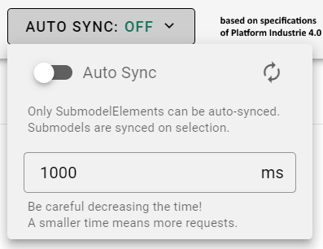

# Data Synchronization

>*As AAS Components user*
>*I want to see the current value of a SubmodelElement in the AAS Web UI without having to refresh the page.*
>*The AAS Web UI provides a data synchronization feature that allows the user to synchronize the currently selected SubmodelElement in the AAS Web UI without having to refresh the page.*

## Feature Overview

In the app bar of the AAS Web UI, the user can click on the "Auto Sync" Menu to synchronize the currently selected SubmodelElement. There are two options available:

* enable/disable automatic synchronization
* set the synchronization interval
**Reminder**: `Data synchronization only affects the "Element Details" view and "Visualization" view`

