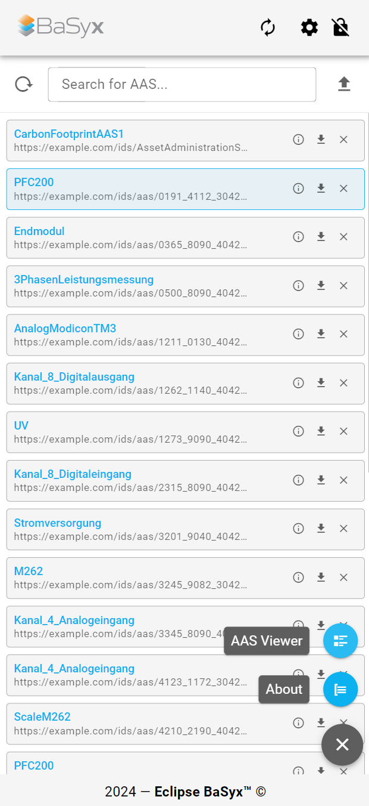

# Mobile Support

>As AAS Web UI user
>I also want to be able to use the AAS Web UI on my mobile device

The AAS Web UI is designed to be used on mobile devices as well. The UI is responsive and adapts to the screen size of the device.

## Feature Overview

The AAS Web UI automatically adapts to the screen size of the device. The user should be able to use the UI on a mobile device without any problems.

