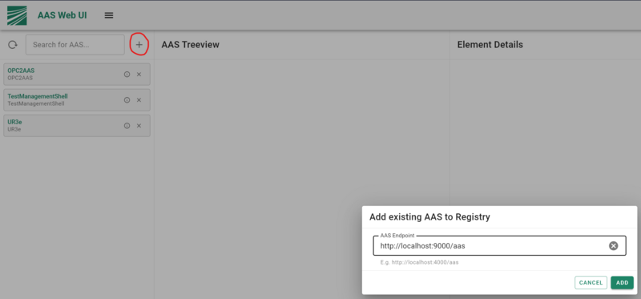

# Register new Shells
>As AAS Web UI user
>I want to add and visualize existing but not yet registered Asset Administration Shells
>This can be useful if you already have a running AAS somewhere which is not part of your current project.

## Feature Overview
You can add an existing AAS by clicking on the + Button at the top of the AAS list as shown in the image below. A dialog window will open where you can enter the Endpoint of your desired AAS. After you clicked on **ADD**, the newly registered AAS will appear in the AAS list.

