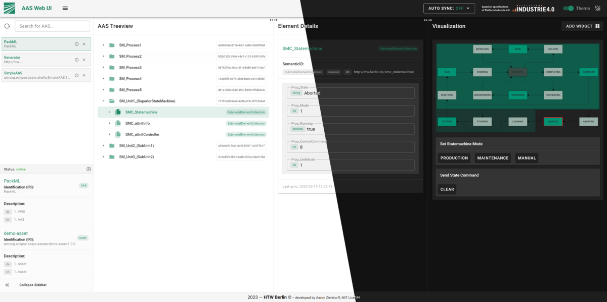

# Application Theme
>As AAS Web UI user
>I want to change the look of the AAS Web UI

The AAS Web UI provides a feature to change between a light and a dark theme.

## Feature Overview
The theme of the UI can be changed by clicking on the theme switch in the top right corner of the application.

It is also possible to change the application name and the logo in the top left corner of the application through the Docker file.