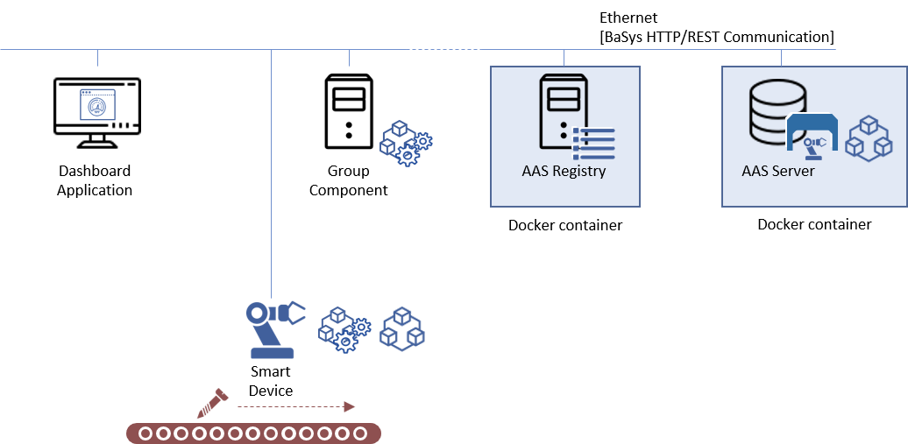
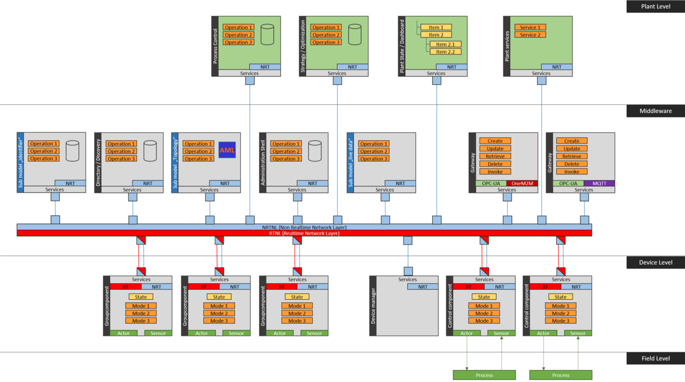

# BaSyx Concepts

The Eclipse BaSys middleware depends on the core concepts Asset Administration Shell (AAS), AAS sub model, control component, registry, and end-to-end communication. These are the core components that are required for the realization of an operational BaSys system. Additional components extend the capabilities of this BaSys system. Every main component of Eclipse BaSyx is described in its own section. The following gives a brief overview on Eclipse BaSyx.

````{sidebar}

BaSyx architecture overview graphic. BaSyx main components are Asset Administration Shell, sub models, registry, and control components that are connected through a communication medium.
````

## Main BaSyx components
The **Asset Administration Shell (AAS)** is the digital representation of any Industrie 4.0 asset. Every relevant asset, e.g. devices, workers, products, but also the manufacturing process has exactly one AAS. The AAS is identified by a unique identifier that represents exactly this asset. Because of this diversity in represented objects, every AAS contains a different set of sub models. Sub models are data models that describe specific aspects of an asset, e.g. its a digital nameplate, offered services, or the plant topology. An AAS and its sub models is a unified representation of a real-world asset. It may contain both static and dynamic models. Static models contain data, i.e. these describe for example offered services and how to reach them, and physical properties of the represented asset. A static model for example describes an OPC-UA server that provides live-sensor data or access to device control functions. Dynamic AAS sub-models contain dynamic data, e.g. live measured sensor data. A dynamic model also may offer callable services, and thus provide direct access to managing, or even controlling assets. It can for example be a facade to an OPC-UA server or a field-bus protocol, and therefore implement a harmonized interface to device-specific communication that can also be used from the IT.

````{sidebar}

BaSyx deployment example: Important Eclipse BaSyx components are provided as docker containers. They can be deployed to any docker host, either in the IT, or close to the process and thus support a wide range of possibly system architectures. BaSyx components can communicate with several systems that implement backend storage, e.g. data bases or file systems.

````

BaSys supports the three types of asset administration shells that are defined by the Platform Industrie 4.0:

* Type 1 Asset Administration Shells are serialized files. A serialized file may contain the serialized AAS and additional static sub-models. A type 1 AAS may refer to dynamic sub models that reside on a host in the network.
* Type 2 Asset Administration Shells are runtime instances that are hosted in the network. They can be reached through a network ID that is retrieved from the AAS registry, and provide a runtime interface. Eclipse BaSyx permits Type 2 AAS to be serialized to a type 1 AAS, and a type 1 AAS can be send to an AAS server component that will host it as type 2 AAS. This way, an AAS can be serialized and send to a receiver.
* Type 3 Asset Administration Shells are type 2 AAS that additionally have an active behavior. For example, these AAS can negotiate with other AAS. A language example is described in VDI/VDE 2193.

The **registry** enables the registration of new AAS, and looking up of registered AAS by their unique identifier or identifiers, as Eclipse BaSyx enables to reach the same AAS through multiple identifiers. The AAS registry provides access to all registered Asset Administration Shells, and is therefore the first point of contact for most Industrie 4.0 applications and devices. The unique AAS identifier is a logic ID that is independent of the physical deployment of the AAS or its sub models. The registry defines basic API functions for registering and de-registering AAS, as well as to lookup an AAS. The AAS registry is usually provided as docker container that is hosted on a server in the network.

A **sub-model** describes one logic aspect of the represented asset. Static sub models consist of serialized data, e.g. a digital nameplate. Dynamic sub models are components in the network. Devices update data contained in dynamic sub-models to reflect the current device state. Both AAS and AAS sub-models can be accessed using common and well-defined HTTP and OPC-UA interfaces to enable access from both the IT and shop floor (OT) devices.

**Control components** provide unified access to production services, e.g. of devices and provide unified access to device states. They provide a common interface to a PackML based device state machine that provides a basic understating of the device state, e.g. whether it is ready, working, done with a service, or whether it is in an error mode. The control component defines a unified interface for setting the device operation mode, for selecting a service, and for invoking that service. Control components are both a unified interface to the device, and they also implement service-oriented control functions on PLC controllers.


## BaSyx architecture overview

The BaSyx middleware groups Industrie 4.0 components around a communication medium, which is for example an Ethernet network. BaSyx users may use any specific network and protocol (e.g. HTTP, OPC UA, BaSyx native) to attach components, but need to make sure that components are able to exchange data with each other. The Virtual Automation Bus is a set of optional components that implement the functionality to bridge networks if necessary. A BaSyx deployment consists of several BaSyx services, as well as other components, e.g. control components that use BaSyx conforming interfaces. Components on the plant or middleware layers are usually deployed as Docker containers. BaSyx provides pre-built containers for its main components on these levels. Components on device level are implemented on PLC controllers or on Edge-Devices. Some edge-devices support BaSyx deployments already, and for example support the hosting of sub-models. All Eclipse BaSyx components are connected to the communication medium. The graphic below illustrates an example architecture overview on the BaSyx middleware and its various components:




An Eclipse BaSyx system consists therefore of the following core and optionally extended components:

Plattform Industrie 4.0 compliant components
Component type	Description	Type
Asset Administration Shell	An Asset Administration Shell is a "standardized digital representation of the asset, corner stone of the interoperability between the applications managing the manufacturing systems. It identifies the Administration Shell and the assets represented by it, holds digital models of various aspects (submodels) and describes technical functionality exposed by the Administration Shell or respective
assets." (Details of the Asset Administration Shell, 2018, p. 13, [1])

Core
Asset Administration Shell Submodels	"A Submodel defines a specific aspect of the asset represented by the Asset Administration Shell. A Submodel is used to structure the virtual representation and technical functionality of an Administration Shell into distinguishable parts. Each Submodel refers to a well-defined domain or subject matter. Submodels can become standardized and thus become submodels types. Submodels can have different life-cycles." (Details of the Asset Administration Shell, 2018, p. 46, [2])	Core
Registry	The BaSys 4.0 Registry enables registration and lookup of Asset Administration Shells within defined system boundaries. Entities that provide Asset Administration Shells including their submodels may register and hence enable other participants to find them. The necessary information required for registration amongst others are unique identifiers for the Administration Shell and her respective Asset, endpoint information regarding the Asset Administration Shell's API and their submodel service provider.	Core
Discovery	The BaSys 4.0 Discovery is a service that uses the registry to find Asset Administration Shells and Submodels. It provides additional functionalities to discover Asset Administration Shells and their Submodels based on filter criteria. These criteria are more advanced than a regular query parameter. The discovery service may provide indexing and/or crawling mechanisms to cache results from queried elements resp. find deeper information when searching.	Extended
BaSys components
Component type	Description	Type
Control component	Control components realize BaSys 4.0 conforming service based Industrie 4.0 interfaces to assets. Assets may be devices, e.g. PLC controllers, sensors, actuators, but can represent any asset that realizes services or provide information, which also includes for example human workers. Control components provide a service based interface with callable services that e.g. drill a hole into a work piece. They define how a specific service is implemented, but do not decide about the orchestration of services, i.e. a control component does not decide when and if a particular service is called.	Core
Group component	Group components implement higher-level services that use services of other control and group components. Similar to control components, group component services provide the implementation of services but do not decide about when and why a provided service is invoked. Service callers are other components that orchestrate services.	Core
Virtual Automation Bus	The virtual automation bus (VAB) is our implementation of an end-to-end communication for Industrie 4.0. It maps one communication semantic with five primitives (create/retrieve/update/delete/invoke) to different networks and protocols. This way, the VAB can bridge networks via gateways, and can also integrate legacy devices into the virtual end-to-end communication network. When using the VAB as the central BaSyx communication medium, Eclipse BaSyx components can be connected to any network that is connected to the VAB, because the VAB will bridge all these networks through its gateways. The VAB is not a new network protocol, but a set of software components that implement the network bridging behavior of the VAB.	Core
Device integration	Device integration components are VAB components that are part of devices and communicate with the VAB. They are realized on edge devices to integrate non-Industrie 4.0 devices with the Industrie 4.0 production. Device integrations for example register device AAS and sub models and keep the device status up-to-date.	Extended
Gateway	Virtual Automation Bus protocol gateways bridges communication networks to enable inter-network communication. Every gateway needs to provide a mapping of all of the five BaSys communication primitives to its supported protocols to enable end-to-end communication. Gateways can be cascaded to bridge multiple networks.	Extended
Process control	The process control component executes the production plans that the Strategy/Optimization component did create. Eclipse BaSyx integrates the open source Camunda BPMN engine as process control engine.	Extended
Monitoring	A monitoring component enables the monitoring of the production process. It for example collects and aggregates data for analysis or pushes selected and aggregated data to a dashboard. BaSyx integrates both Eclipse Grafana and Streamsheets applications for this functionality.	Extended
