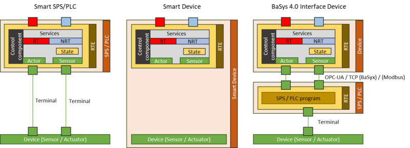

# BaSyx Device Integration

We support three strategies for integrating devices with a BaSys 4.0 production architecture:

* Smart SPS/PLC are PLC controllers with sufficiently smart RTE that enable the development of BaSys 4.0 control components and conforming BaSys 4.0 interface implementation on the device.
* Smart Devices are devices that directly provide a BaSys 4.0 conforming interface. They implement the BaSys 4.0 interface implementation on the device, e.g. on an embedded microcontroller.
* BaSys 4.0 interface devices connect existing legacy devices with proprietary connectors to a BaSys 4.0 production system. Interface devices implement the BaSys 4.0 conforming interface towards the production system, and connect to the device using its native communication technology and protocol. Service invocation is therefore triggered, for example, by calling an OPC-UA operation, by setting an OPC-UA variable, or even by changing a Modbus value. The concrete communication protocol to the device depends on the device to be integrated. For an implementation of such an interface device, see the [BaSyx DataBridge](../basyx_components/databridge/index.md) and the [Asset Integration scenario](../developer/basyx_java_v1/knowledge_base/scenarios/device-integration.md).

