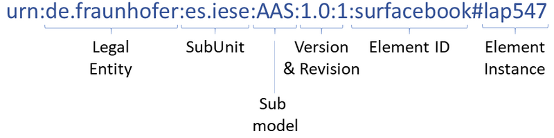

# Basyx AAS Registry

The AAS registry registers all Asset Administration Shells. It enables looking up of an AAS or of an AAS sub model by its unique ID, and stores additional optional meta-data for an AAS. The Eclipse BaSyx AAS registry registers AAS descriptors that describe both an Asset Administration Shell and the sub models of an AAS.


# The Registry

The AAS registry registers all Asset Administration Shells. It enables looking up of an AAS or of an AAS sub model by its unique ID, and stores additional optional meta-data for an AAS. The Eclipse BaSyx AAS registry registers AAS descriptors that describe both an Asset Administration Shell and the sub models of an AAS. AAS and sub-model information can be updated individually, in case of the relocation of an AAS or of a sub-model. The contents of the AAS descriptor point to the communication endpoint, i.e. the network address that connects to the AAS or to a sub-model. The Registry is provided as ready-to-use docker container as part of the open-source BaSyx middleware.


Registry component in a Eclipse BaSyx system - Icons by Icons8.com

## Using the Registry
Asset Administration Shells must be registered in the registry to ensure that they can be found by their ID. Therefore, the software component that brings a new Asset Administration Shell into the system is in charge for its registration. For example, an engineering tool that enables an engineer to project a new manufacturing line will register the AAS for the planned devices. The storage system will register AAS for work-pieces, as soon as they are e.g. scanned and added into the system. The IT system will create an AAS for a new product, as soon as a new order has been received. The AAS registry component therefore provides a http/REST API that enables to access it at runtime.


## AAS Identifiers
The registry of Eclipse BaSyx does not require a particular format for the ID of an AAS or of a sub model. It however requires every ID to be unique. If an AAS represents a physical asset, its ID should therefore be unique for every physical asset instance, and it should enable additionally the specification of type IDs, as well as for sub-models.



Eclipse BaSyx proposes to use the URN format for the main ID of an AAS. This format that has been proposed by the Platform Industrie 4.0. AAS and AAS sub models may be additionally reachable through additional IDs, e.g. serial numbers. The URN ID format defines several parts that are separated by a colon for all parts of the type ID, and gets added the element instance as trailer. The proposed parts of an URN based ID are the following:

* The **Legal Entity** is a unique identifier of the entity that is using the AAS and that defines the following subsequent fields. To ensure uniqueness, the entity should be a reference to a web domain that is owned by the owner of the asset that is represented by the AAS, and that will be kept for a long time. Qualifying the legal entity additionally with the data & time of the creation will ensure that the ID remains unique, even if the owner of the ID changes. A qualified Legal Entity with creation time at 18.05.2020 on 11:13 and 34 seconds for the above Example would look like:

```
de.fraunhofer@18.05.2020.11.13.34
```


* The **SubUnit** is a sub unit of the legal entity. It refers to a substructure of the entity, e.g. a division or a department that responsible for the asset that the AAS refers to. The sub unit definition depends on the internal structure of the legal entity.
* The **sub-model** defines the sub model that is referred by the URN. It points either to the AAS, in this case, sub-model will be “AAS”, or it is the type of a sub-model of the AAS.
* The **Version** tag defines the version of the AAS. The version should refer to a defined data structure for the referenced entity (AAS or sub-model). Changes in the AAS/sub-model meta model should lead to a change in the version number as well.
* The **Revision** tag should be incremented with every change to the AAS or its sub model structure.
* The **Element ID** defines the asset type that is referenced by the AAS or by the sub-model.
* The **Element Instance** identifies the concrete asset that is of type Element ID.

Using the namespace tag (urn:), multiple kinds of identifiers may be used concurrently in the same registry. Furthermore, the same AAS may be reachable with multiple identifiers. The same AAS may therefore be identified with a globally unique URN, or with local identifiers related to e.g. the asset type, like a serial number.

Asset Administration Shells and their sub models may be passed between entities. The receiver of an Asset may opt to create a new AAS with a new (and different) ID and enrich it with received sub-models, or it may keep the received AAS. Eclipse BaSyx enables the serialization and the transfer of sub-models independently of an AAS, and therefore enables numerous AAS based system architectures.