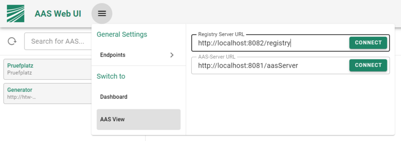

# Step 5: Creating the AAS, registering it, uploading to the AAS server and setting up the UI
The last example did create the oven Submodel. This Submodel is available in the network and can be accessed by the users. In this example step, an [Asset Administration Shell](../../user_documentation/aas.md) will be created as a unified representation of the oven. The AAS provides an asset independent digital representation. All asset specific data, such as temperature sensors and invokable operations are provided through Submodels of the AAS. The created AAS for the oven with therefore reference one Submodel, which is the oven Submodel from the previous steps. The AAS of the oven will be hosted on the AAS server in the IT infrastructure. It is registered in the [AASRegistry](../../user_documentation/vab/index.md) using an AAS descriptor to ensure that it can be found in the network. The descriptor also contains a Submodel descriptor. Once the model is registered, it is accessible by its IT. If the model is re-deployed to a different location, it is sufficient to update the registry entry.

The created AAS then can be explored through its [HTTP-Rest](../../user_documentation/API/aas.md) with any HTTP client, e.g. with a web browser.


## Creating the AAS
The Asset Administration Shell is a digital representation of a real world asset. Every asset is described at least by a short name (in this example ovenAsset), and by an URN. The short name does not need to be globally unique, it is sufficient if it is unique in the local context. The URN is used to refer to the asset, and therefore it should be unique. In this example, we will be using "urn:org.eclipse.basyx:OvenAsset". A guide for creating global URNs, and a proposal for an URN scheme that also includes versioning and revision information is provided [here - Asset Administration Shell](../../user_documentation/aas.md).

A device may come with an initial AAS that is transferred to an AAS server when the device is connected. Alternatively, an AAS may be sent in a serialized format, e.g. as .aasx or as JSON file before a physical device is delivered. In this example, the AAS is created with Java code, and uploaded by the device to the AAS server, and also registered in the registry.
```java

	// The URN is a unique name, and refers to the asset
	ModelUrn aasURN = new ModelUrn("urn:org.eclipse.basyx:OvenAAS");
 
	// A digital representation of the asset
	Asset asset = new Asset("ovenAsset", aasURN, AssetKind.INSTANCE);
 
	// Create the Asset Administration Shell object
	AssetAdministrationShell aas = new AssetAdministrationShell("oven", aasURN, asset);
```

The created Asset Administration Shell needs to be populated with the Submodels of the AAS. For this example, this will be the oven Submodel. This code should be placed after the last lines of the main function from the previous step.

```java
	// Now add the references of the submodels to the AAS header
	aas.addSubmodel(ovenModel);
```

## Creating the AAS descriptor and registering everything
The created Asset Administration Shell needs to be uploaded to the AAS server, and to the AAS registry. The registry requires an AAS descriptor that contains information about the AAS itself, and about the Submodels of the AAS. Make sure your docker Containers we created in Step 2 are running.
```java
	// Create a descriptor for the AAS
	AASDescriptor aasDescriptor = new AASDescriptor(aas, "http://localhost:8081/aasServer");
	// Explicitly create and add submodel descriptors
	SubmodelDescriptor sensorSMDescriptor = new SubmodelDescriptor(ovenModel, "http://localhost:4001/handson/oven/submodel");
 
        // Depending on the registry endpoint, this path needs to be adapted (cf. step 2)
	final String REGISTRYPATH = "http://localhost:8082/registry/";
 
        // Register the oven Submodel at the registry
        AASRegistryProxy registry = new AASRegistryProxy(REGISTRYPATH);
```

## Uploading the AAS
```java 
	ConnectedAssetAdministrationShellManager manager = new ConnectedAssetAdministrationShellManager(registry, new HTTPConnectorFactory());
	// Create the AAS on the remote AAS Server
	manager.createAAS(aas, "http://localhost:8081/aasServer");
	// Create the submodel on the remote AAS Server
	manager.createSubmodel(aasURN, ovenModel);
```

The final code should look like this:
```java
	public static void createShell() {
 
		// The URN is a unique name, and refers to the asset
		ModelUrn aasURN = new ModelUrn("urn:org.eclipse.basyx:OvenAAS");
 
		// A digital representation of the asset
		Asset asset = new Asset("ovenAsset", aasURN, AssetKind.INSTANCE);
 
		// Create the Asset Administration Shell object
		AssetAdministrationShell aas = new AssetAdministrationShell("oven", aasURN, asset);
		// Now add the references of the submodels to the AAS header
		aas.addSubmodel(ovenModel);
 
		// Create a descriptor for the AAS
		AASDescriptor aasDescriptor = new AASDescriptor(aas, "http://localhost:8081/aasServer");
 
		// Explicitly create and add submodel descriptors
		SubmodelDescriptor sensorSMDescriptor = new SubmodelDescriptor(ovenModel, "http://localhost:4001/handson/oven/submodel");
 
		// Depending on the registry endpoint, this path needs to be adapted (cf. step
		// 2)
		final String REGISTRYPATH = "http://localhost:8082/registry/";
 
		// Register the oven Submodel at the registry
		AASRegistryProxy registry = new AASRegistryProxy(REGISTRYPATH);
 
		ConnectedAssetAdministrationShellManager manager = new ConnectedAssetAdministrationShellManager(registry, new HTTPConnectorFactory());
 
		manager.createAAS(aas, "http://localhost:8081/aasServer");
		manager.createSubmodel(aasURN, ovenModel);
	}
```
The last thing to do is to call the method createShell() after the server.start() call in the main method of your class.

## Setting up the Registry UI
To visualize data there is a practical UI which u can run in a docker container. Execute the following command to start the container.
```
docker run -p 3000:3000 --name=aasWebUI eclipsebasyx/aas-gui
```
When the container is started up, you should be able to connect to the GUI via
```
http://localhost:3000
```
Now, inside the main menu located in the top bar, enter the URL of the registry server. If unchanged this would be:
```
http://localhost:8082/registry
```
**Reminder**: `Make sure that the AAS Server, Registry, and Submodel Server are running.`


Once you hit connect you should see your uploaded AAS and, once you click on it, the oven Submodel.



Now we have a working Asset Administration Shell that has been uploaded to the AAS server, as well as an oven Submodel. Both, the Submodel and the AAS have been registered at the registry, and you can access the data via the AAS Web UI.