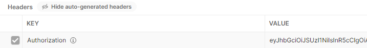

### Setting up your Keycloak instance
A detailed description on how-to set up the Keycloak Docker Container can be found [here](../../scenarios/authorization.md)

A list containing all the Scopes needed to configure your Realm, can be found [here](../../user_documentation/basyx_components/security/authorization.md#scope-tables-for-grantedauthority-and-simplerbac)

**Note**: `When trying to access your Server, with authorization enabled, from an external source, you have to set up HTTPS. You can find a description [here](../../user_documentation/basyx_components/security/index.md)`

### Restricting access via Authorization
To prevent access from unauthorized requests, you can enable authorization via OAuth2.

In order to activate you have to set aas.authorization to Enabled in your aas.properties. There are several other optional Options to set, a complete list can be found [here](../../user_documentation/basyx_components/security/authorization.md#using-authorization)
```yaml
# ###########################
# Authorization
# ###########################
# Enables Authorization via OAuth2, disabled by default

aas.authorization=Enabled
aas.authorization.strategy.jwtBearerTokenAuthenticationConfigurationProvider.keycloak.serverUrl="http://localhost:9006/auth"
#aas.authorization=Disabled
```

Now, do the same configuration for the registry.properties in order to activate it for the registry aswell.

After you enabled Authorization in you property files, you can set up the new Docker Container.

**Note**: `You may have to change the path (C:\tmp\aas | C:\tmp\registry) according to the location of your config files.`

AAS Server Component Command:
```
docker run -v C:\tmp\aas:/usr/share/config --name=aas -p 8081:4001 eclipsebasyx/aas-server:1.2.0
```

Registry Component Command:
```
docker run -v C:\tmp\registry:/usr/share/config --name=registry -p 8082:4000 eclipsebasyx/aas-registry:1.2.0
```
Now, when you try to access the AAS Server via Postman, and not send a Authorization Header, you should get a Code 500 saying:


In order to gain access, you have to generate a Token on your Keycloak Server and put it in the Authorization Header in your request.



Thats it! You now have a protected AAS Server and Registry.