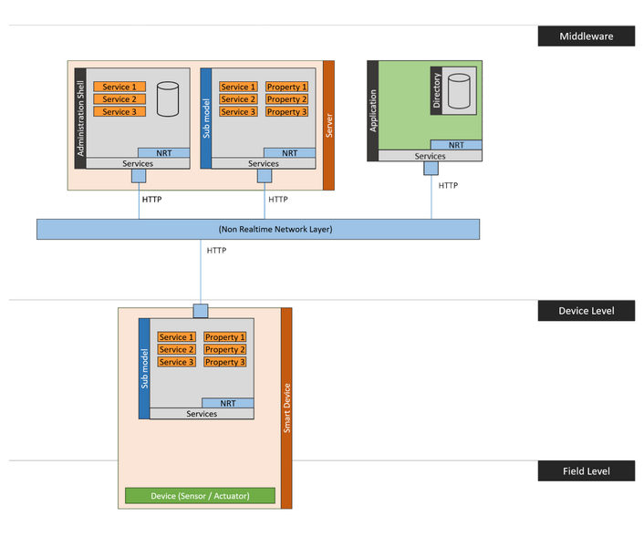

#  Cloud Edge Deployment

This example shows the setup and usage of a distributed deployment. It contains two servers as shown in the illustration. Its code is available on [GitHub](https://github.com/eclipse-basyx/basyx-java-examples/tree/main/basyx.examples/src/main/java/org/eclipse/basyx/examples/scenarios/cloudedgedeployment).

The following components are used:

* [Registry Component](../../../../basyx_components/v1/registry/index.md)
* [AAS Server Component](../../../../basyx_components/v1/aas-server/index.md)




Server one is hosted directly on a smart device and provides values measured directly on the device (e.g. a current temperature). It is called "EdgeServer" in the scenario.

The second server is a cloud server, which hosts the Asset Administration Shell and another submodel containing static property values of the device (e.g. a maximum temperature). It is called "CloudServer".


The EdgeServer and the CloudServer are tomcat servers, which are started in the methodes `startupEdgeServer()` and `startupCloudServer()` called by the constructor of the CloudEdgeDeploymentScenario class.

After the startup of both servers the constructor generates a new ConnectedAssetAdministrationShellManager using the InMemory Component. This Manager then is used to push the AAS and its documentation SM to the cloud server.

```java
// Create an AASRegistryProxy to be used by the manager
 
registry = new AASRegistryProxy(registryPath);
 
 
// Create a ConnectedAASManager with the registry created above
 
aasManager = new ConnectedAssetAdministrationShellManager(registry);
 
 
// Push the AAS to the cloud server
// The manager automatically registers it in the registry
 
aasManager.createAAS(ComponentBuilder.getAAS(), aasIdentifier, "http://localhost:8081/cloud");
 
 
// Get the docuSubmodel from the ComponentBuilder
 
Submodel docuSubmodel = ComponentBuilder.getDocuSM();
 
 
// Push the docuSubmodel to the cloud
// The manager automatically registers it in the registry
 
aasManager.createSubModel(aasIdentifier, docuSubmodel);
```

As a last step the constructor registers the EdgeSubmodel directly in the descriptor of the AAS. This EdgeSubmodel is automatically provided by the EdgeServer and does not need to be pushed there.

```java
// Add the already existing edgeSM to the descriptor of the aas
 
registry.register(aasIdentifier, ComponentBuilder.getEdgeSubmodelDescriptor());

```

An example of how to execute and use the scenario can be found in [TestCloudEdgeDeploymentScenario](https://git.eclipse.org/r/plugins/gitiles/basyx/basyx/+/master/examples/basys.examples/src/test/java/org/eclipse/basyx/examples/scenarios/cloudedgedeployment/). This class demonstrates the access of the AAS in the methode `testAAS()`, of the DocumentationSubmodel in `testDocuSM()` and the EdgeSubmodel in `testEdgeSM()`.