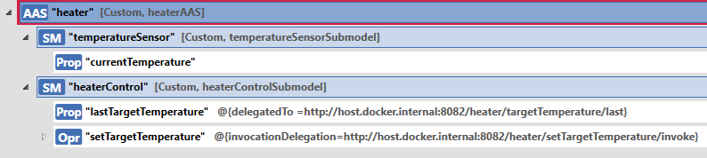

# Device Integration
In the following, device integration with BaSyx as implemented in the [Device Integration Example](https://github.com/eclipse-basyx/basyx-java-examples/tree/main/basyx.examples.deviceintegration/src/main/resources) is considered using a heating element. The heating element has a simple interface:

* A heating setpoint can be configured in degrees Fahrenheit via http/REST.
* The last configured setpoint can be queried via http/REST.
* Every second, the currently measured temperature value in degrees Fahrenheit is made available as an MQTT event.
The first step is to create the digital twin in the form of the Asset Administration Shell, e.g. with the [AASX Package Explorer](https://github.com/admin-shell-io/aasx-package-explorer). The following picture shows a possible representation of the asset on the management shell. Typically, the asset would contain further submodels such as the [Digital Nameplate](https://www.plattform-i40.de/IP/Redaktion/DE/Downloads/Publikation/Submodel_Templates-Asset_Administration_Shell-digital_nameplate.html) - but for reasons of clarity, this has been omitted in the following.



Specifically, the AAS contains two submodels:

* TemperatureSensor: Represents the temperature sensor aspect of the asset and contains the current measured temperature in degrees Celsius.
* HeaterControl: Represents the heater aspect of the asset and provides an operation to set the heater setpoint. Similarly, a property provides the last set heater setpoint. The heating setpoint is specified in degrees Fahrenheit in this example.
In addition, both sumodel elements are annotated with qualifiers. The meaning of these qualifiers is explained in a later step. In the example scenario, the HeaterControl submodel is integrated with an application from the USA, which is why the native temperature measurement value is left in degrees Fahrenheit. The TemperatureSensor submodel, on the other hand, is used to display the current process in a dashboard application for the European market, which is why data is offered here in degrees Celsius.

The defined AAS can now be loaded into the [AAS infrastructure](https://www.iese.fraunhofer.de/blog/industrie-4-0-it-infrastructure-for-digital-twins-part2/) and the architecture shown in the figure below is created. There, however, it exists in the first step detached from the real asset. With Eclipse BaSyx, data integration can now be carried out easily. Eclipse BaSyx offers various means for this, which are presented in more detail below:

* Integration via property delegation
* Integration via operation delegation
* Data integration with the Eclipse BaSyx DataBridge


## Integration via Property Delegation

If a simple data point is to be integrated directly with a submodel, i.e. without transformation, property delegation is a suitable approach. With this integration mechanism, the query of a property by the AAS application is delegated by the AAS server. The data point is queried by the AAS server for an asset and returned to the AAS application. Consequently, this delegation or forwarding is fully transparent and therefore invisible to the AAS application. The advantage of this is obvious: changes to device integrations can be made without any changes to the AAS applications. This means that design decisions can be changed retrospectively without additional tailoring effort. The architecture resulting from this approach is shown below.


But how can this integration be implemented via property delegation with Eclipse BaSyx? The good news: quite simple - without a single line of code. The AAS server component of BaSyx supports [property delegation](../user_documentation/basyx_components/aas-server/features/property-delegation.md) with a simple configuration. Specifically, to use & configure property delegation, only the "delegatedTo" qualifier of a property needs to be set. In the screenshot of the AASX Package Explorer above, this qualifier is set to the value http://host.docker.internal:8082/heater/targetTemperature/last - so any request to this property is automatically delegated to the named URL and thus resolved. The assumption here is that the asset under the delegated endpoint already provides the data in a format suitable for the submodel. If data transformations are necessary, then the DataBridge is a sensible alternative, as also described later in the article.

## Integration via Operation Delegation

Assets often provide interaction points such as http/REST endpoints through which configurations can be made or actions triggered. These endpoints can also be integrated with submodels via a delegation mechanism. Ana-logous to property delegation, BaSyx offers an easy-to-configure feature with [Operation Delegation](../user_documentation/basyx_components/aas-server/features/operation-delegation.md) that addresses precisely this use case. An operation call transmitted to the AAS server can therefore also be delegated in a fully transparent manner. This feature enables the same advantage as property delegation: Sign decisions can be easily changed without having to adapt higher-level applications. The figure below illustrates the resulting architecture.


The configuration of this feature is similar to property delegation: A simple use of the "invocationDelegation" qualifier with the target URL as value is sufficient. In the screenshot of the AASX Package Explorer above, this value is set to "http://host.docker.internal:8082/heater/setTargetTemperature/invoke" - so any invocation of this operation is automatically delegated to the named URL.


## Data integration with the Eclipse BaSyx DataBridge

As already mentioned in the chapter 'Integration via property delegation', the integration mechanism described there is mainly suitable for simple integrations. If complex transformations of data points are necessary, it is not suitable. However, BaSyx can also provide support in these scenarios: The solution is the [BaSyx DataBridge](../user_documentation/basyx_components/databridge/index.md). This is an easy-to-use off-the-shelf component that is provided as a docker image on [DockerHub](https://hub.docker.com/r/eclipsebasyx/databridge). It supports data integration with a variety of protocols such as OPC UA, http/REST, MQTT, ActiveMQ or Kafka. In addition, it enables the transformation of data provided via the protocols. For example, JSON files can be converted into [JSONata](https://jsonata.org) - a transformation language for JSON - using simple expressions. Specifically, it supports two integration patterns:

* Cyclic integration: Data is queried, transformed and integrated into the AAS at regular intervals or event-driven (-> Push).
* On-demand delegation: On request of the AAS server, a data point is queried, transformed and returned (-> Pull).
The figure below compares these two integration patterns. The main difference is the control flow between the AAS server and the DataBridge.


In the example of the heating element, it is used to query the current temperature value every second, transform it from degrees Fahrenheit to degrees Celsius and store it in the "currentTemperature" property. For this integration, various descriptions are necessary as configuration of the DataBridge. The following descriptions are the most important:

* Description of the MQTT endpoint that provides the temperature value.
* Description of the data transformation in JSONata, which selects the temperature value and converts it into degrees Celsius.
* Description of the submodel endpoint and the property in which the data is to be stored.
* Merging the individual elements into a data integration route
The different configurations are shown below; they are also available on GitHub.

Thus, the following files need to be created:

|              File              |                                               Description                                               |
|:------------------------------:|:-------------------------------------------------------------------------------------------------------:|
| mqttconsumer.json              | Describes the mqtt endpoint                                                                             |
| temperatureTransformer.jsonata | Describes the mapping of the temperature data from degree Fahrenheit to degree Celsius by using JSONata |
| jsonatatransformer.json        | Describes available JSONata transformations                                                             |
| aasserver.json                 | Describes where to push the transformated data, i.e., in which Property of which Submodel               |
| routes.json                    | Describes the overall route setup                                                                       |

The MQTT endpoint is described as follows in the mqttconsumer.json file:

```yaml
{
	"uniqueId": "temperatureSensor",
	"serverUrl": "host.docker.internal",
	"serverPort": 1884,
	"topic": "heater/temperature".
}
```

The uniqueId entry specifies the name of the data processing node that is used in the further integration. serverURL & serverPort describe the access point under which the MQTT broker can be found. The entry topic describes the MQTT topic under which the temperature data is published.

The next step describes the data transformation. The JSON messages sent via MQTT look like the following, for example:
```yaml 
{
	"temperature": 32,
	"timestamp": 1674025471
}
```

To select the temperature and convert it from degrees Fahrenheit to degrees Celsius, subsequent JSONata expression is necessary in the temperatureTransformer.jsonata file:

`$floor((temperature - 32) * 5 / 9)`

$floor is a JSONata function that rounds the calculated value to the nearest integer.

The file with this JSONata expression is linked to a route entry via the following configuration in the jsonatatransformer.json file:
```yaml
[
	{
		"uniqueId": "temperatureTransformer",
		"queryPath": "temperatureTransformer.jsonata",
		"inputType": "JsonString",
		"outputType": "JsonString"
	}
]
```

Analogous to the endpoint description of MQTT, the uniqueId is also the name of the data processing node. queryPath specifies the file name in which the previous JSONata expression is stored. The entry JsonString for inputType & outputType specifies that a JSON is to be processed.

In the next step, the submodel endpoint and the target property are described via the following configuration in the aasserver.json file:
```yaml
[
	{
		"uniqueId": "TemperatureSubmodel",
		"submodelEndpoint ": "http://host.docker.internal:4001/aasServer/shells/heaterAAS/aas/submodels/temperatureSensor/submodel",
		"idShortPath": "currentTemperature"
	}
]
```

The uniqueId entry has the same meaning as in the above descriptions. The URL of the submodel endpoint is specified via submodelEndpoint, the idShortPath entry refers to the specific property to be filled.

Finally, the individual data processing nodes must be combined into a route. This is done as follows in the routes.json file:
```yaml
[
	{
		"datasource": "temperatureSensor",
		"transformers": ["temperatureTransformer"],
		"datasinks": [ "temperatureSubmodel" ],
		"trigger": "event".
	}
]
```

Using the various uniqueIds, the route is routed from the datasource via the transformers to the datasink. Since this is an event-driven route, the value event is specified as the trigger. On GitHub you can also find examples of a time-driven integration and a delegated integration with the DataBridge

## Easy integration with BaSyx off-the-shelf components

Once the above configurations have been made, the AAS infrastructure (i.e. AAS Server, AAS Registry, AAS GUI), the DataBridge and the simulated asset can be started. In the example, docker compose is used for this, as also provided on [GitHub](https://github.com/eclipse-basyx/basyx-java-examples/tree/main/basyx.examples.deviceintegration/src/main/resources).

After starting the complete container landscape, the result is the overall system shown below.


The AAS GUI can then be called up in the browser via http://localhost:3000 and is shown below. After configuring the registry URL as http://localhost:4000/registry and activating the auto-sync in the GUI via the button in the top right-hand corner, the administration shell with its submodels can be accessed directly.


The setTargetTemperature operation in the heaterControl submodel can now be used to set a target temperature in degrees Fahrenheit, which can then be called up in the lastTargetTempera-ture property. By selecting the currentTemperature property with a mouse click in the temperatureSensor submodel, it is possible to follow live how the temperature is set.