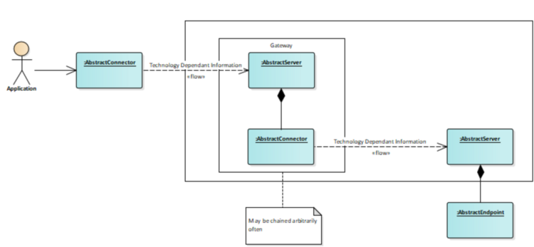

Gateways translate from a source communication to a target communication. Internally, they translate to the five semantic primitives of the VAB. There are several implementations of connectors and servers, that translate to and from these primitives. All connectors implement the IModelProvider interface described in the [SDK architecture](../developer/basyx_java_v1/sdk/java/index.md). By doing so, arbitrary VAB servers can be combined with arbitrary VAB connectors. Thus, introducing a new gateway translating to a previous unknown protocol is as easy as implementing a VAB connector to this protocol. Similarly, translating from a previous unknown protocol works by implementing a server translating from this protocol to the VAB primitives.

