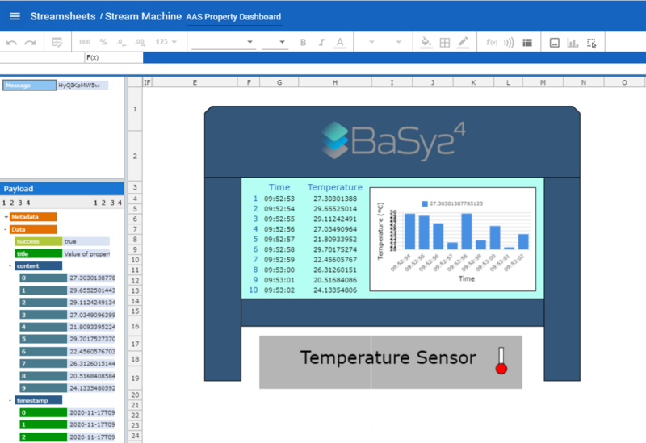

# Integrated End-User Applications

## Overview
BaSyx enables integration with third-party tools to support real-time data visualization, real-time data monitoring, and data processing. The following examples provide different use cases according each application.

## Use Cases

### Data Analytics

Data analysis play a key role in making decisions in a many diverse businesses and domains. In the context of Industry 4.0, data analysis will support to operate more effectively and efficiently, and will also be crucial for predictive maintenance. In the context of Basyx project, a tool named **Streamsheets** is integrated to support Basyx users in the task of monitoring and visualizing streams of data.

Streamsheets provides features such as:

* Data streams may be processed, aggregated, visualized and transformed in real-time as a server application.
* Data streams may be exchanged over REST-based protocols (request/response)
* Data streams may be *published/subscribed* via protocols like MQTT, Apache Kafka or AMQP.

The following example describes a scenario where temperature values are collected from a AAS via a proxy:

* A parameter called **temperature** is collected via a proxy each **1 second**.
* The accumulated results can be see as bar chart.
* It is also possible to customize some **alert messages**, for example when the temperature reaches a certain value. It is possible to send such critical values as a message to an e-mail address.



### Dashboard

Data visualization through user-friendly Dashboards which displays real-time data complements the use case Data Analytics. To support Basyx users the tool names **Grafana** was selected as a flexible and customizable application. Grafana is an open-source tool for creating dashboards of different types of data sources.

Grafana provides features such as:

* It is possible to query and visualize data independent of where data is stored.
* Data may be read from multiple sources.
* Different metrics and parameters can be configured and visualized in a single dashboard.

The following example describes a scenario where temperature values can be visualized in a nice and easy-to-read dashboard:

* A parameter called **temperature** is collected via a proxy each **1 second**. This interval can also be customized according the need, e.g. 5 sec, 1 min, 10 min, 1 hour, and so on.
* The accumulated results can be see using different types of charts.
* It is also possible to configure alert messages based on customized rules. Messages can be sent to an *e-mail* (single or multiple addresses); *Telegram; Microsoft Teams; Slack; webhooks*; and many more.


### Dataflow Controlling

Dataflow controlling is also a need in the context of Industry 4.0. In near future, most of all operations in a shop floor might be based on data. From basic operations, decision making processes, predictive maintenance, to processes optimization all will be realized by interoperability of data. Many sources and targets will be in communication exchanging information. To support such scenarios, Basyx users shall use tools that allows data processing and transformation. For the moment, **Node-RED** is the selected tool to support in these tasks.

Node-RED provides features such as:

* Flows shall be composed by nodes and links. These flows can be wired, and then deployed in runtime.
* Flows can be deployed to run locally; in a device (e.g. a Raspberry Pi); or in the cloud.
* Nodes may send and receive messages whilst the flow is running.

Node-RED shall be used for use cases such as:

* *Data processing and transformation* - e.g. a temperature is collected in Celsius and need to be consumed by a software in Fahrenheit;
* *Data propagation* - e.g. temperature collected from an oven A shall be sent to a cloud server X, and temperature collected from an oven B shall be sent to a cloud server Y;
and many more.


In the following example:

* a node **"Get Temperature"** reads **temperature** via http request each **1 second**. This interval can also be customized according the need, e.g. 5 sec, 1 min, 10 min, 1 hour, and so on.
* a node **"Calculate Average"** computes the temperature average for all read values, and node **"MQTT Avg Temp Publisher"** sends it to a server via MQTT Publisher protocol.
* a node **"Calculate Fahrenheit"** transforms the values from Celsius to Fahrenheit, and node **"MQTT Fahrenheit Temp Publisher"** sends it to a server via MQTT Publisher protocol.


### How to Use
All necessary images that are necessary to run the examples are available in DockerHub. So, in order to run them, you do not need to build them by yourself, but only have to run them in a configured Docker environment. A full example for all monitoring scenarios with a simple AAS is given in the BaSyx Git repository. To run the examples, you therefore need a Docker environment. The necessary files can be checked found on GitHub:

https://github.com/eclipse-basyx/basyx-java-examples

After checking out the repository, you can easily run the example:

```
1. Look at the readme.txt files. There are few steps necessary for the Streamsheets and NodeRED examples to import the predefined setup.
2. Run "docker-compose up" or alternatively run the "start.bat"-file in the respective application folder (for NodeRED, Grafana or Streamsheets) to start all necessary docker images for one example at once.
```

If there are issues with the docker environment, make sure that the files inside of the git repository are shared with the docker containers by configuring the file sharing mechanism in the docker daemon settings.