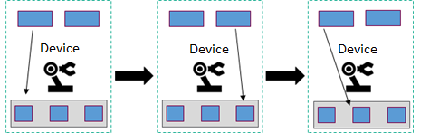
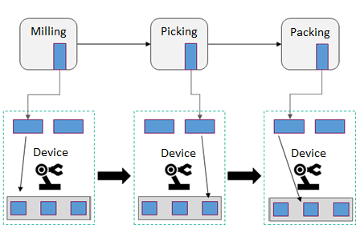

# BaSyx Service Oriented Architecture concept

Eclipse BaSyx is a novel architecture for production systems. Up to now, production systems are predominantly PLC-based system architectures in which a PLC implements a set of production steps. Every PLC executes a cyclic program that controls all devices of a production cell. At runtime, this PLC controller receives information about the product variant and adapts its program accordingly. The complete production process is represented by the totality of all networked PLCs. They form a distributed system that communicates via Ethernet or field buses. Synchronization between dependent units depends on message exchange, but also on the time-synchronization of production cycles. Already small changes in a process may break this synchronization. Changes at one point in the production process therefore often lead to side effects in other parts of the production system due to increased dependencies. Side effects are defined as a failure that was not foreseen and that is triggered by the increased complexity of the system. Fixing these side effects is often lengthy, expensive, and the effort required is difficult to predict.

State-of-the-art automation of production processes (Icons by Icons8.com)

## Service oriented architecture for automation systems

The problem of side effects is not new in the world of software. They occur after introducing changes in complex and often grown systems. The trigger for these side effects are commonly unknown and undocumented dependencies between system parts that at first glance seem to be independent of each other. Therefore, the probability of side effects increases with the complexity of a system design, and with the number of “hacks” that are not conforming to the documented architecture. A similar problem occurs in production systems, where automated production cells use e.g. field-bus communication to exchange data, and therefore create dependencies.

For Industry 4.0, we have adapted a design pattern from software development called Service oriented Architecture (SoA) that has proven itself to avoid side effects. Service based systems structure complex systems into service providers and service users. Service providers implement services with a defined interface that enable service invocation. The concrete realization of a service is up to the service provider. It should not be disclosed to service users, and service users must not make any assumptions regarding the implementation of a service that goes beyond the API for service invocation. On the other hand, the service provider must not make any assumptions regarding the service user other than those that are provided through the service invocation API when the service is invoked. Therefore, all the information required to run the service must be provided via the service interface. It is therefore not permissible for a service provider to access information that originates from a previous service call, for example. This focus on a defined API as contract between service users and service providers is one key to avoid side effects. Service providers therefore may combine offered services in any order they require to achieve their goals.

When transferring this architecture to Industry 4.0, devices become service providers. PLCs no longer implement parts of production processes, but instead offer production services with clearly defined interfaces. Orchestrators combine offered services to realize the production process thus, for example, manufacture a product. Following the Service Oriented paradigm, orchestrators only define the sequence and parameterization of services, but not their implementation. Compared to PLC programs, the programs for orchestration are much more abstract and therefore easier to modify than most PLC programs used today. Furthermore, Service oriented Architectures explicitly invoke PLC services, and do not depend on fixed cycle times. They are therefore much easier to change compared to traditional coupled PLC programs.

Using event-based production services and service orchestrators, a new product can be realized simply by modifying the orchestration, and without changing service implementations. A modification of the PLC is only necessary if new production services have to be implemented or existing services have to be updated. Adapting the automation of a production therefore only requires changes of the orchestration, and, if the SoA principle has been realized in a proper manner, will not induce any side effects.

The orchestration of the services offered by PLC must be carried out once for each product, and needs to be adapted for every product variant. This can either be done automatically, e.g. by means of an application (Strategy App), or by an expert who allocates the production resources. An Industrie 4.0 plant could conduct a simulation to support this expert by evaluating possible production alternatives, for example, with regard to their cost-effectiveness, based on information from Digital Twins.