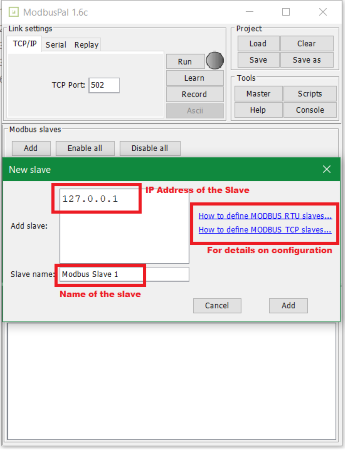
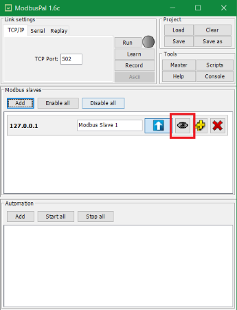
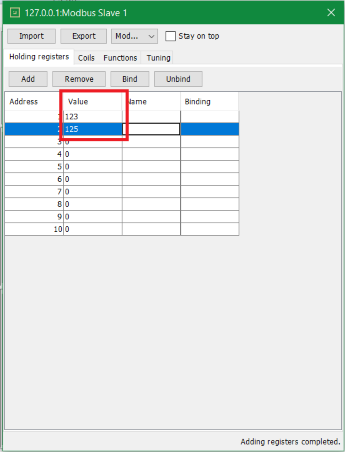
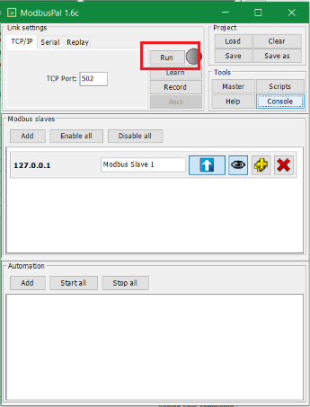
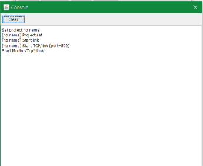
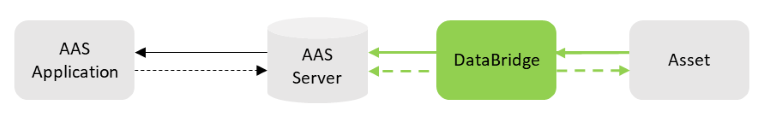
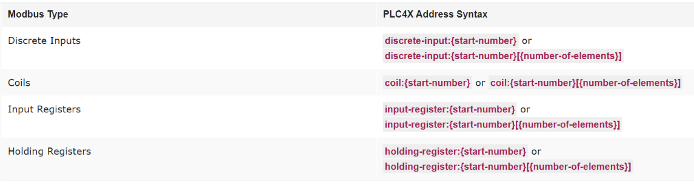

# DataBridge Automation Protocol Integration
The automation protocols such as Modbus, S7 leveraging **apache PLC4X** can be integrated with DataBridge. Apache PLC4X allows you to communicate directly with your industrial Hardware without retrofitting it [1](https://plc4x.apache.org/users/index.html). For more information please refer to [Apache PLC4X](https://plc4x.apache.org/users/getting-started/general-concepts.html)

## Apache PLC4X
PLC4X is a set of libraries for communicating with industrial programmable logic controllers (PLCs) using a variety of protocols but with a shared API [1](https://plc4x.apache.org).

### Supported Protocols

* AB-Ethernet
* ADS /AMS
* BACnet/IP
* CANopen
* ÜDeltaV
* DF1
* EtherNet/IP
* Firmata
* KNXnet/IP
* Modbus
* OPC-UA
* S7

**Note**:

* Few of the protocols are fully supported and few are supported by simulation. For more information on this, please refer to [Protocols](https://plc4x.apache.org/users/protocols/index.html).
* Also, not all the features such as Read Single Address Value, Read Multiple Address Values, etc. are supported by every protocol mentioned above. For details about the features please check [Features](https://plc4x.apache.org/users/protocols/index.html#features)

## Virtual Modbus PLC
This section will demonstrate the configuration of the Modbus PLC virtual simulator [ModbusPal](https://modbuspal.sourceforge.net). If you don’t have any PLC you can configure this virtual PLC and get started with integration of PLC with the Asset Administration Shell (AAS).

### Setting up the virtual Modbus
1. Download the **ModbusPal** software as a Jar from [Source Forge](https://modbuspal.sourceforge.net)

2. Execute the Jar using the below command
```
 java -jar ModbusPal.jar
```
3. When it is launched, the UI would look like this:


Here the port is set to default i.e. **502** (default Modbus port), you can change it as per your need.

4. Now, click on **Add** to add slaves

5. A new window would appear like below, input the **Slave name** and **IP address** of the slave (For Modbus TCP), for Modbus RTU please refer to the links as specified to the right of the window:



6. Now click on the **eye icon** marked in below image to add new registers:



7. Click on **Add** to add the holding registers, here put the number of registers you want to create (10 registers are created in below image):


8. Once it is added you can add **value** to it like:



9. Similarly switch the tab to **Coils** and follow the same procedure to add coils:


10. Now click on **Run** to make your slave communicate:



11. As a last step, it is advisable to check the console by clicking on the **Console**:


This console shows you the log for every important event, for e.g. getting new connections from **PLC4X**:




For more information on these steps, please refer to [Apache PLC4X with a virtual Modbus PLC](https://plc4x.apache.org/users/getting-started/virtual-modbus.html)

## Integration with AAS using DataBridge
As you have configured the virtual Modbus, you can easily integrate this with the **AAS** using the **DataBridge**.



In PLC4X the notation for addresses is as follows [Source](https://plc4x.apache.org/users/getting-started/virtual-modbus.html#some_modbus_basics):



For e.g. as in the above configuration, we have added 10 Holding registers from 1 to 10. So, the notation for this would be:
```
 holding-register:1
```
```
 holding-register:2
```
Similarly, for Coils:
```
 coil:1
```
```
 coil:2
```
You can simply integrate this virtual Modbus with **AAS** by specifying below attributes in **DataBridge** configurations:

* Server URL
* Server port
* Driver
* Service Path (If available)
* Options (*) (If required)
* Tags (**)

(*) : There are several options you can specify here. For more information on options please refer to [Endpoint options](https://camel.apache.org/components/next/plc4x-component.html#_endpoint_options)

(**) : Tags contain the key-value pair, the key would be the name or alias you want to give to the address for making it more readable, and the value is the address itself which you want to read from the PLC.

So, based on the above configurations we did we can identify the above attributes like below:

* **Server URL** -> 127.0.0.1 (The URL of the slave)
* **Server port** -> 502 (The specified port)
* **Driver** -> modbus-tcp (We are using modbus protocol)
* **Service Path** -> None (As we haven’t configured any service path with the Server URL)
* **Options** -> None
* **Tags -> name** = value_1 (Arbitrary Name), **value** = holding-register:1

Now the last step is to specify these attributes in a configuration file **plc4xconsumer.json** as defined in the [PLC4X Protocol](../basyx_components/databridge/features/protocol-integration/PLC4X.md), along with other [protocols](../basyx_components/databridge/index.md#features) supported by the DataBridge.

An **example scenario** demonstrating this is also available on [GitHub](https://github.com/eclipse-basyx/basyx-databridge/tree/main/databridge.examples/databridge.examples.plc4x-jsonata-aas).