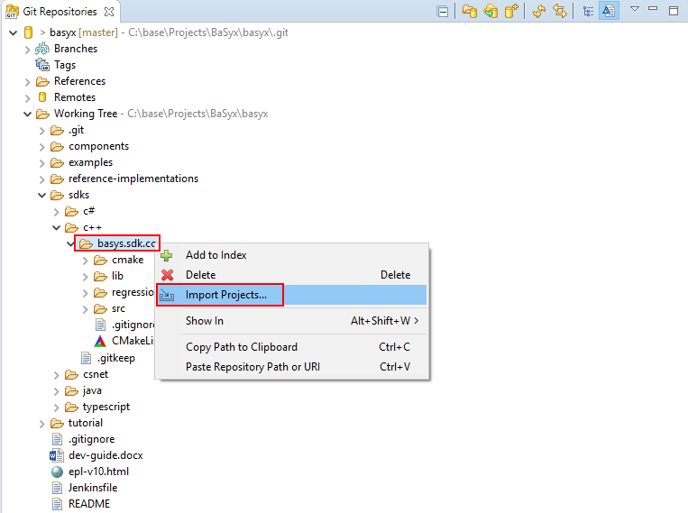
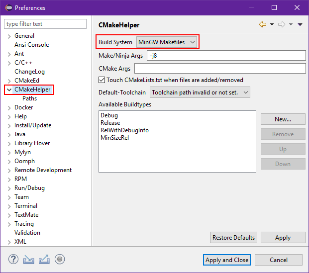
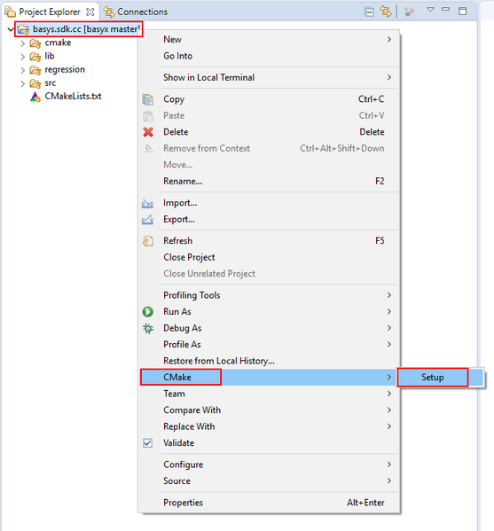

# C++ Setup {How to build the BaSyx C++ SDK}

The BaSyx C++ SDK is now using CMake to generate and control its building process. This article will detail on how to build the C++ SDK from a fresh checkout.

## Requirements
The BaSyx C++ SDK requires the following dependencies to successfully build:

1. A C++11 compiler (GCC, Clang, MinGW, etc.)
2. CMake (version >=3.11.0) (https://cmake.org)

Please make sure that the compiler and CMake are added to the systems PATH (Eclipse may need to be restarted, for PATH settings to take change)

## BaSyx C++ SDK Build Switches
The following switches can be applied during the generation step to control the building process of the BaSyx C++ SDK:

BASYX_BUILD_TESTS [ON/OFF] (default=ON): Specifies if unit tests are to be build

BASYX_UTILITY_PROJECTS [ON/OFF] (default=OFF): Specifies if BaSyx utility targets for (if installed) cppcheck and clang-tidy static code analysis are to be generated.

## Generating Build Files

The following section describes the different approaches on how to generate the build files.

### Command Line Client
This section describes how to generate and build the BaSyx C++ SDK from a fresh checkout using the command line.

For this apporach an out-of-source build is recommended, but not necessary.

From a command line invoke the following commands:
```
git clone basyx

mkdir build && cd build

cmake ../basyx/sdks/c++/basyx.sdk.cc
```
This will generate and create the systems default build files (e.g. Makefiles on UNIX systems) in the previously created build folder.

The C++ SDK can then be built using (in the case of UNIX Makefiles):
```
make -j8
```
or in a more general, platform agnostic way using:
```
cmake --build .
```
Build switches can be supplied during the generation step on the command line like this:
```
cmake ../basyx/sdks/c++/basys.sdk.cc -DBASYX_BUILD_TESTS=OFF -DBASYX_UTILITY_PROJECTS=ON
```
The -G flag can be used to specify the build system for which the build files are generated. An example generating Makefiles for MinGW from the command line looks like this:
```
cmake -G"MinGW Makefiles" ../basyx/sdks/c++/basys.sdk.cc
```
For more information regarding the different generators and CMake in general refer to https://cmake.org/cmake/help/latest/


### CMake Graphical User Interface

### Integration in Eclipse CDT IDE
For seamless integration of the CMake process inside the Eclipse CDT IDE usage of the following plugins is recommended:

* [CMake Editor](https://marketplace.eclipse.org/content/cmake-editor)
* [cmake-eclipse-helper](https://marketplace.eclipse.org/content/cmake-eclipse-helper)

The following steps detail how to setup the BaSyx C++ SDK in the Eclipse CDT IDE by using the cmake-eclipse-helper plugin:

1. Check out the BaSyx SDK from Git inside Eclipse
2. In the Eclipse Git view navigate to the BaSyx C++ SDK and import the basys.sdk.cc directory into the workspace, as seen in the following picture:



Alternatively the directory can be added directly through the *File -> Open Projects from File System* dialog.

3. Leave the settings in the Import dialog as they are and import it as a generic project by just pressing the Finish button, as highlighted in the following picture:


4. Windows user might need to configure the cmake-eclipse-helper plugin to use MinGW Makefiles before the next step. For this, open Eclipse's settings dialog through *Window -> Preferences* and select the CMakeHelper Node on the left side.
There the desired build system can be specified, as seen in the following picture. This setting will be used for the generation of the project files in Eclipse.
MinGW (e.g. C:\MinGW\bin) must be added to the systems PATH, for the build process to work. Consult your operating systems manuals or system administrator on how to achieve this.



5. Change back to the project perspective. Right click on the root directory of the imported C++ SDK and select CMake -> Setup, as seen in the following picture:



This will setup the C++ project inside Eclipse, including the generation of the project files, indexer settings and import of all Build Targets, as specified in the CMakelists. Changes in the CMakelist files will be automatically picked up by the system and the project will be re-generated during the building step.

## Examples

### Cross-compilation with Toolchain File
## Tested Compilers
The BaSyx C++ SDK was successfully tested and built using the following compilers:

* GCC (version 8.2.1 20181127)
* Clang (version 7.0.1)
* MinGW (v?.??) 

## Troubleshooting
### Error 0xc0000139 when using mingw
This is a [known issue](https://stackoverflow.com/questions/4702732/the-program-cant-start-because-libgcc-s-dw2-1-dll-is-missing) with mingw . Add the following lines to the project settings in the main CMakeLists.txt:

`add_link_options("-static-libgcc")`

`add_link_options("-static-libstdc++")`